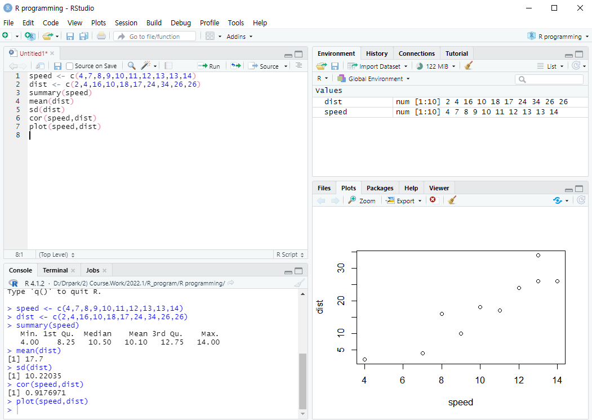

# R 시작하기

## R의 소개

R은 다양한 통계분석과 그래프 작성 등을 위한 프로그래밍 언어이자 개발
환경이다. 뉴질랜드 오클랜드 대학의 Ross Ihaka와 Robert Gentleman에 의해
개발된 오픈 소스 소프트웨어로서 현재는 통계학 및 컴퓨터 분야 등의 쟁쟁한
학자들로 이루어진 R Development Core Team에 의하여 유지 관리되고 있으며
세계 곳곳의 다양한 R 사용자들의 활발한 활동으로 꾸준히 발전되고 있다.
최근 들어 R은 기존 분석 시장의 강자였던 SAS를 능가하 며 분석시장의
판도를 이끌고 있다. 빅데이터 시대를 맞이하여 이미 구글과 같은 인터넷
기업에서 통계자료분석 엔진으로 R이 사용되고 있다는 사실 등은 우리에게
시사하는 바가 크다고 할 것이다. 그럼 무엇 때문에 R이 이와 같이 큰 주목을
받는 것일까? 그것은 다른 통계 소프트웨어들에서는 볼 수 없는 차별화된
장점이 있기 때문일 것이다.

우선 R은 무료로 사용할 수 있다. 이것은 대학뿐만이 아니라 일반 기업에서도
대단히 매력적인 측면이라 할 수 있다. 또한 다양한 형태의 데이터를
이용하여 거의 모든 분야의 통계분석이 가능한 매우 포괄적인 통계
소프트웨어이며, 기존의 어떤 통계 소프트웨어에서도 볼 수 없었던 완벽한
그래프를 간편하게 작성할 수 있다. 더욱이 오픈 소스 소프트웨어이기 때문에
수많은 R 사용자들이 활발하게 분석기법 등을 추가하고 있는데, 이것은 다른
통계 소프트웨어에서는 사용할 수 없는 최첨단 분석기법들을 R에서는 사용할
수 있다는 것을 의미한다. 이외에도 다양한 장점을 지니고 있는 R은 앞으로
계속 발전할 것이며 통계 분석에 관한 기존의 패러다임을 바꾸어 놓을
것이다.

R이 다른 통계 소프트웨어와 차별화되는 다양한 장점을 갖고 있는 것은
사실이나 몇 가지 아쉬운 점이 있는 것 또한 사실이다. 오픈 소스
소프트웨어라는 것은 동전의 양면과 같아서 누릴 수 있는 많은 장점들이 있는
동시에 감내해야 될 어려움 또한 존재하는데, R에서 사용할 수 있는 대부분의
분석기법들이 여러 분야의 수많은 사용자들에 의해서 각각 작성되어
올려진다는 것이 바로 그것이다. 다양한 분석기법이 있다는 것은 더할 나위
없이 좋은 점이나, 현재 R에서 어떤 분석기법이 사용 가능하며 그 사용법이
무엇인지를 알아내는 것이 상당히 번거로운 일이 된다. 이 문제에 대한
이해는 R 패키지에 대한 소개가 이루어지면 명확하게 될 것이다.

이 책에서 우리는 R의 다양한 특징에 대하여 알아보고자 한다. 여러 형태의
데이터 입력과 변환 방법, 다양한 분석기법, 그리고 뛰어난 그래프 작성 방법
등을 살펴볼 것이다. R 은 Windows와 Linux 그리고 Mac OS X에서 설치가
가능한데 이 책에서는 Windows를 기반으로 하는 PC에서 운영하는 방법만을
다루고자 한다.

## R의 설치

R은 크게 base 시스템과 패키지로 구분되며 R의 설치는 base 시스템의 설치를
의미한다. 설치 파일은 [Comprehensive R Archive Network
(CRAN)](https://cran.r-project.org)에 방문하면 얻을 수 있으며, 원활한
다운로드를 위해서는 미러(mirror) 사이트 중 한 곳을 선택하여 방문하는
것이 좋다. 사이트에 설명된 방법에 따라 Windows용 설치 파일을
다운로드하고 설치하면 기본적인 R 사용 준비는 끝나게 된다. R의 업데이트
주기는 매우 짧아서 일 년에도 여러 번 업데이트 버전이 출시된다. 이 책은
버전 `r getRversion()`을 기반으로 하여 작성되었다.

다양한 분석기법들을 사용하기 위해서는 해당 패키지를 설치해야 하는데,
패키지의 설치도 CRAN 사이트에서 할 수 있다. 자세한 내용은
\@ref(section-package)절에서 찾아볼 수 있다.

## RStudio의 설치 및 R의 실행

모든 R 작업은 RStudio에서 진행하는 것이 바람직하다. RStudio는 R을 위한
통합 개발 환경으로서 프로그램의 작성과 실행, 디버깅, 그래프 작성 및
작업공간의 관리, 보고서 작성 등 R과 관련된 모든 작업을 편리하게 수행할
수 있게 한다.

R을 설치한 후에는 [RStudio](https://www.rstudio.com/)에 방문하여 오픈
소스 버전의 설치파일을 다운로드 받아 RStudio를 설치한다. RStudio도
일년에 몇 차례 업데이트 버전이 출시되는데, 이 책에서는 버전 2022.07.1을
사용하고 있다. RStudio를 설치하고 바탕화면에 생성된 아이콘을 더블
클릭하면 그림 \@ref(fig:RStudio-first)과 같은 초기화면이 나타난다.

```{r RStudio-first, fig.cap = "RStudio의 초기화면", echo=FALSE}
knitr::include_graphics("Figure/ch1_RStudio_first.PNG")
```

열린 세 개의 창 중 왼쪽에 있는 Console이라는 이름의 창을 보면 `>` 기호가
나타나는데 이것이 R의 프롬프트이다. 프롬프트 다음에 명령문을 입력하고
Enter 키를 치면 입력된 명령문이 실행되고, 그 실행 결과가 바로 다음 줄에
나오게 된다.즉 R은 기본적으로 대화형 처리방식(interactive mode)으로
작업을 수행한다. SAS 등에서 사용되는 일괄처리방식 (batch mode)에 익숙한
사용자들에게는 무척 생소하고 불편한 방식으로 느껴지겠지만 최근에 우리가
접하는 데이터가 대부분 매우 복잡한 구조를 갖고 있으며 이러한 데이터는
반드시 여러 단계의 중간분석을 거쳐야 한다는 점을 고려할 때 매우 효율적인
작업방식이라고 하겠다. 물론 동일한 작업이 계속 반복되는 경우라면
일괄처리방식이 훨씬 더 편리하다고 할 수 있을 것이다. 따라서 두 가지
처리방식이 모두 가능하다면 상당히 융통성이 있는 작업수행을 할 수 있게
되는데, R에서는 이 두 가지 처리방식이 모두 가능하다. 일괄처리 방식에
대한 자세한 내용은 \@ref(section-batch)절에서 찾아볼 수 있다.

R의 작업환경을 이해하기 위해 간단한 예제 프로그램을 실행해 보자. 다음
데이터 세트는 자동차의 주행속도(`speed`)와 그 속도에서 차를 완전히
멈추는 데 필요한 거리 (`dist`)를 알아보는 실험 데이터의 일부분이다. 두
변수의 관계를 알아보자.

```{r exam-data, echo=FALSE}
library(kableExtra)
library(tidyverse)
my_tab <- bind_cols(speed = c(4, 7, 8, 9, 10, 11, 12, 13, 13, 14),
                    dist = c(2, 4, 16, 10, 18, 17, 24, 34, 26, 26)
                    )
kable(my_tab, format = "html", caption = "예제 데이터") %>% 
  kable_styling(bootstrap_options = "striped",
                full_width = FALSE) %>% 
  add_header_above()
```

R에서 사용되는 명령문이란 대부분 내장함수 혹은 사용자 정의 함수로
이루어지며, 자료의 입력이란 특정 객체에 데이터를 할당하는 것을 의미한다.
간단한 데이터의 입력은 함수 `c()`를 이용할 수 있는데, 할당은 `<-` 기호
또는 `=` 기호로 이루어진다. 예를 들어 `x`라는 이름을 가진 벡터 객체에
숫자 10과 11을 할당하는 작업은 다음의 두 명령문 중 어느 하나를 사용하면
된다. 이 책에서 `<-` 기호를 할당 기호로 사용할 것이며, RStudio에서 할당
기호 `<-`은 Alt 키와 마이너스(-) 키를 함께 치면 나타난다.

```{r}
x <- c(10,11)
x = c(10,11)
```

예제 데이터의 분석을 위해 우선 함수 `c()`를 이용하여 두 변수 `speed`와
`dist`를 각각 생성하고, 두 변수의 기술통계량을 함수 `summary()`와
`mean()`, `sd()`를 이용하여 각각 계산해 보자. 이어서 두 변수의 산점도를
함수 `plot()`으로 작성하고, 상관계수를 함수 `cor()`로 구해 보자. 그림
\@ref(fig:exresult)는 RStudio에서 실행한 결과를 보여주고 있다.

```{r}
speed <- c(4,7,8,9,10,11,12,13,13,14)
dist <- c(2,4,16,10,18,17,24,34,26,26)
summary(speed)
mean(dist)
sd(dist)
cor(speed, dist)
```

```{r, eval=FALSE}
plot(speed, dist)
```

그림 \@ref(fig:exresult)에서 볼 수 있듯이 실행결과는 Console 창에 바로
나타난다. 작성된 그래프의 경우에는 Plots 창에 나타나며, 생성된 객체에
대한 정보는 Environment 창에 표시되는 것 을 알 수 있다.

```{r exresult, fig.cap = '예제 프로그램 실행 결과', fig.height=3, fig.width=4, echo=FALSE}
knitr::include_graphics("Figure/ex_result.png")
```

R에서 프로그램을 실행하면서 주의할 점이 있는데, 우선 R에서는 영문자의
대문자와 소문자를 서로 다른 문자로 인식한다.

```{r, error=TRUE}
mean(speed)
Mean(speed)
```

또한 명령문이 완성되지 않은 상태에서 Enter 키를 치면 프롬프트가 `>`
기호에서 `+` 기호로 바뀐다. 이 연결 프롬프트는 명령문이 완성될 때까지
계속해서 나오는데, 만일 무엇이 문제인지 알 수 없는 경우에는 `Esc` 키로
명령문 실행을 취소시켜야 프롬프트가 `>` 기호로 다시 바뀌게 된다.

```{r}
cor(dist,
    speed)
```

R에서는 `#` 기호 이후의 명령문은 무시되어 처리되지 않는다. 따라서
명령문에 대한 부가설명을 붙이고자 한다면 `#` 기호 후에 입력하면 된다.

```{r}
sd(dist)  # standard deviation of dist
```

## 작업공간

작업공간이란 R의 실행 과정에서 생성되는 모든 객체 및 입력된 명령문 등이
보관되어 있는 공간을 의미하는 것이며, 현재의 작업 디렉터리에 임시로
보관되어 있다. 현재의 작업 디렉터리는 함수 `getwd()`를 실행하면 알 수
있다.

작업공간에 임시 보관되어 있는 객체들은 그림 \@ref(fig:exresult)에서와
같이 Environment 창에서 상세하게 그 내용을 확인할 수 있다. Console
창에서도 함수 `ls()`를 실행시키면 임시 저장된 객체들의 목록을 얻을 수
있다. 앞서 실행시킨 명령문들은 Console 창에서 `↑` 또는 `↓`의 화살표 키를
이용하여 확인하거나, History 창에서 확인할 수 있다.

디폴트로 지정된 작업 디렉터리는 사용자의 필요에 따라 바꿀 수 있는데,
Console 창에서 함수 `setwd()`를 실행하거나, 메인 메뉴
`Session > Set Working Directory > Choose Directory…`을 선택하여 변경할
수 있다. 함수 `setwd()`를 이용하는 경우에는 작업 디렉터리로 사용할
폴더를 미리 생성한 후 그 폴더를 지정해야 하고, 메인 메뉴를 이용하는
경우에는 작업 도중에 폴더를 생성할 수 있다.

현재 작업 디렉터리에 임시로 보관되어 있는 객체들을 저장하면 .RData라는
이름의 파일로 저장된다. 저장 방법은 함수 `save.image()`를 실행하거나,
R을 종료할 때 저장하는 방법이 있다. R의 종료는 함수 `q()`를 실행하거나,
RStudio를 종료하면 R도 함께 종료가 되는데, 종료 직전에 현재 작업공간을
저장할 것인지를 묻게 된다. 실행시킨 명령문들은 .Rhistory라는 이름의
파일로 작업 디렉터리에 저장되는 것이 디폴트이다.

디폴트 작업 디렉터리에 저장된 작업공간은 R이 다시 시작되면 자동으로
올라오지만 변경된 작업 디렉터리에 저장된 작업공간은 함수 `load()`를
실행하거나 메인 메뉴 바에서 `Session > Load Workspace……`를 이용하여
사용자 스스로 불러와야 한다.

여기서 주의해야 할 사항은 작업 디렉터리의 경로를 나타내는 데 사용되는
슬래시의 방향이 Windows에서와 다르다는 점이다. Windows에서의 올바른 경로
표시는 `C:\Users\Park\Documents`이지만, R에서는 슬래시의 방향이
반대이다. 만일 Windows에서 사용되는 방향의 슬래시를 사용하고자 한다면,
두 개를 겹쳐서 `C:\\Users\\Park\\Documents`로 하면 된다.

지금까지 작업공간의 저장 및 디폴트 작업 디렉터리의 변경 방법에 대해서
살펴보았으나, 실제 분석 과정에서는 가급적 사용하지 않는 것이 좋을
것이다. 특히 세션마다 생성되는 객체를 저장하는 것은 차후 분석에 혼선을
줄 가능성이 있기 때문에 반드시 금해야 할 사항이라고 본다.

R 종료 시에 작업공간의 저장 여부를 묻는 과정을 생략하려면, RStudio의
메인 메뉴 바에서 `Tools > Global options...`를 선택하고 나타나는 대화
창에서 `Save workspace to .RData on exit`을 `[Never]`로 선택하면 된다.

작업별로 자료, 프로그램, 결과물 등을 분리해서 저장하는 것이 필요한데,
이러한 작업별 공간의 분리는 RStudio의 project를 이용하는 것이 매우
효과적이다. 작업별 project를 설정한다는 것은 해당 작업를 위한 일종의
'작업 폴더' 지정을 의미하는 것으로써, 작업의 모든 자료와 프로그램 및
결과물 등을 특정 폴더에 분리 저장할 수 있게 한다.

Project를 사용하기 위한 설정 방법은 다음과 같다. RStudio의 메뉴에서
`File > New Project`를 선택해서 나타나는 대화 창에서 `New Directory`를
선택한다. 이어서 나타난 창에서 `New Project`를 선택하고, 다음에 나타난
창에서 project를 위한 폴더의 위치와 이름을 지정한다. 예를 들어 Project의
이름을 `R programming`이라고 입력해 보자. 그리고 `Create Project`를
선택하면 RStudio 창이 그림 \@ref(fig:R-project)와 같이 다시 나타난다.
RStudio 창의 오른쪽 위에 입력한 Project 이름이 있는 것을 볼 수 있다.

```{r R-project, echo=FALSE, fig.cap='R Project 생성'}
knitr::include_graphics("Figure/R_project.png")
```

Project의 사용법에 대한 자세한 내용은 [RStudio support
사이트](https://support.rstudio.com)를 참조하기 바란다.

## 스크립트 파일의 활용

지금까지의 R 작업은 Console 창에 명령문을 하나하나 입력하고 실행하여
이루어졌다. 하지만 일일이 명령문을 Console 창에 입력하는 것은 상당히
번거로운 작업이고 오류를 범할 가능성이 많은 방법이다. 비록 이미 실행된
명령문을 자판의 화살표 키를 이용하여 다시 불러내어 수정하는 것이
가능하지만 여전히 불편한 점이 많은 것은 사실이다. 특히 동일한 작업이
반복되는 경우라면 SAS에서와 같이 프로그램 편집기에서 프로그램을 작성한
후 프로그램의 전체 혹은 일부분을 실행시키는 것이 훨씬 더 편리하다고
하겠다.

RStudio의 스크립트 편집기는 SAS의 확장 편집기보다 훨씬 다양한 기능을
갖고 있다. 따라서 R 작업을 가장 효과적으로 수행하는 방법은 RStudio의
스크립트 편집기를 이용하 는 것이다. 새로운 스크립트 창을 여는 방법은
메인 메뉴 바에서 `File > New File > R Script`를 선택하거나, 단축키
`Ctrl+Shift+N` 키를 누르는 것이다. 스크립트 창은 일반적인 문서 편집기와
동일하게 복사 및 붙여 넣기 등의 편집기능을 갖고 있어서 일련의 명령문
입력 및 수정 등을 훨씬 간편하게 할 수 있다. 또한 구문오류가 있으면
알려주는 기능이 있고, 프로그램의 문제점을 확인해 주기도 한다.

스크립트 창에 입력된 명령문의 실행방식은 상황에 따라 다음 세 가지로
나뉘어진다.

1.  한 명령문씩 차례로 실행해야 하는 경우:

    커서를 실행하고자 하는 명령문에 옮겨놓고 `Ctrl+Enter` 키를 누른다.
    해당 명령문이 실행되고 커서는 자동으로 다음 명령문으로 옮겨간다.

2.  몇 개의 명령문을 한꺼번에 실행해야 하는 경우:

    마우스를 이용하여 해당되는 명령문들을 선택하고 하이라이트를 시킨 후
    `Ctrl+Enter` 키를 누른다. 선택된 몇 줄의 명령문들이 모두 실행된다.

3.  스크립트 창의 모든 명령문들을 한꺼번에 실행해야 하는 경우:

    해당 스크립트 창을 선택하고 `Ctrl+Alt+R` 키를 누른다.

```{r ex-script, echo=FALSE, fig.height=3, fig.width=4, fig.cap="스크립트창을 활용한 작업수행 예"}

```

그림 \@ref(fig:ex-script)은 RStudio 스크립트 창을 이용한 작업수행의 예를
보여주고 있다. 스크립트 창 을 이용하여 작성된 스크립트 파일의 저장은
`Ctrl+S` 키를 누르거나, 메뉴 바에서 `File > Save` 혹은
`File > Save As...`을 선택하여 폴더와 파일이름을 지정하면 된다.

저장된 스크립트 파일은 다음 작업 때 불러올 수 있는데 `Ctrl+O` 키를
누르거나, 메뉴 바 에서 `File > Open File...`를 선택한 후 파일이 저장된
폴더로 이동하여 파일 열기를 선택 하면 된다.

작성된 스크립트 파일을 함수 `source()`를 이용하여 실행시키는 방법이
있다. 이 방법은 실행되는 스크립트 파일의 내용 및 그 처리 결과를 굳이
Console 창에 출력할 필요가 없 는 경우에 적합한 방법이 된다.

```{r ex1-content, fig.cap="파일 ex1.R의 내용", fig.width=2, echo=FALSE}
knitr::include_graphics("Figure/ex1_content.png")
```

예를 들어 `C:\Users\Park\Documents\My R Files` 폴더에 있는 파일 Ex1.R에
그림 \@ref(fig:ex1-content)와 같은 내용의 명령문이 입력되어 있다고 하자.
벡터 `speed`를 생성하고 평균 및 표준편차를 계산하는 내용이다. 명령문
`sd(speed)`에 함수 `print()`가 적용된 것을 볼 수 있다.

파일 ex1.R의 내용을 함수 `source()`로 실행시켜 보자. 첫 번째 경우에는
함수 `print()` 가 적용된 `sd(speed)`의 결과만이 출력되었고,
`echo=TRUE`라는 옵션이 포함된 두 번째 경 우에는 입력된 명령문 및 그
결과도 모두 출력되었음을 알 수 있다.

```{r}
source('~/My R Files/Ex1.R')
source('~/My R Files/Ex1.R', echo = TRUE)
```

작업 과정 중에 Plots 창에 생성된 그래프는 간단하게 외부 파일로 저장할 수
있다. 이 작업은 상당히 자주 사용될 것인데, 그것은 R에서 생성된 매우
뛰어난 품질의 그래프를 다른 보고서 등에 인용해야 하는 경우가 많이 있기
때문이다. 생성된 그래프를 MS Word와 같은 워드프로세스에 삽입하는 것은
그래프를 복사하는 것으로 충분하겠지만 Latex에서 이용하기 위해서는 파일로
저장해야 할 것이다.

```{r save-graphic, echo=FALSE, fig.width=2, fig.cap="그래프의 복사 및 저장"}
knitr::include_graphics("Figure/save_graphic.png")
```

이미 작성된 그래프의 복사 및 저장 작업은 그림
\@ref(fig:save-graphic)에서와 같이 Plots 창의 `Export` 버튼을 클릭하면
나타나는 메뉴에서 선택하면 된다. 또는 메인 메뉴 바에서
`Plots > Copy to Clipboard ...` 혹은 `Plots > Save as Image ...`를
선택하면 된다.

그래프의 복사는 metafile과 bitmap 형식으로 가능하며 파일로의 저장은 PNG,
JPEG, metafile 등 여러 형태로 가능하다. 그래프를 파일로 저장하는 두 번째
방법은 함수 `pdf(), postscript(), bmp(), jpeg()` 등을 이용하는 것이다.
그래프를 작성하기 전 원하는 파일 형태에 해당되는 함수를 실행시키고
이어서 그래프를 작성한 후 함수 `dev.off()`를 실행시키면 작성된 그래프가
파일로 저장된다.

```{r}
speed <- c(4,7,8,9,10,11,12,13,13,14)
dist <- c(2,4,16,10,18,17,24,34,26,26)
pdf("plot1.pdf")
plot(dist, speed)
dev.off()
```

## 일괄처리 {#section-batch}

앞 절에서는 RStudio에서 R 스크립트 파일을 실행하는 방법에 대해서
알아보았다. 이 방법은 대부분의 경우에 적용되는 방법이다. 그러나 경우에
따라서는 스크립트 파일을 일괄 처리방식으로 실행해야 할 수도 있다.
일괄처리는 윈도우 명령 프롬프트 창에서 실행해야 되는 것이므로 RStudio
외부에서만 가능한 것이었으나, RStudio의 최근 버전부터는 내부에서도
가능하게 되었다. 일괄처리방식의 작업이 필요하지 않은 사용자들은 이 절의
내용을 생략해도 무관하다고 본다.

RStudio 내부에서 일괄처리방식의 실행은 Console 탭 옆에 있는 Terminal
탭을 누르면 열리는 Terminal 창에서 할 수 있다. Terminal 창은 윈도우 명령
프롬프트 창을 RStudio 내부로 옮겨 놓은 것으로 간주하면 된다.

R 스크립트 파일을 일괄처리방식으로 실행시키는 명령문의 기본 형식은
다음과 같다.

-   `R CMD BATCH infile outfile`

-   `Rscript infile`

여기서 `infile`은 스크립트 파일이다. `R CMD`를 사용하는 경우에는
실행결과가 `outfile`에 저장되고, `Rscript`를 사용하는 경우에는 결과가
Terminal 창에 출력된다.

예를 들어 실행시킬 스크립트 파일이 그림 \@ref(fig:ex1-content)에서
보았던 `C:\Users\Park\Documents\My R Files`에 있는 Ex1.R이라고 하자.
Terminal 창이 열리면 처음 위치는 현재의 작업 디렉터리가 된다. 따라서
명령문 `cd`를 이용하여 스크립트 파일이 있는 폴더로 이동한다. Terminal
창에서 사용되는 윈도우 명령 프롬프트 명령문들은 예전에는 DOS 명령문으로
불리던 것으로 매우 생소하게 느껴질 것이다. 실행 과정 및 결과는 그림
\@ref(fig:terminal-batch)과 같다.

```{r terminal-batch, echo=FALSE, fig.cap="Terminal 창에서 일괄처리"}
knitr::include_graphics("Figure/terminal_batch.png")
```

R 외부에서 스크립트 파일을 일괄처리방식으로 실행시키기 위해서는 R 실행
파일이 있는 폴더를 기존의 path에 추가해야 하고, 윈도우 명령 프롬프트
창을 열어야 한다. 먼저 R 실행 파일이 있는 폴더인
`C:\Program Files\R\R-4.1.2\bin\x64`를 Windows 10에서 기존 의 path에
추가하는 방법은 다음과 같다.

-   `Windows 시작 버튼 > 설정 > 설정 찾기`에서
    `고급 시스템 설정 입력 > '고급 시스템 설정 보기`를 클릭

-   `시스템 속성` 창이 열리면 `고급` 탭 하단에 있는 `환경 변수`를 클릭

-   `환경 변수` 창 하단의 `시스템 변수`에서 `Path`를 선택하고 `편집`을
    클릭

-   `환경 변수 편집` 창에서 `찾아보기`를 클릭한 후 R 실행 파일이 있는
    폴더를 선택하여 그림\@ref(fig:path-adding)과 같이 path에 추가

```{r path-adding, echo=FALSE, fig.cap= "R 실행 폴더를 path에 추가"}

```

이어서 Windows 명령 프롬프트 창을 연다. 몇 가지 방법이 있으나, 그 중 한
방법은 자판에서 윈도우 키를 찾아 `윈도우+R` 키를 누르면 나타나는 `실행`
창에 `cmd`라고 입력하고 `확인` 키를 누르는 것이다.

이후의 작업은 RStudio 내부에서의 작업과 동일하다. 즉, 실행시킬 스크립트
파일이 있는 폴더로 이동하여 실행한다.

## R의 확장: 패키지 {#section-package}

R의 막강한 파워는 다양한 패키지에서 온다고 할 수 있다. 패키지란 사용자가
작성한 R 함수, 데이터 및 컴파일된 코드 등을 모아 놓은 것으로, 다양한
분야의 분석도구를 제공하 고 있다. 2022년 2월 현재 18,800개가 넘는
패키지가 CRAN 사이트에 올라와 있으며, 그 수가 꾸준히 증가하고 있다.
다양한 패키지를 사용할 수 있다는 것은 분석자의 입장에서는 큰 축복이라고
할 수 있으나 너무 많은 수의 패키지가 있기 때문에 각 패키지의 특성을 모두
파악하는 것이 실질적으로 거의 불가능하며, 따라서 사용자가 필요한 특정
분석기법이 어떤 패키지에 있는지를 알아내는 것이 어렵다는 측면도 있다.
또한 개별 사용자들이 직접 작성해서 올린 것이기 때문에 간혹 문제가 있는
패키지가 있을 수도 있다는 점을 항상 유 의해야 한다.

### 패키지의 종류

몇몇 패키지들은 R을 설치할 때(즉, R의 `base` 시스템을 PC에 설치할 때)
자동으로 설치된 다. 이것들 중 실질적으로 `base` 시스템의 일부분처럼
작동되는 것이 있는데 여기에는 `base`, `datasets`, `graphics`, `grid`,
`methods`, `stats`, `utils` 등이 포함되며, 이것을 `base 패키지`라고 한
다. 또한 자동적으로 설치는 되지만 사용하기 위해서는 R 세션으로 따로
불러들여야 하는 패키지들도 있는데 여기에는 `KernSmooth`, `MASS`,
`foreign`, `lattice` 등이 포함되며, 이것을 `recommended 패키지`라고
한다. 이 두 부류에 포함되지 않는 다른 패키지들은 모두 개별적으로
설치하고 R 세션으로 불러들여야 사용할 수 있다.

사용자가 설치해야 되는 패키지 중에는 C/C++ 또는 Fortran 코드를
컴파일해야 설치가 완료되는 패키지가 있다. 이러한 패키지를 윈도우에
설치하기 위해서는 Rtools를 먼저 설치해야 한다. Rtools의 설치 파일도
[CRAN](https://cran.r-project.org)에 방문하면 얻을 수 있으며, R 버전
4.2.0 부터 RTools 4.2를 설치해야 한다.

### 패키지의 설치 및 사용

패키지를 설치하기 위해서는 함수 `install.packages()`를 이용하거나,
RStudio의 Packages 창에 있는 `Install` 버튼을 클릭하면 된다. 사용자가
개별적으로 설치하는 패키지가 저장되는 위치는 함수 `.libPaths()`를
실행하면 나타나는 첫 번째 경로에 설치되는 것이 디폴트이다. 두 번째
경로는 `base 패키지`와 `recommended 패키지`가 저장되는 위치이다. 설치된
패키지의 목록은 RStudio의 Packages 창에서 확인할 수 있다.

```{r}
.libPaths()
```

예를 들어 John Verzani의 "Using R for Introductory Statistics"라는 책에
있는 여러 가지 함수 및 데이터가 들어 있는 패키지 `UsingR`을 설치해 보자.
Packages 창의 `Install` 버튼 을 클릭하면 나타나는 창에 그림
\@ref(fig:install-package)와 같이 UsingR을 입력하고, `[Install]`을
클릭하자. Console 창에 `install.packages("UsingR")`이 실행되는 것을
확인할 수 있다.

```{r install-package, echo=FALSE, fig.cap="패키지 설치 과정"}
knitr::include_graphics("Figure/install_package.png")
```

설치된 패키지는 R 세션으로 불러와야 사용할 수 있는데 이 작업은 함수
`require()` 또는 `library()`로 하게 된다. 예를 들어 설치된 패키지
`UsingR`를 R 세션으로 불러오기 위해서는 `require(UsingR)` 혹은
`library(UsingR)`를 실행시키면 된다. 이때에는 패키지의 이름에 인용부호를
붙이지 않아야 한다. 두 함수 `require()`와 `library()`의 기능에는 약간의
차이가 있는데, 설치되어 있지 않은 패키지를 불러오면 함수 `library()`는
오류가 발생되지만, 함수 `require()`는 단순 경고 메시지를 보여준다. 또한
함수 `require()`는 패키지를 불러오는데 성공하면 `TRUE` 값을, 실패하면
`FALSE` 값을 발생시킨다.

이미 설치된 패키지들의 버전 등을 포함한 대략적인 정보는 함수
`installed.packages()` 로 확인할 수 있으며, 설치된 패키지들을
업데이트시키기 위해서는 함수 `update.packages()`를 실행시키거나,
Packages 창의 `Update` 버튼을 클릭하면 된다. 특정 패키지에 대한 자세한
도움이 필요한 경우에 `help(package="패키지 이름")`을 실행 시키면 해당
패키지에 있는 함수와 데이터 등에 대한 설명을 볼 수 있다. 예컨대
`help(package="MASS")`을 실행시키면, 패키지 `MASS`에 대한 도움 문서들을
Help 창에서 볼 수 있다.

또한 현재 R 세션에 불러들여져 있는 패키지에 있는 함수나 데이터에 대한
도움은 `help(함수 이름)`로 얻을 수 있다. 즉, 함수 `plot()`에 대한 도움은
`help(plot)` 혹은 물음표 기호를 사용하여 `?plot`으로 얻을 수 있다.

조금 더 포괄적인 도움이 필요한 경우에 함수 `help.search()`를 이용하면
매우 유용한 정보를 얻을 수 있다. 예를 들어 문자열 `plot`이 포함된 여러
다른 패키지에 있는 다양한 함수들에 대한 도움이 필요한 경우
`help.search("plot")` 혹은 물음표 기호를 중복시켜 `??plot`을 실행시키면
매우 유용한 도움을 받을 수 있다.

R은 일 년에도 여러 번 업데이트 버전이 출시된다. 새로운 버전의 R을 다시
설치하기 위해 매번 CRAN 사이트를 방문할 수도 있겠지만, 패키지
`installr`의 함수 `updateR()`을 사용하는 것도 좋은 방법이 된다. RGui에서
함수 `updateR()`을 실행하면, 새로운 버전의 R 출시 여부를 먼저 확인한다.
이어서 나타나는 대화상자에서 설치를 선택하면 새로운 버전의 R이 설치된다.

새로운 버전의 R이 설치되면 이전 버전에서 설치했던 패키지를 다시 설치해야
하는 경우가 있다. 함수 `updateR()`에서 패키지 이전 작업이 잘 수행되지
않는 경우에는 다음과 같이 실행해 보자. 버전 4.1.3에서 버전 4.2로
업데이트한 후, 이전에 설치했던 모든 패키지를 다시 설치하는 작업
내용이다. 사용자가 설치한 패키지의 저장 위치가 버전 4.2와 다르다는 점에
유의하자.

```{r, eval=FALSE}
old.lib <- "C:/Users/PARK/Documents/R/win-library/4.1"
install.packages(pkgs=as.data.frame(installed.packages(old.lib))$Package)
```

R은 잠시도 정체되어 있지 않고 끊임없이 진화하고 있다. 이것은 수많은
패키지들이 새로이 나타나고 업데이트되고 있기 때문에 가능한 일이다.
이렇듯 지속적으로 변화하고 있는 R을 제대로 따라가며 이해하는 것은 말
그대로 큰 도전이라고 하겠다. 하지만 다행스러운 일은 세계 곳곳에 활발하게
활동하고 있는 수많은 R 사용자 모임이 있고 그들이 운영하는 많은
웹사이트가 있다는 것이다. 이들 웹사이트를 잘 활용하면 내가 필요한
분석절차가 어떤 패키지에 있는지를 알 수 있으며, 새로운 분석기법에 대한
소개 및 적절한 도움도 받을 수 있을 것이다.

### 패키지 `tidyverse`의 소개

`tidyverse`는 data science를 위해 개발된 패키지들의 묶음이라고 할 수
있다. 여기에 속한 패키지들은 모두 공통된 분석 방식을 공유하고 있으며,
자료분석에 필요한 모든 과정을 망라하고 있다.

패키지 `tidyverse`에 속한 많은 패키지들은 개별적으로 하나하나 설치할
필요 없이 `install.packages("tidyverse")`를 실행하면 모든 패키지들이
설치된다. 하지만 이 패키지들을 사용하기 위하여 `library(tidyverse)`를
실행하면 설치 때와는 다르게 몇몇 패키지들만 R 세션에 올라오는데, 이 몇몇
패키지들을 `core tidyverse`라고 부른다. 여기에 속하지 않는 다른 많은
패키지들은 모두 개별적으로 함수 `library()`로 불러와야 한다.

현재 설치된 `tidyverse` 패키지들의 리스트와 버전 정보 등은 함수
`tidyverse_sitrep()`으로 다음과 같이 확인할 수 있다.

```{r, eval=FALSE}
tidyverse_sitrep()
```

```{r, message=FALSE, echo=FALSE}
library(tidyverse)
my_tidy <- function(){
  core <- c("dplyr", "ggplot2", "forcats", "readr", "tibble", "purrr", "stringr", "tidyr")
    cli::cat_rule("R & RStudio")
    if (rstudioapi::isAvailable()) {
        cli::cat_bullet("RStudio: ", rstudioapi::getVersion())
    }
    cli::cat_bullet("R: ", getRversion())
    deps <- tidyverse_deps(repos = "https://cloud.r-project.org/")
    package_pad <- format(deps$package)
    packages <- ifelse(deps$behind, paste0(cli::col_yellow(cli::style_bold(package_pad)), 
        " (", deps$local, " < ", deps$cran, ")"), 
        paste0(package_pad, " (", deps$cran, ")"))
    cli::cat_rule("Core packages")
    cli::cat_bullet(packages[deps$package %in% core])
    cli::cat_rule("Non-core packages")
    cli::cat_bullet(packages[!deps$package %in% core])
}
my_tidy()
```

core tidyverse에 속하는 패키지의 대략적 기능은 다음과 같다.

-   `readr`: 자료 불러오기

-   `tibble`: 개선된 형태의 데이터 프레임

-   `tidyr`: 분석이 편리한 형태인 tidy 자료 생성

-   `dplyr`: 데이터 프레임 다루기

-   `stringr`: 문자열 다루기

-   `forcats`: 요인 다루기

-   `ggplot2`: 자료의 시각화

-   `purrr`: 함수형 프로그래밍

자료분석 내용을 과정별로 나누어 살펴보면, 먼저 분석 대상이 되는 외부
자료를 R로 불러와야 한다. R로 불러온 자료는 대부분의 경우 바로 분석이
가능한 형태를 띠고 있지 않다. 따라서 불러온 자료를 분석이 가능한 형태로
다듬어야 하며, 이어서 분석에 필요한 자료를 생성하는 등의 변형 과정을
거쳐서 자료의 시각화와 모형화 과정을 통해 자료를 분석하게 된다. 이러한
각각의 분석 과정을 담당할 수 있는 패키지가 `tidyverse`에는 모두 포함되어
있다. 사실 `tidyverse`로 인하여 R은 완전히 새로 태어났다고 할 수 있는데,
상당히 효율적인 작업이 가능해졌으며, 사용 방식에 일관성이 확립되었고
어렵지 않게 확장할 수 있는 체계가 구성되었기 때문이다. 따라서 데이터를
다듬고 그래프를 작성하는 작업은 이제 `base` 패키지를 이용하는 것보다
`tidyverse`의 일원인 `dplyr`이나 `ggplot2` 등을 이용하는 것이 훨씬 더
바람직하다고 할 수 있다.
