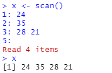
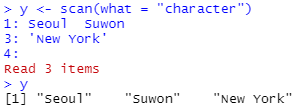
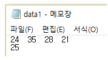

# R 데이터 구조 {#data-structure}

통계학에서 데이터는 양적 데이터와 질적 데이터로 구분된다. 양적 데이터는 숫자형 데이터를 의미하는 것으로서 연속형과 이산형 데이터로 구분할 수 있다. 질적 데이터는 범주형 데이터라고도 하며, 다시 명목형과 순서형으로 구분된다. 
또한 통계 데이터 세트란 데이터들이 아래의 예제처럼 행과 열의 2차원 형태로 배열된 상태를 의미하는 것이다.
열은 변수를 나타내며 하나의 열에는 같은 유형의 데이터만이 올 수 있고, 행은 동일 대상에 대한 여러 변수들의 관찰값을 나타낸다.

```{r, echo=FALSE}
mtcars |> 
  rownames_to_column(var = "model") |> 
  head()
```


이렇듯 분석 대상이 되는 통계 데이터는 다양한 유형과 구조를 가지고 있다. 데이터의 다양한 구조를 표현하기 위해 R에서는 벡터, 요인, 행렬, 배열, 데이터 프레임 그리고 리스트라는 이름의 데이터 객체가 있다. 벡터는 하나의 변수를 나타내기 위한 1차원 구조이고, 요인은 범주형 자료를 나타내기 위한 구조이며, 행렬과 데이터 프레임은 2차원 구조, 배열은 2차원 이상의 구조를 가진 데이터 형태이다. 리스트는 가장 포괄적인 형태의 구조로서 여러 유형, 여러 형태의 데이터를 한데 묶은 형태를 취하고 있다. 이 장에서는 다양한 데이터 객체를 생성하는 방법 및 각 객체들의 중요한 특성들을 살펴보고자 한다.

## 벡터

벡터는 하나의 변수를 나타내기 위한 것으로써 1차원으로 배열된 데이터 구조를 갖고 있다. 한 변수를 나타내는 것이므로, 벡터를 구성하고 있는 자료는 모두 동일한 유형이어야 하며, 그 유형에 따라 논리형(logical), 숫자형(numeric), 문자형(character)으로 구분된다. 숫자형 벡터는 다시 정수형(integer)과 실수형(double)으로 세분된다.

### 벡터의 기본 특성

-   벡터의 생성

벡터는 함수 `c()`로 만들 수 있다.

```{r}
x <- c(TRUE, FALSE, TRUE)
y1 <- c(1L, 3L, 5L)
y2 <- c(1.1, 3.5, 10.4)
z <- c("one", "two", "three")
```

`x`는 논리형, `y1`은 정수형, `y2`는 실수형, `z`는 문자형 벡터이다. 논리형 벡터는 `TRUE` 혹은 `FALSE`로 이루어진 가장 단순한 형태를 갖고 있으며, 벡터의 비교 결과로 주로 생성된다. 정수형 벡터 `y1`을 만들 때 사용된 숫자 뒤에 붙는 기호 `L`은 유형을 정수로 지정하는 효과가 있다. 정수형 벡터와 실수형 벡터는 합쳐서 숫자형 벡터로 분류되며, 문자형 벡터의 구성인자들은 모두 인용부호 `" "` 혹은 `' '` 안에 있어야 한다.

-   벡터의 특성

벡터의 유형 확인은 함수 `typeof()`로 할 수 있다.

```{r}
typeof(x)
```

```{r}
typeof(y1)
```

```{r}
typeof(y2)
```

```{r}
typeof(z)
```

벡터의 유형 확인은 `is.numeric()` 또는 `is.character()`와 같은 `is.*()` 형식의 함수로 할 수 있는데, `is`로 시작하는 함수는 입력된 객체의 유형이 `*`에 지정한 것과 같으면 `TRUE`, 다르면 `FALSE`를 출력한다.

```{r}
is.integer(y1)
```

```{r}
is.double(y1)
```

```{r}
is.numeric(y1)
```

```{r}
is.character(z)
```

```{r}
is.logical(x)
```

벡터를 구성하고 있는 요소의 개수, 즉 벡터의 길이 확인은 함수 `length()`로 할 수 있다. 예를 들어 `length(y2)`는 벡터 `y2`가 몇 개의 숫자로 구성되어 있는지를 확인하는 것이다.

```{r}
length(y2)
```

구성요소가 하나인 벡터를 스칼라(scalar)라고 하는데, 스칼라를 만들 때에는 함수 `c()`를 사용하지 않아도 된다. 즉, `a <- 1` 혹은 `a <- c(1)` 모두 숫자형 벡터 `a`를 생성한다.

```{r}
a <- 1
a
```

벡터는 동일한 유형의 데이터만으로 구성할 수 있는데, 만일 다른 유형의 데이터가 뒤섞여서 있다면 어떤 일이 벌어지겠는가? 아래의 예에서 그 답을 찾을 수 있다.

```{r}
c(1, "1", TRUE)
```

```{r}
c(3, TRUE, FALSE)
```

첫 번째 예에서 `1`은 숫자형, `"1"`은 문자형, `TRUE`는 논리형 데이터이다. 이 데이터를 뒤섞어 입력하면 그 결과는 모두 문자형 데이터로 통일된다. 이것은 문자형이 가장 복잡한 형태의 유형이기 때문이다. 두 번째 예는 숫자형과 논리형 데이터를 함께 입력한 경우이다. 이런 경우에는 논리형 데이터가 숫자형으로 변환되는데, `TRUE`는 `1`로, `FALSE`는 `0`으로 변환된다. 이것 또한 숫자형이 논리형보다 더 복잡한 유형의 구조이기 때문이다.

-   벡터 구성요소에 이름 붙이기

모든 벡터는 각 개별 자료에 이름을 붙일 수 있다. 예를 들어 서울, 부산, 인천, 수원의 인구(천 명 단위)를 숫자형 벡터로 입력하면서 각 숫자에 도시 이름을 붙일 수 있다.

```{r}
c(Seoul = 9930, Busan = 3497, Inchon = 2944, Suwon = 1194)
```

이미 생성된 벡터의 각 개별자료에 이름을 붙이는 것은 함수 `names()`로 할 수 있다.

```{r}
pop <- c(9930, 3497, 2944, 1194)
names(pop) <- c("Seoul", "Busan", "Inchon", "Suwon")
```

```{r}
pop
```


-   함수 `scan()`에 의한 벡터 생성

함수 `scan()`은 다양한 기능을 지니고 있는 함수로서 직접 벡터를 생성할 수도 있고 외부 데이터 파일을 불러와서 벡터에 할당할 수도 있다. 직접 벡터를 생성하기 위해서는 함수 `scan()`을 그냥 실행하면 된다. 그러면 Console의 프롬프트가 `>` 기호에서 `1:` 기호로 바뀌는데, 이것은 첫 번째 자료의 입력을 기다리고 있다는 것을 의미한다. 이어서 데이터를 직접 입력하거나 또는 복사하고 붙여넣기를 할 수 있으며, 한 줄에 여러 개의 숫자를 빈 칸으로 구분하여 입력할 수도 있다. 아래의 예에서 4개 숫자의 입력이 끝나고 나타나는 `5:` 프롬프트에서 그냥 Enter 키를 치면 데이터의 입력이 종료된 것으로 인식한다.



문자형 벡터의 입력은 옵션 `what="character"`를 포함해야 한다. 함수 `c()`의 경우와는 다르게 각각의 자료에 인용부호를 사용할 필요는 없으나, 만일 자료에 빈칸이 포함되어 있다면 그 자료를 인용부호로 감싸야 한다.



한 변수의 자료가 입력되어 있는 데이터 파일을 벡터로 불러오고자 하는 경우에도 함수 `scan()`을 사용할 수 있다. 텍스트 파일에 입력된 각 자료들은 반드시 한 칸 이상의 빈 칸으로 구분되어 있어야 한다. 예를 들어 `Data` 폴더에 있는 파일 data1.txt에 다음과 같이 데이터가 저장되어 있다고 하자. 이것을 벡터 `z`에 입력시키는 방법은 다음과 같이 `scan()`에 불러올 파일이 저장된 위치를 입력하면 된다. 파일이 저장된 위치는 사용자의 컴퓨터가 될 수도 있고, `https://` 등으로 시작되는 웹서버가 될 수도 있다.

{#data1.txt}

```{r}
z <- scan("https://raw.githubusercontent.com/yjyjpark/R-and-statistical-analysis/master/Data/data1.txt")
z
```

### 다양한 형태를 갖는 벡터의 생성

이 절에서는 기존의 벡터에 데이터를 추가하거나 여러 벡터들을 결합하여 하나의 벡터를 만드는 방법 및 일정한 구조를 갖는 벡터의 생성 방법을 살펴보겠다.

#### 벡터에 데이터 추가 및 벡터들의 결합

기존의 벡터에 추가적으로 데이터를 덧붙이는 작업이나 벡터들을 결합하는 작업은 함수 `c()` 또는 함수 `append()`를 이용하여 할 수 있다. 우선 `c()`에 의한 결합 예를 살펴보자.

```{r}
x <- c(11,12,13,14)
c(x, 15)
```

```{r}
y <- c(16,17,18)
c(x, y)
```

함수 `append()`는 추가되는 스칼라 혹은 벡터의 위치를 옵션 `after`로 지정할 수 있다.

```{r}
append(x, 15)
```

```{r}
append(x, 15, after = 2)
```

```{r}
append(x, y)
```

```{r}
append(x, y, after = 3)
```


#### 일정한 구조를 갖는 벡터의 생성

일정한 구조를 갖고 있는 벡터가 필요한 경우가 있다. 예를 들어 1부터 100까지의 정수로 이루어진 벡터를 만들어야 한다고 하자. 이러한 경우 `c()`에 숫자를 하나하나 입력해야 한다면 무척 한심스러운 일이 될 것이다. 콜론(`:`) 연산자 또는 `seq()`를 이용하면 일정한 간격이 있는 자료를 쉽게 만들 수 있으며, `rep()`를 이용하면 반복된 패턴이 있는 자료를 간편하게 만들 수 있다.

-   콜론 연산자

콜론 연산자는 연산자의 왼쪽 숫자에서 시작하여 오른쪽 숫자를 초과하지 않을 때까지 1씩 증가하는 수열을 만든다. 왼쪽의 숫자가 오른쪽의 숫자보다 크면 1씩 감소를 시킨다.

```{r}
1:5
```

```{r}
-3:3
```

```{r}
1.5:5.4
```

```{r}
5:0
```


-   함수 `seq()`에 의한 수열 생성

콜론 연산자는 만들고자 하는 수열의 증가 폭이 1인 경우에만 사용할 수 있다는 한계가 있다. 조금 더 일반적인 형태의 수열을 만드는 작업은 함수 `seq()`를 사용해야 한다. 가장 기본적인 형태는 옵션 `from`과 `to`가 있으면서 `by`와 `length`로 수열의 간격 또는 개수를 지정하는 것이다. 시작점(from)과 끝점(to)만이 있다면, 콜론 연산자의 경우와 같이 간격이 1이 된다. 옵션 `by`는 간격을 지정하는 것으로써 `from`에서 시작하여 `by` 만큼 증가(감소)를 시키되 `to`를 지나치지 않는 수열을 생성한다. 옵션 `length`는 수열의 개수를 지정하는 것으로써 `from`과 `to`를 포함하는 간격이 일정한 수열을 생성한다. 만일 옵션 `to`가 없다면, `from`에서 시작하여 `by` 만큼의 간격이 있는 `length`개의 수열을 구성한다.

```{r}
seq(from = 0, to = 5)   
```

```{r}
seq(from = 0, to = 5, by = 2)
```

```{r}
seq(from = 0, to = 5, length = 3)
```

```{r}
seq(from = 0, by = 2, length = 3)
```

함수 `seq()`에 하나의 숫자만을 입력하면 1을 시작점으로 하여 1씩 증가(감소)하여 지정된 숫자를 끝점으로 하는 수열이 만들어진다.

```{r}
seq(3)
```

```{r}
seq(-3)
```

주어진 벡터와 길이가 같으면서, 1에서부터 시작하고 간격이 1인 수열이 필요한 경우가 있다. 이러한 경우에는 함수 `seq()`의 옵션 `along`에 해당되는 벡터를 지정하거나, 옵션 `length`에 해당 벡터의 길이를 지정하면 된다. 또는 함수 `seq_along()` 혹은 함수 `seq_len()`을 대신 사용해도 된다.

```{r}
x <- c(24,31,29)
```

```{r}
seq(along = x)
```

```{r}
seq(length = length(x))
```

```{r}
seq_along(x)
```

```{r}
seq_len(length(x))
```

-   함수 `rep()`에 의한 반복된 패턴이 있는 데이터 생성

함수 `rep()`는 옵션 `times`와 `each`, `length`를 이용하여 다양한 형태의 반복된 패턴이 있는 데이터를 만들 수 있다. 옵션 `times`는 반복 횟수를 지정하는 것으로써 하나의 정수를 지정할 때와 반복시키려는 벡터의 길이와 같은 정수형 벡터를 지정할 때에 다른 결과가 나온다.

```{r}
rep(1, times = 3)     
```

```{r}
rep(1:3, times = 2)
```

```{r}
rep(c("M","F"), times = c(2,3))
```

옵션 `times`에 하나의 반복 횟수만 지정하면 데이터 전체를 지정된 횟수만큼 반복시킨다. 반복 대상이 `c("M","F")`이고 반복 횟수가 `c(2,3)`이 되어 일대일 대응이 되는 경우에는 `M`이 두 번 먼저 반복되고 이어서 `F`가 세 번 반복된다.

옵션 `each`에 반복 횟수를 지정하면, 데이터의 요소들이 각각 each번 반복한다. 이어서 옵션 `times`를 추가하면 각 요소의 `each`번 반복 과정 전체가 `times`만큼 반복된다.

```{r}
rep(1:3, each = 2)
```

```{r}
rep(1:3, times = rep(2,3))
```

```{r}
rep(1:3, each = 2, times = 2)
```

옵션 `length`에 벡터의 길이를 지정하면, 길이가 `length`가 될 때까지 데이터 전체가 반복된다. 옵션 `each`를 함께 사용하면, 데이터 각 요소가 `each`번 반복되는 과정을 반복하여 결과 벡터의 길이가 `length`가 되도록 한다.

```{r}
rep(1:3, length = 6)
```

```{r}
rep(1:3, each = 2, length = 8)
```


### 문자열을 위한 함수

R에는 문자열을 다루기 위한 매우 유용한 함수들이 있다. 우리는 종종 문자형 벡터에서 특 정 정보를 얻거나 문자형 벡터의 내용을 수정해야 할 때가 있는데 이런 경우 유용하게 사 용할 수 있는 함수들이 표 \@ref(tab:char-func)에 있다.

```{r char-func, echo=FALSE}
col1 <- c('nchar(x)', 'paste(..., sep=\" \")', 'substr(x, start, stop)',
          'toupper(x)', 'tolower(x)', 'strsplit(x, split)',
          'sub(old, new, x)', 'gsub(old, new, x)')
col2 <- c('문자열 x를 구성하는 문자의 개수', '문자열의 결합', '문자열 일부분 선택',
          '영문자 대문자로 변환', '영문자 소문자로 변환', '문자열의 분리',
          '문자열 치환', '문자열 치환')
tab1 <- tibble::tibble(`함수` = col1, `기능` = col2)
knitr::kable(tab1, "pipe", caption = "문자 함수", booktabs = TRUE)
```

-   함수 `nchar()`: 문자열을 구성하는 문자 개수 계산

함수 `nchar()`는 문자열을 구성하고 있는 문자의 개수를 센다. 다음에 주어진 문자형 벡터 `x`의 첫 문자열은 4개, 두 번째는 3개, 마지막 문자열은 4개의 문자로 이루어졌다는 것을 알 수 있다. 한글로 이루어진 문자열도 문제 없이 문자 개수를 셀 수 있다.

```{r}
x <- c("Park","Lee","Kwon")
nchar(x)
```

```{r}
nchar("응용통계학과")
```


-   함수 `paste()`: 문자열의 결합

여러 개의 문자열들을 적절하게 결합시켜 새로운 문자열을 만들어야 하는 경우가 자주 있다. 이런 경우에 함수 `paste()`가 매우 유용하게 사용된다. 함수 `paste()`의 기본적인 사용법은 결합시키고자 하는 문자열들을 차례로 입력하는 것이고, 옵션 `sep`에서 지정하는 문자 혹은 빈칸 등이 결합되는 문자열과 문자열 사이에 오게 된다.

5개의 문자열인 "모든", "사람에게는", "통계적", "사고능력이" 그리고 "필요하다"를 결합시켜 보자. 첫 번째는 옵션 `sep`의 디폴트 값인 `sep=" "`가 사용되어 결합되는 문자열들 사이에 하나의 빈칸이 생긴 것이고, 두 번째는 `sep="-"`가 지정되어 문자열들이 대시(dash) 기호로 결합되었고, 세 번째에는 `sep=""`이 사용되어 빈칸 없이 문자열들이 결합되었다.

```{r}
paste("모든", "사람에게는", "통계적", "사고능력이", "필요하다")
```

```{r}
paste("모든", "사람에게는", "통계적", "사고능력이", "필요하다",
      sep="-")
```

```{r}
paste("모든", "사람에게는", "통계적", "사고능력이", "필요하다",
      sep="")
```

함수 `paste()`에 입력된 숫자는 문자로 전환되어 문자열 결합에 사용된다.

```{r}
paste("원주율은", pi, "이다")
```

함수 `paste()` 안에 문자형 벡터 몇 개가 함께 들어오면 벡터들의 대응되는 요소끼리의 결합이 이루어진다. 이때 벡터의 길이가 서로 다르면, 순환법칙이 적용된다. 즉, 문자열 `"Stat"`과 벡터 `1:3`을 함께 입력하면 실제로는 `c("Stat","Stat","Stat")`과 `1:3`이 결합이 되는 것이고, `c("Stat","Math")`와 `1:3`을 함께 입력하면, `c("Stat","Math", "Stat")`과 `1:3`이 결합되는 것이다.

```{r}
paste(c("Stat", "Math"), 1:2, sep = "")
```

```{r}
paste("Stat", 1:3, sep = "")
```

```{r}
paste(c("Stat", "Math"), 1:3, sep = "-")
```

빈칸 없이 문자열을 결합시킬 때에는 함수 `paste()`에 옵션 `sep=""`을 추가하는 것보다 그냥 함수 `paste0()`을 사용하는 것이 더 편리하다.

```{r}
paste0("stat", 1:3)
```

한 개의 문자형 벡터를 구성하고 있는 모든 문자열을 묶어서 하나의 문자열로 나타내는 작업이 필요한 경우가 있다. 이때는 옵션 `collapse`를 사용하면 된다. 영문자 소문자와 대문자로 구성된 문자형 벡터 `letters`와 `LETTERS`를 각각 하나의 문자열로 합쳐보자.

```{r}
letters
```

```{r}
paste0(letters, collapse = "")
```

```{r}
paste(LETTERS, collapse = ",")
```

하나의 문자열로 합쳐질 때 옵션 `collapse`에 지정한 문자가 일종의 구분자 역할을 하고 있다.

함수 `paste()`에 두 개의 문자형 벡터를 입력하고, 이어서 옵션 `collapse`를 사용하면 입력된 두 문자형 벡터를 하나의 문자형 벡터로 결합시키고, 이어서 모든 문자열을 묶어서 하나의 문자열로 나타낸다.

```{r}
paste0(letters, LETTERS, collapse = ",")
```

```{r}
paste(letters, LETTERS, sep = "-", collapse = ",")
```

-   함수 `substr()`: 문자열에서 일부분 선택

주어진 문자열에서 일부분을 선택해야 하는 작업도 빈번히 일어나는 중요한 작업 중 하나이다. 함수 `substr()`에는 문자형 벡터, 시작점, 끝점이 차례로 입력된다. 시작점과 끝점은 각각 정수형 스칼라 혹은 벡터가 된다.

시작점과 끝점이 벡터가 되면, 대응되는 숫자끼리 시작점과 끝점을 구성하며 필요하다면 순환법칙도 적용된다. 아래 예의 첫 번째 결과는 문자형 벡터 `x`를 구성하고 있는 세 문자에 대하여 동일하게 시작점과 끝점을 하나의 숫자로 지정하여 추출한 것이다. 두 번째 결과는 시작점과 끝점이 벡터로 지정된 것으로 첫 번째 문자열에는 (시작점=1, 끝점=2), 두 번째 문자열에는 (시작 점=3, 끝점=6), 그리고 세 번째 문자열에는 다시 (시작점=1, 끝점=2)가 적용된 결과이다.

```{r}
substr("Statistics", 1, 4)
```

```{r}
x <- c("응용통계학과", "정보통계학과", "학생회장") 
substr(x, 3, 6)
```

```{r}
substr(x, c(1,3), c(2,6))
```

미국의 세 도시와 그 도시가 속한 주 이름이 입력된 문자형 벡터 `x`에서 세 도시가 속한 주 이름만을 선택하여 출력해 보자. 비록 세 문자열의 길이가 서로 다르지만 주의 이름은 각 문자열의 마지막 두 칸에 있다는 점에 착안하여 함수 `nchar()`로 시작점과 끝점을 지정할 수 있다.

```{r}
x <- c("New York, NY","Ann Arbor, MI","Chicago, IL")
substr(x, start=nchar(x)-1, stop=nchar(x))
```

패키지 `ggplot2`에 있는 데이터 프레임 `mpg`는 자동차의 연비와 관련된 자료이다. 11개의 변수 중 `trans`는 변속기 종류를 나타내는 변수이다. 변수 `trans`가 갖는 값을 살펴보자. 함수 `library()`로 패키지를 로딩하지 않은 상태에서 해당 패키지의 데이터를 불러오려면 `패키지::데이터`의 형식을 사용하면 된다. `mpg$trans`는 데이터 프레임 `mpg`의 변수 `trans`를 벡터 형태로 선택한 것이며 자세한 설명은 \@ref(section-dataframe)절에서 찾아볼 수 있다. 또한 함수 `table()`로 문자형 벡터를 구성하고 있는 각 문자열의 빈도를 계산할 수 있다.

```{r}
x <- ggplot2::mpg$trans
table(x)
```

`auto(av)`부터 `auto(s6)`까지를 `auto`로 통합하고 `manual(m5)`와 `manual(m6)`를 `manual`로 통합하는 작업은 시작점을 `1`, 끝점을 `nchar(x)-4`로 지정함으로써 가능하다.

```{r}
y <- substr(x, start = 1, stop = nchar(x) - 4)
table(y)
```

-   함수 `strsplit()`: 문자열의 분할

여러 문자열들을 서로 결합하는 것도 중요한 작업이지만 하나의 문자열을 몇 개로 분리하는 것도 매우 중요한 작업이다. 함수 `strsplit()`는 주어진 문자열을 옵션 `split`에 지정된 기준에 의하여 분리시킨다.

문자형 벡터 `x`에 입력된 세 도시의 이름과 주 이름을 분리해 보자. 도시 이름과 주 이름이 콤마로 구분되어 있기 때문에 분리 기준으로 옵션 `split=","`을 지정하였다. 결과는 리스트로 출력된다. R 데이터 구조 중 하나인 리스트에 대한 소개는 \@ref(section-list)절에 있다.

```{r}
x <- c("New York, NY","Ann Arbor, MI","Chicago, IL")
(y <- strsplit(x, split = ","))
```

리스트 `y`를 생성하는 할당문 전체가 괄호로 감싸여 있는데, 이렇게 할당문을 괄호로 감싸면 할당된 객체의 값이 출력됨을 볼 수 있다.

```{r}
unlist(y)
```

또한 리스트 객체를 함수 `unlist()`에 입력하면, 리스트의 모든 구성요소들로 이루어진 벡터가 만들어진다.

문자열을 구성하는 개별 문자들을 모두 분리시키는 작업도 가능한데, 이 경우에는 분리 기준이 옵션 `split = ""`이 되어야 한다.

```{r}
unlist(strsplit("PARK", split = ""))
```

점(.)이 포함된 문자열에서 점을 기준으로 분리하고자 하는 경우에 옵션 `split="."`을 지정하는 것으로는 원하는 결과를 얻을 수 없다. 옵션 `split`에는 정규 표현식(regular expression)이 사용되는데, 정규 표현식에서 점(`.`)은 다른 의미를 갖고 있는 메타 문자로 사용된다. 이러한 경우에는 또 다른 메타 문자인 대괄호를 함께 사용하면 원하는 결과를 얻을 수 있다. 
또는 옵션 `fixed`에 `TRUE`를 지정하면, 문자 자체의 의미로 사용된다. 
정규 표현식에 대한 소개는 \@ref(ch6)장에서 볼 수 있다.

```{r}
unlist(strsplit("a.b.c", split = "."))
```

```{r}
unlist(strsplit("a.b.c", split = "[.]"))
```

```{r}
unlist(strsplit("a.b.c", split = ".", fixed = TRUE))
```

-   함수 `toupper()`와 `tolower()`

가끔 주어진 문자형 벡터를 구성하는 영문자들의 대문자 혹은 소문자를 서로 바꿔야 하는 경우가 생긴다. 이러한 경우에 유용하게 사용할 수 있는 함수가 `toupper()`와 `tolower()` 이다.

```{r}
x <- c("park","lee","kwon")
(y <- toupper(x))
```

```{r}
tolower(y)
```

문자열 전체를 바꾸는 것이 아닌 특정 위치에 있는 것만 바꿔야 할 경우가 있다. 문자형 벡터 `x`를 구성하고 있는 세 문자열의 첫 글자만 대문자로 바꿔보자. 이 경우 우선 함수 `substr()`로 첫 글자를 추출하고, 그것을 함수 `toupper()`로 대문자로 변환시킨 후, 그 결 과를 다시 함수 `substr()`로 추출한 첫 글자를 치환하면 된다.

```{r}
x
```

```{r}
substr(x,1,1) <- toupper(substr(x,1,1))
x
```

-   함수 `sub()`와 `gsub()`: 문자열의 치환

문자열의 일부를 수정하는 작업은 매우 중요한 작업이라 하겠다. 두 함수의 일반적인 사용법은 `sub(old, new, x)`과 `gsub(old, new, x)`이 되는데, 문자형 벡터 `x`를 구성하고 있는 각 문자열 중 `old`를 `new`로 치환하는 것이다. 두 함수의 차이점으로 함수 `sub()`는 각 문자열 중 첫 번째 `old`만을 `new`로 치환하지만, 함수 `gsub()`는 각 문자열의 모든 `old`를 `new`로 치환한다는 것이다.

```{r}
x <- "Park hates stats. He hates math, too."
```

```{r}
sub("hat", "lov", x)
```

```{r}
gsub("hat", "lov" ,x)
```

문자형 벡터를 구성하고 있는 각 원소의 치환도 가능하다.

```{r}
(y <- paste0("banana", 1:3))
```

```{r}
sub("a", "A", y)
```

```{r}
gsub("a", "A", y)
```


문자열의 일부를 삭제하고자 한다면 `new`에 `""`을 입력하면 된다.

```{r}
z <- "Everybody cannot do it"
sub("not", "", z)
```

치환하고자 하는 문자가 정규 표현식에서 다른 의미를 갖고 있는 메타 문자인 경우에는 옵션 `fixed`에 `TRUE`를 지정해서 문자 그대로 매칭이 이루어지도록 해야 한다. 

메타 문자인 점(`.`)과 `$` 기호가 포함된 문자형 벡터를 만들어 보자. 

```{r}
w1 <- c("a.1", "a.2", "a.3")
w2 <- c("a$1", "a$2", "a$3")
```

이제 `w1`에서는 점(`.`)을 밑줄(`_`)로 바꾸고, `w2`에서는 `$` 기호를 삭제해 보자. 
옵션 `fixed`의 값을 변경하지 않으면, 원하는 결과를 얻지 못하는 것을 알 수 있다. 

```{r}
gsub(".", "_", w1)
```

```{r}
gsub("$", "", w2)
```

옵션 `fixed = TRUE`를 추가해서 다시 실행해 보자. 

```{r}
gsub(".", "_", w1, fixed = TRUE)
```

```{r}
gsub("$", "", w2, fixed = TRUE)
```


### 벡터의 연산

벡터와 벡터의 연산은 대응되는 각 구성요소끼리의 연산, 즉 벡터 단위로 이루어진다. 이것의 의미는 다음의 예에서 확인할 수 있다.

```{r}
x <- c(7,8,9,10)
y <- c(1,2,3,4)
x+y
x-y
x*y
x/y
x^y
```

두 벡터의 연산은 각 벡터의 대응되는 구성요소끼리의 연산, 즉 첫 번째 숫자끼리 연산, 두 번째 숫자끼리 연산 등등으로 이루어진다. 벡터와 스칼라의 연산도 동일한 개념으로 수행 되어 벡터의 모든 구성요소와 스칼라와의 연산이 이루어진다.

```{r}
x
x+3
x/4
2^x
```

벡터 연산은 R의 가장 큰 강점 중 하나이다. 벡터 단위의 연산이 가능하지 않은 다른 소프트웨어에서 R의 벡터 연산과 동일한 작업을 수행하기 위해서는 루프(loop)에 의한 반복 작업이 이루어져야 하며, 이것은 프로그램의 복잡성뿐만이 아니라 처리속도에도 악영향을 미치게 된다.

벡터의 연산 결과로 나타날 수 있는 특수 기호에는 `Inf`, `-Inf`, `NaN` 등이 있다. `Inf`와 `–Inf`는 무한대와 마이너스 무한대를 나타내는 것이고 `NaN`은 'Not a Number'를 나타내는 기호이다.

```{r}
c(-1,0,1)/0
```

`NaN`은 0/0 외에도 계산을 할 수 없는 몇몇 상황에서 발생한다.

```{r}
sqrt(-1)
```

```{r}
Inf-Inf
```

```{r}
Inf/Inf
```


-   벡터 연산의 순환법칙

R에서 두 벡터의 연산은 각 벡터의 대응되는 구성요소끼리의 연산으로 이루어지는데, 만일 두 벡터의 길이가 달라 일대일 대응이 되지 않는다면 어떤 일이 벌어지겠는가? 이런 경 우에는 길이가 짧은 벡터의 구성요소를 순환 반복시켜 길이가 긴 벡터의 구성요소와 짝을 짓게 된다. 예를 들어 `1:6 + 1:3`의 경우에는 길이가 3인 `1:3`을 한 번 반복시켜서 길이가 6인 `c(1,2,3,1,2,3)`을 만든 후 벡터 연산을 수행하게 된다.

```{r}
1:6 + 1:3
1:6 + rep(1:3, 2)
```

이와 같은 연산의 순환법칙은 비단 벡터 연산의 경우에만 국한되는 것은 아니고, 다양한 함수의 적용 과정에서도 이 순환법칙이 사용되고 있다. 앞으로 많은 경우에 있어서 순환법칙이 적용되는 상황을 보게 될 것이다. 사실 벡터와 스칼라의 연산도 순환법칙이 적용된 결과로서 `c(7,8,9,10)`과 3의 덧셈은 3이 4번 반복되어 `c(3,3,3,3)`이 된 후 덧셈이 이루어지는 것이다.

이러한 순환법칙이 실행될 때 긴 벡터의 길이가 짧은 벡터 길이의 배수가 아니라면 짧은 벡터를 순환 반복시키더라도 긴 벡터와 길이를 동일하게 만들 수 없게 되다. 이런 경우 R은 경고 문구를 내보낸다.

```{r}
1:4 + 1:3
```

의도적으로 순환법칙을 사용하지 않은 경우에 이와 같은 경고 문구를 보게 되면 무엇이 문제인지를 면밀히 검토해보는 것이 좋을 것이다. 대부분의 경우 잘못된 연산이 수행되었을 것이다.

-   수학 계산 관련 함수

R에는 숫자형 벡터를 위한 다양한 함수가 있다. 먼저 기본적인 수학계산과 관련된 함수들 을 살펴보자. 표 \@ref(tab:math-func)에 있는 함수들의 사용 예는 다음과 같다.

```{r math-func, echo=FALSE}
col1 <- c('abs(x)', 'sqrt(x)', 'ceiling(x)', 'floor(x)', 'trunc(x)',
          'round(x, n)', 'signif(x, n)', 'log(x)', 'log10(x)', 'exp(x)')
col2 <- c('절댓값 계산', '제곱근 계산', 'x보다 작지 않은 가장 작은 정수',
          'x보다 크지 않은 가장 큰 정수', 'x의 소수점 이하 버림', 'x를 소수 n자리로 반올림',
          'x를 유효수 n자리로 반올림', 'x의 자연로그 값', 'x의 사용로그 값', 'x의 지수 함수 값')
tab1 <- tibble::tibble(`함수` = col1, `설명` = col2)
knitr::kable(tab1, "pipe", caption = "수학 계산과 관련된 함수")
```

```{r}
abs(-2)
sqrt(25)
ceiling(3.475)
floor(3.475)
ceiling(-3.475)
floor(-3.475)
trunc(5.99)
round(3.475,2)
signif(0.00347, 2)
sin(1); cos(1); tan(1)
asin(sin(1)); acos(cos(1)); atan(tan(1))
log(2, base = 2)
log(10)
log10(10)
exp(log(10))
```

-   기초 통계 관련 함수

많이 사용되는 기초적인 통계 계산과 관련된 함수를 살펴보자. 표 \@ref(tab:stat-func)에 있는 함수들의 사용 예는 다음과 같다.

```{r stat-func, echo=FALSE}
col1 <- c('mean(x)', 'median(x)', 'range(x)', 'IQR(x)', 'sum(x)', 
          'diff(x, n)', 'min(x)', 'max(x)')
col2 <- c('산술 평균값', '중앙값', '최솟값과 최댓값', '사분위범위', '합', 
          '차분', '최솟값' , '최댓값')
tab1 <- tibble::tibble(`함수` = col1, `설명` = col2)
knitr::kable(tab1, "pipe", caption = "통계 관련 함수")
```

```{r}
x <- c(1,2,3,4,50)
mean(x)
median(x)
range(x)
IQR(x)
sd(x)
var(x)
sum(x)
min(x)
max(x)
diff(c(1,2,4,7,11))

```

-   결측값

데이터에는 그 규모에 관계 없이 결측값이 있을 수 있다. R에서는 결측값을 기호 `NA` (not available)로 표시한다. 주어진 데이터에 결측값의 포함 여부를 파악하는 것은 모든 분석의 시작이라고 할 수 있으며, 함수 `is.na()`로 그러한 작업을 할 수 있다.

```{r}
x <- c(1,0,3,5,NA)
is.na(x)
```

자료에 포함된 결측값의 개수는 함수 `is.na()`로 생성된 논리형 벡터를 함수 `sum()`에 입 력하면 계산할 수 있다.

```{r}
sum(is.na(x))
```

결측값의 포함여부를 비교 연산자를 이용하여 `x == NA`로 파악할 수 있을 것이라고 생각할 수도 있겠으나 결측값은 자기 자신을 포함한 어느 대상과도 비교되지 않는다. 따라서 `x == NA`의 결과는 모두 `NA`가 된다. 여기서 두 개의 등호를 연속해서 사용한 기호 `==`는 벡터의 비교에 사용되는 비교 연산자로써 자세한 설명은 \@ref(vector-compare)절에서 찾아볼 수 있다.

`NA`가 포함된 벡터를 수학 및 통계 관련 함수들에 적용시키면 많은 경우에 그 결과가 `NA` 로 출력되며 어떤 경우에는 함수의 실행이 중단되기도 한다. 이것은 R에서 `NA`를 중요한 요소로 인식하고 있다는 증거가 된다. 몇몇 함수의 경우 계산 과정에서 `NA`를 제외하고자 한다면 옵션 `na.rm=TRUE`를 사용해야 한다.

```{r}
mean(x)
max(x)
```

```{r}
mean(x, na.rm = TRUE)
max(x, na.rm = TRUE)
```


### 벡터의 비교 {#vector-compare}

두 벡터의 구성요소끼리 크기를 비교하거나, 혹은 벡터와 스칼라를 비교하는 작업 등은 그 자체로도 의미가 있지만 벡터의 인덱싱이나 벡터의 변환 등에서 필수적인 요소가 된다. 어느 경우든 적절한 비교를 위해서는 비교 연산자와 논리 연산자가 필요하다.

```{r, echo=FALSE}
col1 <- c('<', '<=', '>', '>=', '==', '!=', '!x', 'x | y', 'x & y')
col2 <- c('작다', '작거나 같다', '크다', '크거나 같다', '같다', '같지 않다', 
          'x가 아니다 (NOT)', 'x 또는 y (OR)', 'x 그리고 y (AND)')
tab1 <- tibble::tibble(`연산자` = col1, `기능` = col2)
knitr::kable(tab1, "pipe", caption = "비교/논리 연산자") 
```

R의 큰 강점 중 하나가 벡터 연산이 가능하다는 것인데 두 벡터의 비교도 벡터 연산으 로 이루어진다. 즉, 두 벡터 사이에 대응되는 구성요소끼리의 비교가 이루어지는 것이다. 따라서 3개의 숫자로 구성된 두 벡터를 비교하면 그 구성요소 각각을 비교한 3개의 `TRUE` 또는 `FALSE`가 결과로 출력된다.

```{r}
x <- c(3, 8, 2)
y <- c(5, 4, 2)
x > y
x >= y
x < y
x <= y
x == y
x != y
```

벡터와 스칼라의 비교는 숫자 하나를 벡터의 모든 구성요소와 비교하게 되는 것으로 연산의 순환법칙이 적용된 것이다.

```{r}
x <- 1:3
x > 2
x < 2
x <= 2 | x >= 3
x <= 2 & x >= 1
```

벡터의 비교가 이루어지면 벡터의 길이만큼의 논리형 벡터가 결과로 출력된다. 이때 만일 각 구성요소 차원의 세세한 결과보다 전체 비교 중 한 번이라도 사실이 있는지, 혹은 모든 비교가 사실인지가 중요한 결과인 경우에는 함수 `any()`와 `all()`이 유용하게 사용될 수 있다.

```{r}
x <- 1:5
```

```{r}
any(x >= 4)
```

```{r}
all(x >= 4)
```


주어진 벡터의 구성요소 중 특정 조건을 만족시키는 요소의 개수 혹은 비율을 알고자 하는 경우에도 논리형 벡터는 매우 유용하게 사용된다. 예를 들어 주어진 숫자형 벡터 `x` 중 4보다 크거나 같은 숫자의 개수와 비율은 다음과 같이 논리형 벡터를 함수 `sum()` 또는 `mean()`에 적용시켜 구할 수 있다.

```{r}
x <- 1:5
```

```{r}
x >= 4
```

```{r}
sum(x >= 4)
```

```{r}
mean(x >= 4)
```

주어진 벡터의 구성요소 중 특정한 값이 포함되어 있는지를 확인해야 하는 경우에는 `%in%` 연산자가 매우 유용하게 사용된다.

```{r}
x <- 1:5
x %in% c(2,4)
```

벡터 `x`의 구성요소 하나하나와 `%in%` 연산자 오른쪽에 주어진 값을 비교하여 같은 값이 면 `TRUE`, 아니면 `FALSE`가 생성된다.

만일 벡터 `x`에 `c(2,4)`가 포함되어 있는지 여부를 `x == c(2,4)`로 확인하려고 한다면 어떤 결과가 나오는지 살펴보자.

```{r}
x == c(2,4)
```

여기에서 이루어진 작업은 길이가 다른 벡터 `x`와 `c(2,4)`에 대한 비교이다. 따라서 길이가 짧은 벡터 `c(2,4)`를 순환 반복시켜서 실질적으로는 `x == c(2,4,2,4,2)`가 실행된 것이므로, 원하는 작업을 수행한 것이 아니다.

### 벡터의 인덱싱

벡터의 인덱싱(indexing)이란 벡터의 일부분만을 선택하는 것을 의미하는 것으로, 하나의 대괄호를 인덱싱 기호로 사용한다. 즉, `x[a]`의 형태가 되는데, 여기서 `a`는 정수형 벡터와 논리형 벡터가 사용되며, 이름이 있는 벡터의 경우에는 문자형 벡터도 가능하다.

정수형 벡터가 모두 양수인 경우에는 지정된 위치의 자료를 선택하는 것이고, 모두 음수인 경우에는 지정된 위치의 자료를 제외하는 것이다. 양수와 음수를 혼합하여 지정할 수는 없다.

```{r}
y <- c(2, 4, 6, 8, 10)
```

```{r}
y[c(1, 3, 5)]
```

```{r}
y[c(-2, -4)]
```

같은 위치를 반복해서 지정할 수 있으며, 지정한 위치가 벡터의 길이보다 크면 지정할 자료가 없기 때문에 결측값인 `NA`가 출력된다.

```{r}
y[c(2, 2, 2)]
```

```{r}
y[0]
```

```{r}
y[6]
```

이름이 있는 벡터의 경우에는 문자형 벡터를 사용하여 인덱싱을 할 수 있다. 벡터 `pop`에서 `Seoul`과 `Suwon`의 인구만을 선택해 보자.

```{r}
pop <- c(Seoul = 9930, Busan = 3497, Inchon = 2944, Suwon = 1194)
pop[c("Seoul", "Suwon")]
```

논리형 벡터를 사용하는 경우에는 `TRUE`가 있는 위치의 자료만 선택되는데, 이러한 인덱싱은 벡터의 비교에 따른 자료 선택에서 유용하게 사용된다.

```{r}
y
```

```{r}
y[c(TRUE, TRUE, FALSE, FALSE, TRUE)]
```

```{r}
y > 3
```

```{r}
y[y > 3]
```

-   조건에 의한 인덱싱

논리형 벡터에 의한 인덱싱의 경우에는 `TRUE`인 위치의 자료가 선택된다고 하였는데, 이러한 논리형 벡터는 주로 벡터의 비교 결과로 생성된다. 이것은 곧 주어진 조건을 만족시키는 요소만을 선택할 수 있다는 것을 의미한다. 벡터 `x`의 각 개별 값 중 벡터 `x`의 평균값보다 큰 값을 선택해 보자. 우선 벡터 `x`의 개별값과 평균값의 크기를 비교해 보자.

```{r}
x <- c(80, 88, 90, 93, 95, 94, 99, 78, 101)
x >= mean(x)
```

`FALSE`는 작은 경우를, `TRUE`는 크거나 같은 경우를 나타내고 있다. 이 결과를 대괄호에 입력시키면 평균값보다 크거나 같은 개별 값들만이 선택된다.

```{r}
x[x >= mean(x)]
```

위에서 소개된 방법을 이용하여 다음의 조건을 만족시키는 개별 관찰값을 각각 선택해 보자.

1)  평균으로부터 ±1 표준편차 안에 있는 관찰값

2)  평균으로부터 ±1 표준편차와 ±2 표준편차 사이에 있는 관찰값

3)  평균으로부터 ±2 표준편차를 벗어나는 관찰값

진행 절차는 우선 벡터 `x`를 표준화시켜 그것을 벡터 `z`에 할당하고 이어서 벡터 `z`로 각 조건을 나타내는 비교를 실시하여 그 결과를 벡터 `x`의 대괄호에 입력하면 된다. 평균으로 부터 ±2 표준편차를 벗어나는 관찰값은 없는 것으로 나타났다.

```{r}
z <- (x-mean(x))/sd(x)
```

```{r}
x[abs(z) <= 1]               # 1
```

```{r}
x[abs(z) > 1 & abs(z) <= 2]  # 2
```

```{r}
x[abs(z) > 2]                # 3
```


## 요인

명목형 혹은 순서형 데이터와 같은 범주형 데이터를 나타내기 위한 구조를 요인(factor)이 라고 한다. 1차원 구조를 갖고 있는 요인이 취하는 값을 수준(level)이라고 하는데, 따라서 요인은 `level` 속성을 가진 벡터라 할 수 있으며 데이터 분석에서 매우 중요한 역할을 하고 있다.

### 요인의 기본 특성

-   명목형 요인의 생성

주어진 벡터를 요인으로 변환시키는 작업은 함수 `as.factor()` 또는 `factor()`로 할 수 있다.

```{r}
gender <- c("Male", "Female", "Female")
gender_f <- as.factor(gender)
```

```{r}
gender_f
```

함수 `as.factor()`는 수준의 개수나 이름 등의 변화 없이 벡터를 요인으로 변환하는 작업을 수행한다. 문자형 벡터에서 요인으로 변환된 `gender_f`의 개별자료에는 인용부호가 없어지고 대신 `level`이 다음 줄에 나타나는데, 알파벳순으로 `Female`이 첫 번째, `Male`이 두 번째가 되었다.

요인이 갖고 있는 수준의 이름 등을 바꾸고자 하는 경우에는 함수 `factor()`을 사용해야 한다. 옵션 `labels`에 수준의 개수와 길이가 같은 문자형 벡터를 지정해 주면 수준의 이름이 변경된다. 예를 들어 다음의 숫자형 벡터 `x`를 요인으로 변환하면 숫자가 수준이 되는데, 이것에 다른 이름을 주는 방법은 다음과 같다.

```{r}
x <- c(1, 3, 2, 2, 1, 4)
factor(x)
```

```{r}
x1 <- factor(x, labels = c("A", "B", "C", "D"))
x1
```

옵션 `labels`에 수준의 개수만큼의 문자를 지정하였다. 만일 `labels`에 같은 문자를 반복해서 입력하면 요인의 수준이 합쳐지게 된다. 예를 들어 벡터 `x`의 네 개 수준에서 `(1, 2)`를 `A`로 합치고 `(3, 4)`를 `B`로 합쳐서 두 개 수준으로 병합하고자 한다면 다음과 같이하면 된다.

```{r}
x2 <- factor(x, labels = c("A","A","B","B"))
x2
```

함수 `nlevels()`과 `levels()`를 사용하면 요인의 수준 개수와 이름을 확인할 수 있다.

```{r}
levels(x1)
```

```{r}
levels(x2)
```

```{r}
nlevels(x1)
```

```{r}
nlevels(x2)
```


-   요인의 유형 및 속성

요인의 유형 및 속성을 확인하기 위하여 함수 `typeof()`와 `class()`를 사용해 보자.

```{r}
typeof(gender_f)
```

```{r}
class(gender_f)
```


함수 `typeof()`로 확인한 요인의 유형은 정수형 벡터이다. R 내부에서는 첫 번째 수준인 `Female`이 1로, 두 번째 수준인 `Male`이 2로 저장된다. 함수 `class()`는 객체가 가진 부가적인 속성 중 class 속성을 확인하는 함수인데, 이 속성은 객체 지향 프로그램에서 매우 중요한 역할을 하는 속성이다. 예를 들어 함수 `summary()`는 입력되는 객체의 class 속성에 따라 다른 분석을 실시하는 `generic` 함수 중 하나이다. 함수 `summary()`에 문자형 벡터 `gender`와 요인 `gender_f`를 입력시키면 각 속성에 적합한 다른 분석 결과가 출력됨을 알 수 있다.

```{r}
summary(gender)
```

```{r}
summary(gender_f)
```


-   순서형 요인의 생성

순서형 요인을 만들기 위해서는 함수 `factor()`에 `order = TRUE`를 포함시켜야 하고, 원하는 수준의 순서가 알파벳 순서와 다른 경우에는 옵션 `level`에서 사용자가 직접 지정해야 한다.

```{r}
income <- c("Low", "Medium", "High", "Medium")
```

```{r}
factor(income, order = TRUE)
```

```{r}
factor(income, order = TRUE, level = c("Low", "Medium", "High"))
```


### 숫자형 벡터를 요인으로 변환

통계분석과정에서 기존의 숫자형 변수를 범주형 변수로 변환시켜야 하는 경우가 종종 있는데, 시험점수(숫자형 변수)를 기반으로 특정 기준에 따라 학점(범주형 변수)을 부여하는 경우가 여기에 해당된다고 하겠다. 이러한 경우 숫자형 변수가 취할 수 있는 값의 전체 범위를 특정 기준에 따라 일정구간으로 나누고 각 구간에 개별 값이 속하면 해당 범주의 값을 갖게하면 된다.

-   논리형 벡터에 의한 변수 변환

예를 들어 0에서 100 사이의 값을 갖는 숫자형 벡터 x를 '90 이상', '90 미만 80 이상', '80 미만'의 세 등분으로 구분하여 각각 A, B, C의 값을 갖는 요인 `cat.x`로 변환해 보자. 변환방법으로 우선 논리형 벡터를 사용하는 방법을 생각해 볼 수 있다. 조금씩 다른 세 가지 방법을 살펴보자. 각 방법 모두 세 번의 벡터 비교가 이루어졌는데, 각 괄호 안에는 비교 결과인 `TRUE`와 `FALSE`로 이루어진 논리형 벡터가 생성되며, 이 논리형 벡터들이 사칙연산에 적용되면 `TRUE`는 1, `FALSE`는 0으로 전환되는 것을 이용하였다.

첫 번째 방법에서는 90 이상의 값들이 세 번의 비교에서 모두 1의 값을 갖게 되지만 80 이상 90 미만의 값들은 두 번의 비교에서만 1의 값을 갖게 되고, 80 미만의 값들은 한 번의 비교에서만 1의 값을 갖게 되는 구조가 된다. 숫자형 벡터를 요인으로 전환하는 작업은 함수 `factor()`로 수행하였다. 옵션 `labels`를 사용하여 1은 C, 2는 B, 3은 A로 나타내었다.

```{r}
x <- c(80, 88, 90, 93, 95, 94, 100, 78, 65)
```

```{r}
x_1 <- (x >= 0) + (x >= 80) + (x >= 90)
factor(x_1, labels = c("C", "B", "A"))
```

두 번째 방법은 첫 번째 방법과 반대 방향으로 비교가 이루어지는 것으로 80 미만은 3, 80 이상 90 미만은 2, 그리고 90 이상은 1의 값을 갖게 된다. 생성된 벡터 `x_2`에 대해서는 옵션 `labels`에 지정된 문자의 방향이 첫 번째 방법과는 반대로 되어 있다.

```{r}
x_2 <- (x <= 100) + (x < 90) + (x < 80)
factor(x_2, labels = c("A", "B", "C"))
```

세 번째 방법은 세 번의 비교가 서로 배타적인 관계가 되도록 설정한 것이다.

```{r}
x_3 <- 1*(x >= 0 & x < 80) + 2*(x >= 80 & x < 90) + 3*(x >= 90)
factor(x_3, labels = c("C", "B", "A"))
```

-   함수 `cut()`에 의한 변수 변환

연속형 벡터를 요인으로 전환하는 작업은 함수 `cut()`을 사용하면 비교적 간단하게 할 수 있다. 함수 `cut()`의 옵션으로 `breaks`에는 최솟값과 최댓값을 포함하여 전체 구간을 원하는 그룹으로 구분하는 벡터가 입력되며, `right`에는 설정된 구간이 오른쪽으로 닫히는 $(a < x ≤ b)$와 같은 구간이면 `TRUE`, 왼쪽으로 닫히는 $(a ≤ x < b)$와 같은 구간이면 `FALSE`가 입력되고, `include.lowest`에는 개별 값이 전체 구간의 최솟값(또는 최댓값, `right=FALSE`의 경우)과 같아도 변환에 포함시킬 것(`TRUE`)인지 아닌지(`FALSE`)를 지정하게 된다. 옵션 `right`의 디폴트는 `TRUE`이고, 옵션 `include.lowest`의 디폴트는 `FALSE`이다. 요인 수준의 라벨은 옵션 `labels`로 지정할 수 있다.

```{r}
cut(x, breaks=c(0, 80, 90, 100), include.lowest = TRUE,
    right = FALSE, labels = c("C", "B", "A"))
```

자료에 무한대가 포함될 가능성은 없기 때문에, 옵션 `break`에 최솟값과 최댓값을 `-Inf`와 `Inf`로 지정하면, 옵션 `include.lowest`에 대한 걱정 없이 모든 자료를 요인으로 변환할 수 있다.

```{r}
cut(x, breaks = c(-Inf, 80, 90, Inf),
    right = FALSE, labels = c("C", "B", "A"))
```

순서형 요인을 원한다면 옵션 `ordered_result = TRUE`를 입력해야 한다.

```{r}
cut(x, breaks = c(-Inf, 80, 90, Inf),
    right = FALSE, labels = c("C", "B", "A"), 
    ordered_result = TRUE)
```

## 날짜

시간의 흐름에 따라 데이터를 얻는 경우, 날짜는 중요한 변수가 된다. 날짜를 만드는 방법은 문자형 벡터에 함수 `as.Date()`를 적용하면 된다. 입력되는 문자형 벡터의 디폴트 형태는 `yyyy-mm-dd`가 된다.

```{r}
x <- as.Date(c("2017-01-01","2018-01-01"))
x
```

출력된 날짜는 문자형 벡터로 보이지만, 사실은 숫자형 벡터로 1970년 1월 1일부터의 날수로 저장되며, 따라서 날짜를 대상으로 사칙연산을 할 수 있다.

```{r}
typeof(x)
```

```{r}
x[2]-x[1]
```

날짜의 class 속성은 `Date`이다.

```{r}
class(x)
```

일정한 간격의 날짜를 만들고자 한다면 함수 `seq()`를 사용하는 것이 좋다. 예를 들어 2018년 3월 1일부터 3월 31까지의 기간 동안 7일 간격의 날짜를 구해 보자.

```{r}
s1 <- as.Date("2018-03-01")
e1 <- as.Date("2018-03-31")
```

옵션 `by`에 숫자를 지정하면, 일 단위 간격의 날짜를 생성하는데,
양수를 지정하는 것과 음수를 지정하는 것의 차이를 확인 할 수 있다.

```{r}
seq(from = s1, to = e1, by = 7)
```

```{r}
seq(from = e1, to = s1, by = -7)
```

증가 폭을 일 단위가 아닌 주 단위 혹은 월 단위로 하는 것도 가능한데,
`by`에 `"week"`, `"month"`, `"quarter"`, 혹은 `"year"`를 지정하면 된다.

```{r}
seq(from = s1, by = "week", length = 5)
```

```{r}
seq(from = s1, by = "month", length = 5)
```

```{r}
seq(from = s1, by = "year", length = 5)
```

`by`에 `"-1 week"`와 같이 지정하면 일주일 간격으로 감소되는 날짜를 생성한다. 

```{r}
seq(from = s1, by = "-1 week", length = 5)
```

```{r}
seq(from = s1, by = "-1 month", length = 5)
```

```{r}
seq(from = s1, by = "-1 year", length = 5)
```


## 행렬 및 배열

1차원 구조인 벡터에 부가적인 속성 중 하나인 `dim`이 추가되면 이차원 구조인 행렬이나, 다차원 구조인 배열이 된다. 따라서 행렬과 배열도 구성요소는 모든 동일한 유형(논리형, 숫자형, 문자형)이어야 한다

### 행렬과 배열의 기본 특성

-   행렬의 생성

행렬은 함수 `matrix()`로 만들 수 있다. 행렬로 전환될 벡터를 먼저 입력하고 이어서 행과 열의 개수를 `nrow=`와 `ncol=`로 지정할 수 있다. 벡터가 먼저 입력되어 행렬을 구성하 는 요소의 전체 개수가 주어진 상태이므로, `nrow` 혹은 `ncol` 둘 중 하나만 사용해도 된다.

```{r}
x <- matrix(1:12, nrow = 3)
x
```

위의 예에서 자료는 열 단위로 채워졌는데, 이것을 행 단위로 채우려면 `byrow=TRUE`를 지정하면 된다

```{r}
y <- matrix(1:12, nrow = 3, byrow = TRUE)
y
```

행렬을 생성하는 두 번째 방법은 함수 `cbind()`와 `rbind()`를 사용하는 것이다. 함수 `cbind()`는 기존의 벡터들을 열 단위로 묶어서 행렬을 만들 때 사용할 수 있고, 함수 `rbind()`는 벡터들을 행 단위로 묶어서 행렬을 구성할 때 사용할 수 있다.

```{r}
x1 <- 1:3
x2 <- 4:6
```

```{r}
(A <- cbind(x1,x2))
```

```{r}
(B <- rbind(x1,x2))
```


기존의 행렬에 열 또는 행을 추가하는 경우에도 함수 `cbind()`와 `rbind()`를 사용할 수 있다.

```{r}
cbind(A, x3 = 7:9)
```

```{r}
rbind(A, 7:8)
```

함수 `cbind()`와 `rbind()`를 사용할 때 결합 대상이 되는 벡터들의 길이가 서로 다르면 순환법칙이 적용된다. 다음 예에서 벡터 `x2`는 한 번, `x3`는 세 번 반복되어 `x1`과 길이를 맞춘 후 결합이 진행된다.

```{r}
x1 <- 1:4 
x2 <- 5:6 
x3 <- 7
```

```{r}
cbind(x1,x2,x3)
```

행렬을 만드는 세 번째 방법은 함수 `dim()`을 사용하는 것이다.
벡터에 함수 `dim()`으로 `dim` 속성을 부가하면 벡터가 행렬이나 배열로 변환된다.

```{r}
x <- 1:12 
dim(x) <- c(3,4)
```

```{r}
x
```

행렬의 행과 열에 이름을 붙일 수 있는데, 이것은 함수 `rownames()`와 `colnames()`로 할 수 있다.

```{r}
rownames(x) <- c("one", "two", "three")
colnames(x) <- c("a", "b", "c", "d")
```

```{r}
x
```

행렬을 함수 `length()`에 입력하면 벡터의 경우와 같이 자료 전체의 개수가 출력된다.

```{r}
length(x)
```

하지만, 행렬의 경우에는 자료 전체의 개수보다 행 또는 열의 개수가 더 중요한 정보가 된다. 따라서 행의 개수를 출력하는 함수 `nrow()`, 또는 열의 개수를 출력하는 `ncol()` 혹은 행과 열을 개수를 모두 출력하는  `dim()`의 사용이 더 적절할 것이다.

```{r}
nrow(x)
```

```{r}
ncol(x)
```

```{r}
dim(x)
```

-   배열의 생성

배열은 함수 `array()`로 만들 수 있다. 배열은 다차원 구조이므로 각 차원에 대한 정의가 함수 `array()` 안에 포함되어야 한다.

```{r}
y <- array(1:24, c(4, 3, 2))
y
```

각 차원에 대한 이름은 함수 `dimnames()`로 붙일 수 있는데, 문자형 벡터들로 이루어진 리스트를 할당해야 한다.
행렬도 배열의 일종이므로, 함수 `dimnames()`는 행렬의 행 이름과 열 이름을 지정하거나, 수정하는 경우에도 사용할 수 있다. 

```{r}
dimnames(y) <- list(X = c("x1", "x2", "x3", "x4"), 
                    Y = c("y1", "y2", "y3"),
                    Z = c("z1", "z2"))
y
```

-   행렬과 배열의 인덱싱

벡터의 경우와 동일하게 행렬에서도 자료의 일부분을 선택하는 인덱싱은 매우 중요한 작업이다. 이 경우에도 대괄호가 사용되는데 행렬 `x`의 `i`번째 행, `j`번째 열에 있는 값은 `x[i,j]`로, `i`번째 행은 `x[i,]`로, `j`번째 열은 `x[,j]`로 나타낸다.

```{r}
x <- matrix(1:12, nrow = 3)
x
```

```{r}
x[2,3]
```

```{r}
x[1,]
```

```{r}
x[,2]
```

```{r}
x[1:2,]
```

```{r}
x[1:2, 3:4]
```

배열의 인덱싱도 대괄호가 사용되며, 차원 수만큼의 첨자가 필요하다. 다음은 3차원 배열에 대한 인덱싱 예제이다.

```{r}
y <- array(1:24, c(4,3,2))
```

```{r}
y[,1,1]
```

```{r}
y[,,1]
```

### 행렬의 연산

행렬의 연산은 다양한 통계분석을 진행하는 과정에서 종종 사용된다. 표 \@ref(tab:matrix-func)에는 행렬의 연산에서 중요하게 사용되는 함수 및 연산자들이 정리되어있다. 표에서 `A`와 `B`는 행렬을, `x`와 `b`는 벡터를, 그리고 `k`는 스칼라를 의미한다.

```{r matrix-func, echo=FALSE}
col1 <- c(paste('+', '-', '*', '/', '^', sep = "  "), 'A %*% B', 'colMeans(A)', 'colSums(A)', 
                'diag(A)', 'diag(x)', 'diag(k)', 'eigen(A)', 'rowMeans(A)', 'rowSums(A)',
                'solve(A)', 'solve(A, b)','t(A)')
col2 <- c('행렬을 구성하는 숫자 각각에 적용', '행렬 A와 B의 곱하기', 
          '행렬 A 각 열의 평균값으로 구성된 벡터', '행렬 A 각 열의 합으로 구성된 벡터',
          '행렬 A의 대각선 원소로 구성된 벡터', '벡터 x를 대각선 원소로 하는 대각행렬',
          'k * k 단위행렬', '행렬 A의 고유값과 고유벡터로 구성된 리스트', 
          '행렬 A 각 행의 평균값으로 구성된 벡터', '행렬 A 각 행의 합으로 구성된 벡터',
          '행렬 A의 역행렬', '연립방정식 Ax=b의 해', 
          '행렬 A의 전치')
tab1 <- tibble::tibble(`연산자 및 함수` = col1, `기능` = col2)
knitr::kable(tab1, "pipe", caption = "행렬의 연산에 유용하게 사용되는 함수 및 연산자")
```

행렬 연산에 대한 이해를 돕기 위해 몇몇 함수 및 연산자들에 대한 간단한 사용 예를 살펴보자. 

```{r}
(A <- matrix(1:4, 2, byrow = TRUE))
(B <- matrix(5:8, 2, byrow = TRUE))
```

두 행렬에 곱셈 연산자 `*`를 사용하면 두 행렬의 대응되는 원소끼리 곱셈이 이루어진다.
행렬의 곱셈은 `%*%` 연산자를 사용해야 하며, 함수 `t()`는 행렬의 열과 행을 서로 바꾸는 전치 행렬을 계산하다.  

```{r}
A * B
```

```{r}
A %*% B
```

```{r}
t(A)
```

함수 `cbind()`는 열 단위 결합이고, `rbind()`는 행 단위 결합을 실행한다. 

```{r}
cbind(A,B)
```

```{r}
rbind(A,B)
```

각 행의 합과 평균 또는 각 열의 합과 평균을 다음과 같이 간편하게 계산할 수 있다. 

```{r}
colMeans(A)
```

```{r}
colSums(A)
```

```{r}
rowMeans(A)
```

```{r}
rowSums(A)
```

함수 `diag()`에는 입력되는 객체의 형태에 따라 다른 결과가 나오게 되는데, 행렬을 입력하면 대각 원소를 벡터로 출력한다.

```{r}
diag(A)
```

벡터를 입력하면, 입력된 벡터를 대각 원소로 하는 대각 행렬을 출력한다.

```{r}
x <- c(10,20)
diag(x)
```

양수를 입력하면, 입력된 숫자를 차원으로 하는 단위 행렬을 출력한다. 

```{r}
diag(2)
```

함수 `solve()`는 행렬의 역행렬을 계산한다. 

```{r}
solve(A)
```

```{r}
solve(A)%*%A
```

함수 `solve()`에 행렬 `A`와 벡터 `b`를 차례로 입력하면, 연립방정식의 해를 구할 수 있다.
다음 연립방정식의 해를 구하자.

$$
\begin{matrix}
2x + 3y &=& 5 \\
4x + 5y &=& 6
\end{matrix}
$$
주어진 문제에 따라 행렬 `A`와 벡터 `b`를 다음과 같이 지정한다. 

```{r}
A <- matrix(c(2, 4, 3, 5), ncol = 2)
b <- c(5,6)
```

함수 `solve()`로 연립방정식을 풀어보자.  

```{r}
solve(A,b)
```

## 데이터 프레임 {#section-dataframe}

데이터 세트는 행과 열의 2차원 구조를 갖고 있으며, 하나의 열에는 같은 유형의 자료만이 올 수 있으나, 각각의 열은 서로 다른 유형의 자료를 가질 수 있는 구조이다. 이러한 통계 데이터 세트를 위한 데이터 객체가 바로 데이터 프레임이다. 따라서 가장 빈번하게 사용되는 데이터 객체가 된다.

### 데이터 프레임의 생성

함수 `data.frame()`에 이름을 붙인 벡터를 차례로 입력함으로써 데이터 프레임을 만들 수 있다. 벡터 `x`와 `y`가 데이터 프레임 `df1`의 열(변수)이 되었고, 행 번호가 자동으로 붙은 것을 알 수 있다.

```{r}
df1 <- data.frame(x = c(2, 4, 6), y = c("a", "b", "c"))
df1
```

이 때 입력하는 벡터의 길이는 반드시 같아야 한다.

```{r, error=TRUE}
data.frame(x = c(2, 4), y = c("a", "b", "c"))
```

길이가 1인 벡터의 경우에는 순환 법칙이 적용되어 길이가 긴 벡터의 길이만큼 반복되어 입력된다.

```{r}
data.frame(x = 1, y = c("a", "b", "c"))
```

함수 `str()`은 데이터 객체의 특성을 살펴볼 수 있는 함수이다. 함수 `str()`을 이용하여 데이터 프레임 `df1`의 특성을 살펴보자. 관찰값(행)과 변수(열)의 개수가 표시되고 각 변수의 이름과 유형 및 자료의 처음 몇 개의 값이 출력된다.

```{r}
str(df1)
```

데이터 프레임은 행렬과 같이 2차원 구조여서 함수 `rownames()`와 `colnames()`의 역할은 행렬과 동일하다. 다만 데이터 프레임에서는 함수 `names()`가 함수 `colnames()`와 같은 역할을 하고 있으며, 함수 `length()`도 전체 데이터의 개수가 아닌 열의 개수, 즉 변수의 개수를 구한다.

```{r}
colnames(df1)
```

```{r}
names(df1)
```

```{r}
rownames(df1)
```

```{r}
length(df1)
```

### 데이터 프레임의 인덱싱

함수 `typeof()`로 확인할 수 있는 데이터 프레임의 유형은 리스트이다.

```{r}
typeof(df1)
```

따라서 리스트에 적용되는 인덱싱 방법을 사용할 수 있다. 또한 데이터 프레임은 행렬과 같이 2차원 구조를 갖고 있기 때문에 행렬에 적용되는 인덱싱 방법도 사용할 수도 있다.

리스트에서는 하나의 대괄호 또는 겹쳐진 두 개의 대괄호를 인덱싱 기호로 사용하고 있다. 즉, `df1[a]` 또는 `df1[[a]]`의 형태가 된다. 데이터 프레임에 이 방식을 적용하면, 데이터 프레임을 구성하고 있는 열, 즉 변수 중 일부분을 선택할 수 있다. 대괄호 안에 들어가는 벡터 `a`는 숫자형 또는 문자형이 되는데, 숫자형인 경우에는 선택할 열의 위치를, 문자형인 경우에는 선택할 열의 이름을 지정하면 된다.

하나의 대괄호 기호와 겹쳐진 두 개의 대괄호 기호의 차이는 선택된 객체의 구조인데, 하나의 대괄호 기호로 선택한 결과는 데이터 프레임이 되고, 겹쳐진 두 개의 대괄호 기호로 선택한 결과는 벡터가 된다. 따라서 여러 변수를 선택할 때에는 하나의 대괄호 기호를 사용해야 한다.

```{r}
df1[1]
```

```{r}
df1[[1]]
```

```{r}
df1["x"]
```

```{r}
df1[["x"]]
```

데이터 프레임을 대상으로 통계분석을 할 때에는 분석 대상이 되는 개별 변수를 벡터 형태로 선택하는 경우가 많다. 따라서 `df1[[“x”]]`의 형태가 자주 사용되는데, 이것을 조금 더 편리하게 하는 방식이 `$` 기호의 사용이다. 즉 `df1[[“x”]]`은 `df1$x`와 동일하다.

```{r}
df1$x
```

데이터 프레임도 행렬과 같은 2차원 구조이므로 행렬의 인덱싱 방법을 동일하게 적용할 수 있다. 이 경우에는 선택한 변수의 개수에 따라 결과 객체의 구조가 결정되는데, 선택한 변수가 하나이면 벡터가 되고 두 개 이상이면 데이터 프레임이 된다.

```{r}
df1[,1]
```

```{r}
df1[1,]
```

```{r}
df1[c(1,2),]
```

### 함수 `with()`

데이터 프레임의 개별 변수를 벡터 형태로 선택할 때 겹쳐진 두 개의 대괄호 기호 또는 `$` 기호를 사용하여 개별 변수를 선택할 수 있다. 그러나 이러한 방법은 변수를 선택할 때 마다 데이터 프레임의 이름을 함께 입력해야 하는 번거로운 방법이기도 하다. 데이터 프레임이라는 것이 가장 빈번하게 사용되는 구조의 데이터 객체이기 때문에 조금 더 편하게 변수에 접근할 수 있는 방법이 필요한데, 이러한 경우에 사용할 수 있는 함수가 바로 `with()` 이다. 함수 `with()`의 일반적인 사용 형태는 `with(데이터 프레임, R 명령문)`으로, 함수 `with()` 안에서는 지정된 데이터 프레임에 속한 변수를 인덱싱 기법 없이 그냥 사용할 수 있다.

데이터 프레임 `airquality`는 1973년 5월부터 9월까지 미국 뉴욕시의 공기의 질과 관련된 몇몇 변수들로 이루어진 데이터 프레임이다. 처음 3개 케이스를 출력해 보자.

```{r}
head(airquality, n = 3)
```

데이터 프레임 `airquality`에 있는 변수 `Temp`를 표준화시켜보자. 변수 `Temp`는 데이터 프레임 `airquality`의 열 벡터이기 때문에 인덱싱 기법을 사용하지 않은 상태에서는 R이 변수 `Temp`를 찾지 못한다. 따라서 다음에 주어진 첫 번째 문장에서 오류가 발생한 것이다. 두 번째 문장이 데이터 프레임의 인덱싱이 사용된 방법인데, 데이터 프레임의 이름을 여러 번 입력해야 한다는 것이 번거로운 작업이 될 수 있다. 세 번째에서는 함수 `with()` 안에 `airquality`를 한 번만 선언하고 이어지는 R 명령문에서는 변수 이름만을 사용하여 표준화 과정을 실행시켰다. 두 번째와 세 번째 명령문의 실행 결과는 당연히 동일하며, 더 간편한 방법을 선택하는 것이 좋을 것이다.

```{r, error=TRUE}
z.Temp <- (Temp - mean(Temp))/sd(Temp)
```

```{r}
z.Temp <- (airquality$Temp - mean(airquality$Temp))/sd(airquality$Temp)
```

```{r}
z.Temp <- with(airquality, (Temp - mean(Temp))/sd(Temp))
```

## tibble: 개선된 형태의 데이터 프레임

`tibble`은 `tidyverse`에 속한 패키지들이 공통적으로 사용하는 개선된 형태의 데이터 프레임이다. 기존의 데이터 프레임에 몇 가지 기능을 추가함으로써 조금 더 사용하기 편리한 형태를 취하고 있다. `tibble`과 관련된 작업을 하기 위해서는 패키지 `tibble`을 불러와야 하는데, `Core tidyverse`에 속한 패키지이므로 `library(tidyverse)`를 실행하면 다른 `core tidyverse`패키지들과 함께 세션에 올라오게 된다.

```{r, message=TRUE}
library(tidyverse)
```

### tibble 생성

기존의 전통적인 데이터 프레임을 tibble로 전환하기 위해서는 함수 `as_tibble()`을 사용하면 된다.

```{r}
as_tibble(cars)
```

앞 절에서 살펴보았던 전통적인 데이터 프레임의 출력 형태와는 많이 다른 모습을 보이고있다.

개별 벡터를 이용한 `tibble`의 생성은 함수 `tibble()`로 할 수 있다. 길이가 1인 스칼라는 순환법칙이 적용되며, 함께 입력된 변수를 이용하여 다른 변수를 만들 수 있다.

```{r}
tibble(x = 1:3, y = x + 1, z = 1)
```

함께 입력되는 변수를 이용하여 다른 변수를 만들 수 있는 기능은 매우 유용하게 사용될 수 있는데, 함수 `data.frame()`에서는 가능하지 않던 것이다.

```{r, echo=FALSE}
rm(x)
```

```{r, error=TRUE}
data.frame(x = 1:3, y = x + 1)
```

함수 `tibble()`에서는 열(변수) 단위로 자료를 입력해야 했는데, 경우에 따라서 행 단위로 입력하는 것이 더 편리할 때가 있다. 이런 경우에는 함수 `tribble()`을 사용해야 한다. 첫 줄의 변수 이름은 기호 `~`으로 시작되는 공식으로 정의되며, 각 자료는 콤마로 구분된다.

```{r}
tribble(
  ~x, ~y,
  1, "a",
  2, "b",
  3, "c"
)
```

### tibble과 전통적인 데이터 프레임의 차이

Tibble과 전통적인 데이터 프레임은 출력 방식과 자료의 부분을 선택하는 인덱싱 방식에서 차이가 있으며 행 이름(row name)를 다루는 방식에서도 차이가 있다.

-   출력 방식의 차이

먼저 출력 방식에서 보면 전통적인 데이터 프레임은 대규모 데이터를 대상으로 하는 경우에 불편한 측면이 있다. 전통적 데이터 프레임은 가능한 모든 자료를 화면에 출력하게 되어 있는데, 이런 출력 방식은 대규모 자료의 경우 내용을 확인하기 매우 어려운 측면이 있다. 이에 반하여 `tibble`은 처음 10개 케이스만을 출력하며, 변수도 화면의 크기에 따라 출력되는 개수를 조절하여, 한 화면에서 자료의 특성을 비교적 편하게 확인할 수 있다.

패키지 `MASS`에 있는 데이터 프레임 `Cars93`는 1993년 미국에서 판매된 93 종류 자동차에 대한 자료이며, 전통적 데이터 프레임이다. 
데이터 프레임 `Cars93`를 불러와 보자.
패키지에 있는 특정 데이터만 불러오는 경우에는 함수 `library()`로 패키지의 모든 내용을 다 불러오는 것보다 함수 `data()`를 사용하는 것이 더 효과적이다.  

```{r}
data(Cars93, package = "MASS")
as_tibble(Cars93)
```

변수 이름과 더불어 변수의 유형을 바로 밑 줄에 표시하고 있으며, 화면 크기 때문에 자료가 출력되지 않은 변수는 이름과 유형을 가장 밑에 나열해 두었다. 만일 조금 더 많은 자료를 확인하고자 한다면 함수 `print()`를 옵션과 함께 사용하면 된다. 예를 들어 처음 20개 케이스와 모든 변수를 다 출력하고자 한다면 다음과 같이 옵션 `n = 20`과 `width = Inf`를 사용한다.

```{r, eval=FALSE}
print(as_tibble(Cars93), n = 20, width = Inf)
```

-   행 이름 처리 방식의 차이

자료가 출력될 때 전통적인 데이터 프레임의 경우에는 행 이름이 함께 출력되지만, `tibble`에서는 생략된다. 데이터 프레임 `mtcars`를 출력해 보자.

```{r}
head(mtcars)
```

```{r}
mtcars_t <- as_tibble(mtcars)
print(mtcars_t, n = 6)
```

생략된 행 이름은 함수 `rownames_to_column()`을 사용하면 변수로 전환할 수 있으며, 변수 이름은 `var=`에 지정하면 된다.

```{r}
mtcars_d <- rownames_to_column(mtcars, var = "rowname")
mtcars_t <- as_tibble(mtcars_d)
```

```{r}
mtcars_t
```

-   인덱싱 방법의 차이

데이터 프레임의 일부분을 선택하는 인덱싱 기법은 `tibble`에서도 동일하게 적용된다. 한 가지 차이점은 기호 `$`을 이용하는 경우인데, 데이터 프레임에서는 변수이름이 부분 매칭만 되어도 선택되지만, `tibble`에서는 엄격한 기준이 적용되어 변수의 전체 이름을 다 사용해야 선택된다.

```{r}
df1 <- data.frame(xyz = 1:3, abc = letters[1:3])
df1$x
```

```{r}
tb1 <- as_tibble(df1)
tb1$x
```

```{r}
tb1$xyz
```

흔한 상황은 아니지만, 만일 `tibble`을 입력했을 때 처리를 못하는 함수가 있다면, `tibble`을 전통적인 데이터 프레임으로 전환해야 한다. 데이터 프레임으로의 전환은 함수 `as.data.frame()`을 사용하면 된다. 이러한 전환이 필요한 상황 중 하나는 대괄호를 이용하여 행렬 방식으로 인덱싱을 실시하는 경우이다. 전통적 데이터 프레임의 경우 행렬 방식으로 자료를 부분 선택할 때 선택된 변수가 두 개 이상이면 데이터 프레임이 유지되지만, 선택된 변수가 한 개라면 벡터가 된다. 즉, `mtcars[,1:2]`는 데이터 프레임이지만 `mtcars[,1]`은 벡터가 되는 것이다. 반면에 `tibble`의 경우에는 선택되는 변수의 개수와 관계 없이 그대로 `tibble` 속성이 유지가 된다. 따라서 `mtcars_t[,1:2]`와 `mtcars_t[,1]` 모두 `tibble`이며, `mtcars_t[1,1]`도 `tibble` 속성을 그대로 유지하고 있다. 따라서 데이터 프레임에서 행렬 방식으로 하나의 변수를 선택했을 때 벡터가 되어야 작동이 되는 경우라면 tibble을 사용해서는 안 되는 상황이 되는 것이다.

## 리스트 {#section-list}

리스트는 R에서 가장 포괄적인 형태의 데이터 구조이다. 그 구성요소로서 벡터, 배열, 데이터 프레임, 함수, 다른 리스트 등이 될 수 있는, 한마디로 여러 다른 유형의 객체들을 하부 구조로 하여 한데 묶은 또 다른 객체라고 할 수 있다.

-   리스트의 생성

리스트는 함수 `list()`로 만들 수 있다. 문자형 벡터, 숫자형 벡터, 데이터 프레임과 다른 리스트로 이루어진, 리스트 `x`를 만들어보자.

```{r}
x <- list(a = c("one", "two", "three"), 
          b = 1:3, 
          c = list(-1, -5),
          d = data.frame(x1 = c("s1", "s2"), x2 = 1:2))
```

```{r}
x
```

-   리스트의 인덱싱

리스트의 인덱싱 기호는 하나의 대괄호 또는 겹쳐진 두 개의 대괄호이다. 대괄호 하나를 사용하여 선택하면 원래의 구조가 그대로 유지되어 항상 리스트가 되고, 겹쳐진 두 개의 대괄호를 사용하면 해당되는 구성요소의 객체 구조가 된다. 즉, `x[1]`은 `x`의 첫 번째 구성 요소인 문자형 벡터 하나로만 이루어진 리스트가 되며, `x[[1]]`은 `x`의 첫 번째 구성요소인 문자형 벡터가 된다.

```{r}
x[1]
```

```{r}
x[[1]]
```

```{r}
str(x[1])
```

```{r}
str(x[[1]])
```

따라서 `x[[4]]`는 네 번째 구성요소인 데이터 프레임이 되는 것이며, `x[[4]][2]`은 해당 데이터 프레임의 두 번째 열만으로 구성된 데이터 프레임이 되고, `x[[4]][[2]]`는 숫자형 벡터가 된다.

```{r}
x[[4]]
```

```{r}
x[[4]][2]
```

```{r}
x[[4]][[2]]
```

데이터 프레임의 경우와 같이 리스트에서도 `$` 기호를 사용하여 인덱싱을 할 수 있다. 즉, `x$a`는 `x[["a"]]`와 같은 것이며, 따라서 `x$a[1:2]`는 `x[["a"]][1:2]`와 같은 것이다.

```{r}
x$a
```

```{r}
x$a[1:2]
```

리스트는 매우 중요한 구조 형태인데, 그것은 산만하게 흩어져 있는 정보들을 간편하게 묶을 수 있다는 장점과 대부분의 R 함수들이 실행 결과를 리스트의 형태로 생성하기 때문이다. 앞으로 많은 예제를 통하여 R 함수들의 실행 결과로 생성되는 리스트를 볼 수 있을 것이다. 리스트로 생성된 결과물 중 우리가 원하는 결과는 대부분의 경우 그 일부분이 될 것이기 때문에 리스트의 인덱싱 기법을 사용하여 적절하게 선택해야 할 것이다.

## 연습문제

**1.**  데이터 프레임 `iris`는 세 가지 종류 붓꽃 `setosa` , `versicolor` , `virginica`의 꽃잎과 꽃받침의 길이와 폭을 측정한 자료이다. 각 종류별로 50송이를 측정하여 처음 50개 행에는 `setosa`, 51부터 100번째 행에는 `versicolor`, 마지막 50개 행에는 `viginica`의 측정값이 입력되어 있다.

-   `iris`의 1\~3 행 51\~53 행 101\~103 행을 다음과 같이 출력해 보자.

```{r, echo=FALSE}
iris_ind <- c(1:3, 51:53, 101:103)
iris[iris_ind,]
```

-   `iris`의 변수 `Sepal.Length`, `Sepal.Width`, `Petal.Length`, `Petal.Width`에는 꽃잎과 꽃받침의 길이와 폭을 측정한 결과가 입력되어 있다. 세 가지 붓꽃 종류별로 네 변수의 평균값을 각각 계산해 보자

-   150송이 중 `Petal.Width`의 값이 1 이하이고 `Petal.Length`가 4 이하인 붓꽃이 모두 몇 송이가 있는지 알아보자. 또한 세 종류의 붓꽃별로는 각각 몇 송이가 있는지 알아보자.

**2.**  데이터 프레임 `mtcars`는 1974년에 발행된 어떤 잡지에 소개된 32대 자동차의 연비와 관련된 자료이다.

-   숫자형 변수 `mpg`에 대한 다음의 조건으로 요인 `grade`를 생성해 보자. 단, $\bar{x}$ 와 $sd$ 는 변수 `mpg`의 평균 및 표준편차이다.

$$
\mbox{grade} = 
\begin{cases}
\mbox{Bad}, & \mbox{if   mpg}~ \leq \overline{x} - sd \\
\mbox{Good}, & \mbox{if}~~~ \overline{x} - sd <~ \mbox{mpg}~ \leq \overline{x} + sd \\
\mbox{Excellent}, & \mbox{if   mpg}~ \geq \overline{x} + sd
\end{cases}
$$

-   `mtcars`의 행 이름을 데이터 프레임에 변수 이름 `model`로 추가해 보자

-   요인 `grade`가 `Excellent`인 자동차의 변수 `model`과 `mpg`의 값을 출력해 보자.

-   요인 `grade`가 `Bad`인 자동차들의 평균 `mpg` 값을 계산해 보자.

**3.**  데이터 프레임 `mtcars`는 32대 자동차의 연비와 관련된 자료가 입력되어 있으며, 자동차 모델 이름은 행 이름으로 입력되어 있다.

-   변수 `mpg` 의 값이 `mpg` 의 평균보다 큰 자동차의 모델 이름을 다음과 같이 벡터로 출력해 보자.

```{r, echo=FALSE}
ex2_3_1 <- rownames(mtcars)[with(mtcars, mpg >= mean(mpg))]         
```

```{r, echo=FALSE}
ex2_3_1
```

-   변수 `mpg` 의 값이 `mpg` 의 평균보다 크고, 변수 `gear`가 4 또는 5이며, 변수 `am`이 1인 자동차를 선택해서 다음과 같이 데이터 프레임으로 출력해 보자.

```{r, echo=FALSE}
mpg_2 <- with(mtcars, mpg >= mean(mpg) & gear %in% c(4,5) & am == 1) 
ex2_3_2 <- mtcars[mpg_2,]                                              
```

```{r, echo=FALSE}
ex2_3_2
```

**4.**  데이터 프레임 `iris`는 세 가지 종류 붓꽃 `setosa` , `versicolor` , `virginica`의 꽃잎과 꽃받침의 길이와 폭을 측정한 자료이다.

-   변수 `Sepal.Length`가 5 이하고, `Sepal.Width`가 2.5 이하인 붓꽃을 선택해서 다음과 같은 데이터 프레임 형태로 출력해 보자.

```{r, echo=FALSE}
iris_1 <- with(iris, Sepal.Length <= 5 & Sepal.Width <= 2.5)   
ex2_4_1 <- iris[iris_1,]                                         
```

```{r, echo=FALSE}
ex2_4_1
```

-   붓꽃 `setosa` 중에 변수 `Petal.Length`가 3 이하고, `Petal.Width`가 1 이하인 케이스가 몇 송이가 되는지 확인해 보자.

```{r, include=FALSE}
sum(with(iris,  Petal.Length <= 3 & Petal.Width <= 1 & Species == 'setosa'))
```

**5.**  벡터 `letters`는 영문자 소문자로 이루어진 문자형 벡터이다.

-   `letters`의 첫 번째, 세 번째, 다섯 번째와 마지막 문자를 선택해서 다음의 벡터 `ex2_5_1`을 만들어 보자.

```{r, echo=FALSE}
ex2_5_1 <- letters[c(1, 3, 5, length(letters))]  
ex2_5_1 <- paste0(ex2_5_1, collapse = "")          
```

```{r}
ex2_5_1
```

-   벡터 `ex2_5_1`을 이용해서 다음의 벡터 `ex2_5_2`를 만들어 보자.

```{r, echo=FALSE}
ex2_5_2 <- paste(ex2_5_1, toupper(ex2_5_1), sep = ",")   
```

```{r}
ex2_5_2
```

-   벡터 `letters`를 이용해서 다음의 벡터 `ex2_5_3`를 만들어 보자.

```{r, echo=FALSE}
y2_1 <- rep(letters[1:3], times = 3)
y2_2 <- rep(letters[1:3], each = 3)
y2_3 <- rep(letters[1:3], times = c(1, 3, 5))
ex2_5_3 <- paste0(y2_1, y2_2, y2_3)                 
```

```{r}
ex2_5_3
```

**6.**  다음의 code를 실행해서 문자형 벡터 `a1`, `a2`, `a3`를 생성하자.

```{r}
a1 <- rep("a", times = 5)
a2 <- rep("b", times = 3)
a3 <- rep("c", times = 4)
```

-   벡터 `a1`, `a2`, `a3`를 이용해서 다음의 벡터 `ex2_6_1`을 만들어 보자.

```{r, echo=FALSE}
a1_1 <- paste(a1, collapse = "")
a2_1 <- paste(a2, collapse = "")
a3_1 <- paste(a3, collapse = "")

ex2_6_1 <- paste(a1_1, a2_1, a3_1, sep=",")  
```

```{r}
ex2_6_1
```

-   벡터 `ex2_6_1`의 문자열은 같은 문자가 연속적으로 반복되어 있는데, 이렇게 동일 문자가 연속 반복된 문자열에서 반복 횟수를 계산할 수 있는 code를 작성해 보자. 벡터 `ex2_6_1`에서 동일 문자가 연속해서 반복되는 횟수를 계산해서 해당 문자 다음에 표시하고, 이어서 콤마로 구분한 벡터 `ex2_6_2`를 만들어 보자.

```{r, echo=FALSE}
a4 <- unlist(strsplit(ex2_6_1, split = ","))   
a4_1 <- substr(a4, 1, 1)                     
a4_2 <- nchar(a4)                            
ex2_6_2 <- paste0(a4_1, a4_2, collapse = ",")  
```

```{r}
ex2_6_2
```


**7.** 전통적 데이터 프레임과 tibble로 구성된 다음과 같은 리스트 `ex2_7`를 만들어 보자.

```{r, echo=FALSE}
df1 <- data.frame(name = c("Park", "Lee", "Kim"),
                  Sales = c(14, 16, 21))
df2 <- tibble(age = c(24, 35, 28, 21),
              gender = c("M", "F", "F", "F"),
              income = c(2000, 3100, 3800, 200))
ex2_7 <- list(df1 = df1, df2 = df2)                   
```

```{r}
ex2_7
```

- 리스트 `ex2_7`의 첫 번째 요소인 데이터 프레임에서 변수 `Sales`가 20을 초과하는 행을 선택해서 다음과 같이 출력해 보자.

```{r, echo=FALSE}
ex2_7_1 <- ex2_7$df1[ex2_7$df1$Sales > 20,]
```

```{r, echo=FALSE}
ex2_7_1
```

- 리스트 `ex2_7`의 두 번째 요소인 tibble에서 변수 `gender`가 `"F"`인 행들의 변수 `income`의 평균값을 계산해 보자.

```{r, include=FALSE}
ex2_7_2 <- ex2_7$df2[ex2_7$df2$gender == "F",]
mean(ex2_7_2$income)
```


