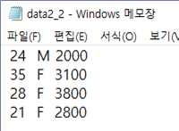
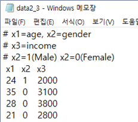
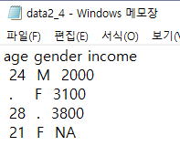
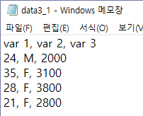
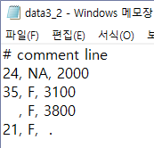
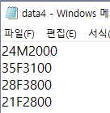
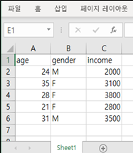
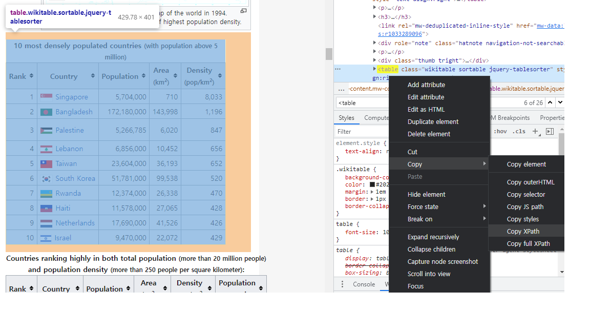

# 데이터 입력

\@ref(data-structure)장에서는 다양한 R 데이터 객체에 대해 살펴보았다.
지금부터는 모든 통계분석 및 그래프 작성의 첫 단계라고 할 수 있는 데이터
입력 방법에 대해 살펴보자. R은 텍스트 파일, 다른 통계 소프트웨어 전용
데이터 파일, Excel 파일 및 HTML 테이블 등 다양한 유형의 데이터 파일을
비교적 간단하게 불러올 수 있다.

## 텍스트 파일 불러오기: 패키지 `readr` 함수의 활용

많은 경우에 데이터 파일은 텍스트 파일의 형태로 저장되어 있다. 통계
데이터 세트는 행과 열의 2차원 형태로 구성되는데, 입력 형식은 매우 다양할
수 있다. 즉, 각각의 자료들이 빈칸으로 구분된 경우, 콤마로 구분된 경우,
고정 포맷 구조로 구성된 경우 등이 있게 된다. 따라서 이렇게 각기 다른
구성 형식의 텍스트 파일을 불러오는데 적합한 함수가 필요한 것이다.

외부 텍스트 파일을 불러오는 작업은 base R 함수인 `read.table()` 또는
`read.csv()`로도 할 수 있으나, 크기가 큰 텍스트 파일을 불러와야 하는
경우에는 시간이 많이 걸린다는 문제가 있다. 이 절에서는 `tidyverse`에
속한 패키지 `readr`의 함수를 사용하여 효율적으로 텍스트 파일을 불러오는
방법을 살펴보겠다. 패키지 `readr`에는 텍스트 파일의 구성 형식에 맞추어
사용할 수 있는 다양한 함수가 마련되어 있다. 각각의 자료들이 하나 이상의
빈 칸으로 구분된 경우에는 `read_table()`, 콤마로 구분된 경우에는 함수
`read_csv()`, 탭으로 구분된 경우에는 함수 `read_tsv()`, 그 외 다른
형태의 구분자로 구분된 경우는 함수 `read_delim()`을 사용할 수 있으며,
고정된 포맷 구조를 갖는 경우에는 함수 `read_fwf`()을 사용하여 자료를
불러올 수 있다.

이 함수들은 불러올 파일의 경로를 포함한 파일 이름이 첫 번째 입력 요소가
된다. 파일 이름이 `.gz` 또는 `.zip` 등으로 끝나는 압축 파일은 자동으로
압축을 해제하고 자료를 불러온다. 또한 `http://`, `https://`, `ftp://`,
`ftps://`로 시작되는 웹 서버에 있는 텍스트 파일도 불러올 수 있다.

### 함수 `read_table()`로 데이터 파일 불러오기

자료들이 하나 이상의 빈칸으로 구분된 경우에는 read_table()를 사용하여
파일을 불러올 수 있다.

1.  데이터 파일의 첫 줄에 변수 이름이 입력되어 있는 경우

예를 들어 `Data` 폴더에 있는 파일 `data2_1.txt`에 세 변수의 자료가
다음과 같이 있다고 하자. 이런 경우에는 함수 `read_table()`에 파일의
위치와 함께 파일의 이름만 입력하면 된다.

{#data2-1}

```{r, message=FALSE}
library(tidyverse)
```

```{r}
read_table("Data/data2_1.txt")
```

패키지 `readr`에 속한 함수들은 각 변수의 유형을 스스로 파악한다. 각
변수마다 처음 1000개의 자료를 읽고 정해진 규칙에 의하여 문자형, 정수형,
숫자형, 논리형 등으로 유형을 결정한다. 스스로 자료의 유형을 파악한
경우에는 각 변수별로 파악된 결과를 출력한다.

각 변수의 유형은 사용자가 직접 선언할 수도 있는데, 가장 간단한 방법은
입력 요소 `col_types`에 변수의 유형을 나타내는 문자를 변수가 입력된
순서대로 나열하여 지정하는 것이다. 자료의 유형을 나타내는 문자에는
`c`(문자형), `i`(정수형), `d`(실수형), `n`(숫자형), `l` (논리형),
`f`(요인), `D`(날짜) 등이 있다. 예를 들어 파일 `data2_1.txt`의 경우에는
다음과 같이 자료의 유형을 선언하여 자료를 불러올 수 있다.

```{r}
read_table("Data/data2_1.txt", 
           col_types = "dcd")
```

2.  데이터만 파일에 입력되어 있는 경우

첫 줄에 변수 이름이 입력되어 있지 않은 데이터 파일도 많이 있다. 예를
들어 `Data` 폴더에 있는 파일 `data2_2.txt`에 세 변수에 대한 데이터가
다음과 같이 있다고 하자.

{#data2-2}

이런 경우에는 입력 요소 `col_names`에 `FALSE`를 지정하거나 변수 이름을
나타내는 문자형 벡터를 지정해야 한다. 아무것도 지정하지 않으면 데이터
파일의 첫 줄에 입력된 자료가 각 변수의 이름으로 사용되는 오류가
발생한다. `FALSE`를 지정한 경우에 변수 이름은 `X1`, `X2`, `X3` 등이
된다.

```{r}
read_table("Data/data2_2.txt", 
           col_names = FALSE)
```

```{r}
read_table("Data/data2_2.txt", 
           col_names = c("age", "gender", "income"))
```

3.  데이터 파일에 주석이 입력된 경우

데이터 파일에 주석이 있는 경우, 해당 행을 무시하기 위해서는 주석이
시작됨을 나타내는 기호를 입력 요소 `comment`에 지정하면 된다. 만일 기호
`#`을 주석 기호로 사용했다면 `comment="#"`을 입력하면 된다. 또한 만일
주석이 데이터 파일의 처음 몇 개 행에 입력되어 있다면, 입력 요소 `skip`을
사용하여 해당되는 처음 몇 개 행을 읽지 않고 그냥 넘기는 방법을 사용할
수도 있다. 예를 들어 `Data` 폴더에 있는 파일 `data2_3.txt`의 처음 세
줄이 다음과 같이 `#` 기호로 시작되는 주석이 입력되어 있다고 하자. 이
파일을 두 가지 방법을 각각 사용하여 불러와 보자.

{#data2-3}

```{r}
read_table("Data/data2_3.txt",
           comment = "#")
```

```{r}
read_table("Data/data2_3.txt", 
           skip = 3)
```

4.  데이터 파일에 결측값이 `NA`가 아닌 다른 기호로 입력된 경우

데이터에 결측값이 있는 것은 당연한 것으로 봐야 한다. R에서는 결측값을
`NA`로 표시하기 때문에 데이터에 결측값이 있다면 해당되는 자리에 `NA`를
입력해야 한다. 그러나 경우에 따라서 결측값이 다른 숫자나 문자 혹은
기호로 데이터 파일에 입력될 수도 있는데, 예를 들어 SAS의 경우 결측값은
점(.)으로 표시한다. 이렇듯 다른 기호로 결측값이 입력된 경우 에는 옵션
`na`에 해당 기호를 지정해 주어야 한다. 만일 결측값이 점(.)으로만
입력되어 있 다면 `na = "."`으로 지정하면 되지만 `NA`와 점(.)이 모두
결측값을 나타내는 기호로 사용되었 다면 `na = c(".", "NA")`로 두 기호를
모두 지정해야 한다. 예를 들어 `Data` 폴더에 있는 `data2_4.txt`에 다음과
같이 `NA`와 점(.)이 모두 결측값을 나타내는 기호로 사용되어 있다고 하자.
이 파일을 옵션 `na`를 사용해서 불러와 보자.

{#data2-4}

```{r}
read_table("Data/data2_4.txt", 
           na = ".")
```

```{r}
read_table("Data/data2_4.txt", 
           na = c(".", "NA"))
```

-   함수 `file.choose()`

외부 파일을 R로 불러오는 과정에서 파일이 저장되어 있는 폴더의 정확한
위치를 잊는 경우가 가끔 있다. 혹은 정확하다고 생각되는 파일의 경로를
입력했는데도 파일을 열 수 없다는 오류가 발생하는 경우도 있다. 이런 경우
굳이 윈도우 파일 탐색기를 이용하여 파일의 위치를 다시 확인하지 않고도
파일에 접근할 수 있는 방법이 있는데 그것은 `file.choose()`를 이용하는
것이다. 예를 들어 함수 `read_table()` 등에 파일의 위치와 더불어 파일
이름을 입력하는 대신 `read_table(file.choose())`를 실행하면 탐색기 창이
나타나서 접근하고자 하는 파일을 쉽게 찾을 수 있다.

### 함수 `read_csv()`로 CSV 데이터 파일 불러오기

CSV(Comma Separated Values) 파일이란 각 자료들이 콤마로 구분된 형식의
데이터 파일을 의미한다. Excel을 포함하는 많은 소프트웨어들이 CSV 형식의
데이터 파일을 읽어 올 수도 있고 작업결과를 CSV 형식으로 저장할 수도 있기
때문에 자주 사용되는 형식의 데이터 파일이라고 하겠다. 예들 들어 `Data`
폴더에 있는 파일 `data3_1.txt`에 자료들이 다음과 같이 콤마로 구분되어
있고, 첫 줄에는 변수 이름이 입력되어 있다고 하자. 이 경우에는
`read_csv()`에 파일의 위치를 포함한 이름을 입력하면 파일을 불러올 수
있다.

{#data3-1}

```{r}
read_csv("Data/data3_1.txt")
```

함수 `read_csv()`로 생성된 `tibble`의 변수 이름이 backtick(\`) 기호로 감싸져 있는 것을 볼 수 있다.
이것은 문자로 시작하지 않거나 중간에 빈칸이 있는 등 R의 전통적인 변수 이름 규칙에 어긋나 변수 
이름으로 사용할 수 없는 문자열을, `tibble`에서는 backtick 기호로 감싸서 정상적인 변수
이름으로 사용하고 있음을 보여주는 것이다. Backtick 기호는 키보드에서 tab
키 바로 위에 있는 것이며, 인용부호와는 다른 기호이다.

함수 `read_table()`에서 살펴보았던 `col_types`, `col_names`, `na`,
`comment`, `skip`은 `read_csv()`에서도 동일하게 작동되는 요소들이다.
예를 들어 `Data` 폴더에 있는 `data3_2.txt`에 다음과 같이 자료가 입력되어
있다고 하자. 첫 줄에 주석이 있고, 결측값이 기호 `NA`와 점(.)으로
표시되어 있으며, 변수 이름은 입력되지 않았다.

{#data3-2}

이제 각 변수의 유형을 스스로 파악하게 해 보자.

```{r, warning=FALSE}
read_csv("Data/data3_2.txt", 
         col_names = FALSE, 
         comment = "#", 
         na = c(".", "NA"))
```

위 실행결과에서 자세하게 살펴볼 두 가지 중요한 사항이 있다. 첫 번째
사항은 CSV 파일에서는 자료를 입력하지 않고 빈칸으로 남겨두면 결측값으로
자동 처리된다는 것이다. 이것은 빈칸으로 남겨져 있는 변수 `X1`의 세 번째
자료가 `NA`로 처리된 것으로 알 수 있다. 각 자료가 콤마로 구분되어 있다는
것은 곧 각 자료의 입력 영역이 확보되어 있다는 것을 의미하기 때문에
빈칸으로 남겨진 영역을 결측값으로 자연스럽게 처리할 수 있는 것이다.

두 번째 사항은 변수 유형 파악에 오류가 발생할 수도 있으니 반드시 결과를
확인해야 한다는 것이다. 위 실행 결과에서 문자형 변수 `X2`의 유형이
논리형으로 파악된 현상이 발생했는데, 이것은 변수 `X2`의 자료가 `NA`와
`F`로만 이루어져 있어서 `F`를 `FALSE`로 인식했기 때문이다. 이런 경우에는
변수 유형을 사용자가 직접 지정해야 한다.

```{r, warning=FALSE}
read_csv("Data/data3_2.txt", 
         col_names = FALSE, 
         col_types = "dcd", 
         comment = "#", 
         na = c(".", "NA"))
```

### 함수 `read_fwf()`로 고정 포맷 구조를 갖는 데이터 파일 불러오기

데이터 파일 중에는 각 자료의 입력 위치가 고정되어 있는 경우가 있다. 예를
들어 `Data` 폴더에 있는 파일 `data4.txt`에 다음과 같은 형식으로 세 변수의
데이터가 입력되어 있다고 하자.

{#data4}

변수 `age`는 1-2열, `gender`는 3열, `income`은 4-7열에 각각 입력되어
있다. 이러한 경우 각 자료들이 빈칸이나 콤마 등으로 구분되어 있어야만
사용할 수 있는 함수 `read_table()` 또는 `read_csv()` 등은 그야말로
무용지물이 된다. 이러한 형식의 파일을 읽기 위해서는 각 자료의 고정된
위치를 지정할 수 있어야 하는데, 함수 `read_fwf()`에 바로 그러한 기능이
있다. 고정된 위치 지정은 입력 요소 `col_positions`에 함수 `fwf_widths`()
또는 `fwf_positions()`를 연결하는 것이다. 각 변수의 자료가 입력되는
영역의 폭으로 위치를 지정하는 것은 `fwf_widths(widths, col_names)`로
하면 되고, 각 변수의 시작 열과 끝 열을 지정해서 자료의 위치를 나타내기
위해서는 `fwf_positions(start, end, col_names)`로 하면 된다. 옵션
`col_names`를 생략하면 변수 이름은 `X1`, `X2`, `X3` 등으로 지정된다.

이제 `data4.txt`를 읽어보자. `fwf_widths()`에 `widths=c(2,1,4)`를 지정하면
첫 번째 변수 `age`는 두 개의 열, 두 번째 변수 `gender`는 한 개의 열,
마지막 변수 `income`은 네 개의 열을 차지하고 있다는 것이다.

```{r}
read_fwf("Data/data4.txt", 
         col_positions = fwf_widths(widths = c(2, 1, 4), 
                                    col_names = c("age", "gender", "income")))
```

`fwf_positions()`에 `start=c(1,3,4)`와 `end=c(2,3,7)`을 지정하면 첫 번째
변수 `age`는 1\~2열에, 두 번째 변수 `gender`는 3열에, 마지막 변수
`income`은 4\~7열에 입력되어 있다는 것을 나타낸다.

```{r}
read_fwf("Data/data4.txt", 
         col_positions = fwf_positions(start = c(1, 3, 4),
                                       end = c(2, 3, 7),
                                       col_names = c("age", "gender", "income")))
```

-   웹 서버에 저장된 2차원 형태의 데이터 파일 직접 불러오기

웹 서버에 저장된 텍스트 파일은 함수 `read_table()` 또는 `read_csv()`
등에 `http://` 또는 `https://`로 시작하는 URL을 지정해서 불러올 수 있다.
예를 들어 [UCI Machine Learning
Repository](https://archive.ics.uci.edu/ml/index.php)라는 사이트가
있는데, 여기에는 Machine Learning으로 분석 가능한 대략 500개 이상의
데이터 세트가 있다. 그 중 `Iris`라는 데이터 세트를 R로 직접 불러와보자.
웹에 있는 데이터를 불러오기 위해서는 데이터 파일의 URL과 자료의 저장
형태를 파악해야 한다. `Iris` 데이터 세트의 URL은
`https://archive. ics.uci.edu/ml/machine-learning-databases/iris/iris.data`이며,
파일 형태는 자료들이 콤마로 구분된 CSV 파일이고, 변수 이름이 입력되어
있지 않은 상태이다. 이제 파악된 URL을 함수 `read_csv()`에 입력하여 웹
데이터를 직접 불러보자.

```{r, message=FALSE}
iris.url <- "https://archive.ics.uci.edu/ml/machine-learning-databases/iris/iris.data"
read_csv(iris.url,
         col_names=c("S.length","S.width","P.length","P.width","Species"))
```

-   RStudio 메뉴에서 불러오기

외부 텍스트 파일을 불러오는 작업은 RStudio의 메뉴를 이용해서도 할 수
있다. 메인 메뉴 에서 `File > Import Dataset > From Text (readr)…` 을
선택하면 나타나는 별도의 창에서 필요한 사항을 선택하면 `read_table()`
혹은 `read_csv()` 등을 사용하여 파일을 불러오게 된다. 만일 base R 함수인
`read.table()` 혹은 `read.csv()` 등을 이용하고자 한다면
`File > Import Dataset > From Text (base)…`을 선택해서 불러올 수 있다.
또한 다음 절에서 살펴볼 Excel 파일이나, SAS 데이터 파일 등을 불러오는
작업도 `File > Import Dataset`의 하부 메뉴를 이용해서 할 수 있다.

-   데이터 프레임을 외부 텍스트 파일로 저장하기

R에서 생성되고 수정된 데이터 프레임을 외부 텍스트 파일로 저장시켜 다른
소프트웨어에서도 사용할 수 있도록 하는 것도 중요한 작업이다. 데이터
프레임을 외부 텍스트 파일로 저장하는 작업은 자료들을 어떤 기호로 구분할
것인지에 따라 패키지 `readr`의 함수 `write_delim()`, `write_csv()` 또는
`write_tsv()` 등을 사용할 수 있다. 자료들을 빈칸으로 구분하려면
`write_delim()`, 콤마로 구분하려면 `write_csv()`, 탭으로 구분하려면
`write_tsv()`를 사용하면 된다. 데이터 프레임을 외부 텍스트 파일로
저장하는 작업은 `write.csv()`와 같은 base R 함수로도 할 수 있다. Base
R의 함수들은 데이터 프레임의 행 이름을 텍스트 파일의 첫 번째 열에
배치하고, 모든 문자 및 변수 이름에 인용부호를 붙이는 것이 디폴트인
반면에 패키지 `readr`의 함수들은 데이터 프레임의 행 이름을 절대 저장하지
않으며 인용 부호는 필요한 경우에만 사용된다. 또한 패키지 `readr`의
함수들의 실행 속도가 2배 정도 빠른 것으로 되어 있다.

Base 패키지인 `datasets`에 있는 데이터 프레임 `women`은 30대 미국 여성
15명의 몸무게와 키가 측정되어 있는 데이터 세트이다. 키는 인치 단위,
몸무게는 파운드 단위로 측정되었다. 데이터 프레임 `women`을 `Data` 폴더에
텍스트 파일로 저장하기 위해 다음 프로그램을 각각 실행해 보고 생성되는
텍스트 파일을 확인하기 바란다.

```{r, eval=FALSE}
write_delim(women, "Data/women.txt")
write_csv(women, "Data/women.csv")
write_tsv(women, "Data/women.tsv")
```

## Excel 파일 불러오기

Excel에서 데이터를 만들고 가공하는 경우가 많기 때문에 Excel
스프레드시트에 있는 데이터를 R로 불러오는 것은 상당히 중요한 작업이
된다. 이 절에서는 패키지 `xlsx`의 함수 `read.xlsx()`와 패키지 `readxl`의
함수 `read_excel()`을 사용하여, Excel 파일을 R로 불러오는 방법에 대하여
알아볼 것이다 예제 데이터로 `Data` 폴더에 있는 `data5.xlsx`에 다음과 같이
자료가 입력되어 있다고 하자. 자료는 첫 번째 시트에 입력되어 있다.

{#data5}

-   패키지 `xlsx`의 함수 `read.xlsx()`로 Excel 파일 불러오기

함수 `read.xlsx()`에는 입력할 데이터가 있는 시트의 번호를 `sheetIndex`에
지정해야 한다.

```{r}
library(xlsx)
read.xlsx("Data/data5.xlsx", sheetIndex = 1)
```

함수 `read.xlsx()`는 `tidyverse`에 속한 함수가 아니어서, 이 함수로 생성된
객체는 전통적인 데이터 프레임이 됨을 알 수 있다. 만일 전체 스프레드시트
중 일부분만을 입력하고자 한다면 `rowIndex`와 `colIndex`에 입력할 행과
열의 번호를 지정하면 된다.

```{r}
read.xlsx("Data/data5.xlsx", sheetIndex = 1,
          rowIndex = 1:5, colIndex = 1:2)
```

-   패키지 `readxl`의 함수 `read_excel()`로 Excel 파일 불러오기

함수 `read_excel()`은 Excel 2003 이하 버전의 파일 형식인 xls 파일과
Excel 2007 이상 버전의 파일 형식인 xlsx 파일을 모두 불러올 수 있다. 또한
입력할 데이터가 있는 시트 번호를 지정하지 않으면, 디폴트로 첫 번째
시트의 데이터를 입력한다. 만일 다른 시트의 데이터를 입력하고자 한다면,
옵션 `sheet`에 시트 번호를 지정하면 된다.

```{r}
library(readxl)
read_excel("Data/data5.xlsx")
```

시트의 전체 데이터 중 일부분만을 입력하고자 한다면, 옵션 `range`에
입력하고자 하는 데이터 범위 사각형의 왼쪽 위 모서리와 오른쪽 아래
모서리의 셀 번호를 지정하면 된다.

```{r}
read_excel("Data/data5.xlsx", range = "A1:B5")
```

-   Excel 파일을 CSV 파일로 전환한 후 불러오기

앞에서 소개한 두 함수 중 어떤 함수를 사용하든지 Excel 파일을 R로
불러오는 데에는 큰 문제가 없겠지만, 어떤 이유로 해서 Excel 파일을 직접
R로 불러올 수 없는 경우에 대안으로 사용할 수 있는 방법이다. Excel 파일을
CSV 파일로 전환하여 저장하는 방법은 Excel의 메인 메뉴에서
`파일 > 다른 이름으로 저장`을 선택한 후 CSV 파일 형식으로 저장하면 된다.
저장된 CSV 파일은 함수 `read_csv()`로 불러올 수 있다.

-   함수 `write.xlsx()`를 사용하여 데이터 프레임을 Excel 파일로 저장하기

데이터 프레임을 Excel 파일로 저장하는 것은 패키지 `xlsx`에 있는 함수
`write.xlsx()`를 사용하면 된다. 예를 들어 데이터 프레임 `women`을 `Data`
폴더에 `women.xlsx`로 저장해보자.

```{r, eval = FALSE}
library(xlsx)
write.xlsx(women, "Data/women.xlsx", row.names = FALSE)
```

## SAS 데이터 파일 불러오기

SAS는 범용 통계 소프트웨어로서 매우 두터운 사용자 층을 형성하고 있다.
따라서 SAS 전용 데이터 파일을 R로 불러오는 것도 중요한 작업이다. SAS
전용 데이터 파일을 R로 직접 불러오는 방법을 알아보자.

-   패키지 `haven`의 함수 `read_sas()`로 SAS 전용 데이터 파일 불러오기

예를 들어 `Data` 폴더에 다음의 SAS 명령문으로 생성된 데이터 파일
`data6.sas7bdat`가 있다고 하자.

```{sas, eval = FALSE, prompt = FALSE}
LIBNAME mysas 'D:\Data';

DATA mysas.data6;
INPUT age gender $ income;
CARDS;
24 M 2000
35 F 3100
28 F 3800
21 F 3500
31 M 3500
RUN;
```

패키지 `haven`도 `tidyverse` 계열에 속하는 패키지이므로, 함수
`read_sas()`은 tibble을 생성한다.

```{r}
library(haven)
read_sas("Data/data6.sas7bdat")
```

-   SAS 전용 데이터 파일을 CSV 파일로 전환한 후 불러오기

SAS 전용 데이터 파일은 SAS의 PROC EXPORT를 사용하여 CSV 파일로 전환하여
저장할 수 있다. Excel의 경우처럼 R로 직접 불러오는 방법에 대한 대안으로
사용할 수 있다. SAS 전용 데이터 파일인 `data6.sas7bdat`을 CSV 파일인
`data6.csv`로 출력하는 SAS 명령문은 다음과 같다.

```{sas, eval = FALSE, prompt = FALSE}
LIBNAME mysas 'D:\Data';

PROC EXPORT DATA=mysas.data6
      OUTFILE='D:\Data\data6.csv'
      DBMS=CSV;
RUN;
```

패키지 `haven`에는 SPSS 데이터 파일과 Stata 데이터 파일을 불러올 수 있는
함수도 있다. SPSS 데이터 파일은 `read_spss()`, Stata DTA 파일은
`read_stata()`를 사용하면 어렵지 않게 불러올 수 있다.

## HTML 테이블 불러오기

웹 페이지를 보다 보면 중요한 정보가 있는 HTML 테이블을 자주 만나게
되는데, 이 테이블에 있는 데이터를 R로 바로 불러들일 수 있다면 분석
과정에 큰 도움이 될 것이다. 문제는 웹 페이지에 있는 HTML 테이블이라는
것이 사람들에게 시각적으로 보여지는 측면이 강조되는 대상이어서 거기에
있는 정보를 '긁어모아' 컴퓨터에 입력하는 것이 조금 복잡한 작업이 될 수
있다는 점이다. 그러나 패키지 `rvest`를 이용하면 비교적 간편하게 HTML
테이블의 데이터를 긁어모아 R에 입력시킬 수 있다.

패키지 `rvest`에서 HTML 테이블을 불러오는데 필요한 함수는
`read_html()`과 `html_nodes()`, `html_table()`이다. 함수 `read_html()`은
원하는 HTML 테이블이 있는 웹 페이지를 읽어오는 데 사용된다. HTML
테이블의 내용은 `<table>` 태그 사이에 존재하기 때문에 `<table>`
노드(node)를 찾는 것이 다음 순서인데, 이 작업은 함수 `html_nodes()`로 할
수 있다. 이어서 선택된 노드의 HTML 테이블 데이터를 R로 불러오는 작업은
함수 `html_table()`로 하게 된다.

-   예제 1: Wikipedia 웹 페이지에 있는 HTML 테이블 데이터 불러오기

Figure \@ref(fig:wiki)은 [Wikipedia](https://en.wikipedia.org/wiki)에서
"World population"을 검색하면 열리는 웹 페이지에 있는 "10 most densely
populated countries"라는 제목의 HTML 테이블을 보여주고 있다. 검색은
2022년 2월 9일에 실시된 것을 바탕으로 하고 있으며, 차후에 HTML 테이블의
배치가 변경되면 아래 예제 프로그램도 적절히 변경해야 할 것이다.

```{r wiki, fig.cap='예제 1에서 사용된 HTML 테이블', echo=FALSE}
knitr::include_graphics("Figure/wiki_22_02_09_1.png")

```

원하는 웹 페이지의 URL을 함수 `read_html()`에 입력하여 얻은 결과에서
`table` 노드를 함수 `html_nodes()`로 찾아보자. 함수 `html_nodes()`는
결과를 리스트 형태로 출력한다. 모두 26개의 `table` 노드가 발견되었고, 그
중 처음 6개의 내용을 출력해 보자.

```{r, message=FALSE}
library(rvest)
URL <- "https://en.wikipedia.org/wiki/World_population"
web <- read_html(URL)
tbl <- html_nodes(web, "table")
length(tbl)
head(tbl)
```

함수 `html_nodes()`의 결과로 생성된 리스트 객체인 tbl의 26개 구성요소 중
우리가 원하는 HTML 테이블에 해당되는 노드를 찾아서 함수 `html_table()`에
입력하면, 해당 테이블 데이터가 R로 입력된다. 문제는 몇 번째 노드가
우리가 원하는 테이블에 관한 것인지 알기가 어렵다는 점이다. 시행착오를
거치면, 원하는 테이블이 6번째 노드에 있다는 것을 알 수 있고, 따라서
`html_table(tbl[6])`을 실행하면 테이블의 데이터를 불러올 수 있다. 그러나
HTML 테이블이 많은 웹 페이지에서는 다른 체계적인 방법이 필요할 것이다.

```{r}
html_table(tbl[6])
```

웹 페이지에서 HTML 테이블을 체계적으로 찾는 방법 중 하나는 해당 테이블
노드의 XPath를 알아내는 것이다. XPath는 웹 문서에서 원하는 태그나 속성
등을 쉽게 찾기 위해 개발된 것으로 윈도우의 파일 경로와 비슷한 개념이라고
하겠다.

크롬 웹 브라우저를 대상으로 웹 페이지에서 원하는 HTML 테이블의 XPath를
알아내는 방법은 다음과 같다.

1.  원하는 웹 페이지로 이동
2.  F12 키를 눌러서(또는 `마우스 오른쪽 버튼 클릭 > 검사 클릭`) 개발자
    도구 실행. 창이 분리되며 오른쪽 창에 html 코드가 나타남.
3.  Ctrl + F 키를 눌러서 나타난 찾기 창에 `<table`을 입력하고 찾기 실행
4.  원하는 테이블에 해당되는 노드를 찾게 되면 Figure
    \@ref(fig:wiki2)에서와 같이 테이블이 하이라이트가 된다. 이어서
    마우스 오른쪽 버튼을 클릭
5.  나타난 별도 메뉴에서 `Copy > Copy XPath`를 클릭

```{r wiki2, fig.cap='예제 1의 HTML 테이블 XPath 복사', echo=FALSE}

```

원하는 HTML 테이블의 XPath의 값은
`//*[@id="mw-content-text"]/div[1]/table[5]`이 되 며, 이것을 함수
`html_nodes()`안에 옵션 `xpath`에 지정하면 된다.

```{r}
X_path <- '//*[@id="mw-content-text"]/div[1]/table[5]'
node_1 <- html_nodes(web, xpath = X_path)
tbl_1 <- html_table(node_1)
tbl_1
```

함수 `html_table()`로 생성된 객체 `tbl_1`은 하나의 데이터 프레임으로
구성된 리스트이다. 변수 이름을 수정하고 입력된 자료를 출력해 보자..

```{r}
top_pop <- tbl_1[[1]]
names(top_pop) <- c("rank", "country", "pop", "area", "density")
top_pop
```

변수 `pop`, `area`, `density`이 숫자가 아닌 문자형 벡터로 입력되었음을
알 수 있다. 이것은 숫자에 콤마가 함께 입력되어 있기 때문인데, 이제 변수
`pop`을 숫자형으로 변환하여 평균을 구해 보자. 숫자형으로 변환하는 방법은
`pop`에 포함된 콤마를 함수 `gsub()`를 사용하여 제거하고, 이어서 함수
`as.numeric()`을 사용하여 유형을 숫자형으로 변환하면 된다.

```{r}
pop <- top_pop$pop
pop <- gsub(",", "", pop)
mean(as.numeric(pop))
```

-   예제 2: KBO 홈페이지 기록실에 있는 자료 불러오기

[KBO 홈페이지의 기록실](https://www.koreabaseball.com/Record/Team/Hitter/Basic1.aspx)에
있는 자료를 불러와 보자. 자료를 불러온 시점은 2022년 2월이며, 내용은
2021년 KBO 정규 시즌 중 타자들의 팀 기록이다. 불러오고자 하는 HTML
테이블은 Figure \@ref(fig:KBO)에서 볼 수 있다. 해당 웹 페이지에는 하나의
HTML 테이블만이 있기 때문에 굳이 XPath를 복사해야 할 필요는 없다. 문제는
한글이 포함된 HTML 테이블을 불러올 때 종종 오류가 발생할 수 있다는
점이다. 이러한 오류를 어떻게 해결할 수 있는지 살펴보자.

```{r KBO, fig.cap='예제 2에서 사용된 HTML 테이블', echo=FALSE}
knitr::include_graphics("Figure/KBO.png")
```

```{r, error=TRUE}
URL_2 <- "https://www.koreabaseball.com/Record/Team/Hitter/Basic1.aspx"
web_2 <- read_html(URL_2)
node_2 <- html_nodes(web_2, "table")
tbl_2 <- html_table(node_2)[[1]]
```

함수 `html_table()`에서 발생한 오류는 한글/영문의 locale로 인한 것이다.
우선 locale을 영문으로 바꾸고, 다시 함수 `html_table()`을 실행시켜 보자.

```{r}
Sys.setlocale("LC_ALL", "English")
tbl_2 <- html_table(node_2)[[1]]
head(tbl_2)
```

오류문제는 해결되었으나, 불러온 데이터에 이상한 문자가 포함되어 있음을
알 수 있다. 이것을 정상적인 한글로 보이게 하려면, 다시 locale을 한글로
바꾸면 된다. 이어서 합계가 들어간 마지막 행을 삭제하고, 결과를 출력해
보자.

```{r}
Sys.setlocale("LC_ALL", "Korean")
tbl_2 <- tbl_2[-11,]
tbl_2
```

일반적으로 웹 페이지에 있는 HTML 테이블을 R로 불러온 후에도 실제 분석
데이터로 사용하기 위해서는 많은 추가 작업이 필요하게 된다.
