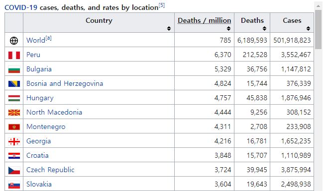

# `dplyr`에 의한 데이터 다듬기

R에 입력된 데이터 세트는 대부분의 경우 바로 통계분석이 가능한 상태가 아니다. 분석에 필요한 적절한 변수가 없거나, 특정 조건을 만족하는 자료만을 선택해야 하거나, 자료의 순서를 바꿔야 하거나, 그룹별로 자료를 합치거나 또는 나눠야 하는 등등의 작업이 필요한 경우가 대부분이다. 이러한 데이터 다듬기는 최적의 통계 예측모형 적합 등을 위해 반드시 필요한 절차이지만, 시간이 매우 많이 소요되는 힘든 작업이다. 따라서 일관된 법칙에 따라 편리하고 효율적으로 적용할 수 있는 데이터 다듬기 기법이 절실하게 필요한 상황이라고 하겠다.

통계 데이터 세트는 변수가 열, 관찰값이 행을 이루고 있는 2차원 구조를 가지고 있으며 데이터 프레임으로 입력된다. 이 장에서 살펴볼 내용은 패키지 `dplyr`에서 수행할 수 있는 다양한 데이터 프레임 다듬기 기법이다. 먼저 데이터 프레임 다듬기 작업에 사용되는 매우 중요하면서도 기본적인 `dplyr` 함수들을 살펴볼 것이다. 이어서 이러한 기본 `dplyr` 함수들 이 그룹으로 구분된 데이터에 대해서는 어떻게 작용을 하는지 살펴볼 것이며, 여러 개의 변수들을 대상으로 반복적으로 실행해야 하는 동일한 작업을 함수 `across()`를 이용하면 얼마나 간편하게 할 수 있는지를 살펴볼 것이다. 또한 행 단위로 작업이 이루어져야 하는 경우에 함수 `rowwise()`가 어떤 역할을 하는지도 살펴볼 것이다.

기본 `dplyr` 함수들은 세 가지 그룹으로 나누어 볼 수 있다. 함수 `filter()`, `slice()`, `arrange()`, `distinct()`와 같이 데이터 프레임의 행을 작업 대상으로 하는 함수가 있고, 함수 `select()`, `rename()`, `mutate()`, `relocate()`와 같이 열을 대상으로 작업을 하는 함수가 있으며, 요약 통계량을 계산하는 함수 `summarise()`가 있다.

기본 `dplyr` 함수들이 공통으로 갖고 있는 특징은 데이터 프레임(또는 tibble)이 함수들의 첫 번째 입력요소라는 것이다. 두 번째 특징은 각 함수 안에서 입력된 데이터 프레임의 변수를 인덱싱 기호(`$`) 없이 사용할 수 있다는 것이다. 마지막 특징은 이 함수들이 생성하는 결과는 또 다른 데이터 프레임(또는 tibble)이라는 것이다. 기본 함수들이 갖고 있는 이러한 특징을 이용해서 조금 더 효율적인 프로그램이 가능하도록 `dplyr`에서는 pipe 기능을 사용하도록 하자.

-   Pipe 기능

Pipe 기능이란 한 명령문의 결과물을 바로 다음 명령문의 입력 요소로 직접 사용할 수 있도록 명령문들을 서로 연결하는 기능을 의미한다. 이것이 가능하다면, 분석 중간 단계로 생성되는 무수한 객체들을 따로 저장할 필요가 없기 때문에 프로그램 자체가 매우 깔끔하게 정리되며, 분석 흐름을 쉽게 이해할 수 있게 된다. Pipe 연산자 `%>%`는 `tidyverse`에 속한 패키지인 `magrittr`에서 정의된 것으로 `tidyverse`에 속한 다른 패키지에서도 사용이 가능하다. RStudio에서 pipe 연산자 `%>%`의 입력은 `Shift+Ctrl+M` 키를 함께 누르면 된다.

기본적인 형태는 `lhs %>% rhs`인데, `lhs`는 데이터 객체이거나 데이터 객체를 생성하는 함수가 되고, `rhs`는 `lhs`를 입력 요소로 하는 함수가 된다. 예를 들어 `x %>% f()`는 객체 `x`를 함수 `f()`의 입력 요소로 하는 `f(x)`를 의미한다. 만일 `rhs`에 다른 요소가 있다면 `lhs`는 `rhs`의 첫 번째 입력 요소가 된다. 따라서 `x %>% f(y)`는 `f(x,y)`를 의미한다. 만일 `lhs`가 `rhs`의 첫 번째 요소가 아닌 경우에는 원하는 위치에 점(.)을 찍어야 한다. 예를 들어, `x %>% f(y,.)`은 `f(y,x)`를 의미한다.

Base R에도 R 버전 4.1.0부터 pipe 연산자 `|>`가 도입되었다.
패키지 `tidyverse`를 불러오지 않아도 사용할 수 있다는 것이 장점으로 볼 수 있는 연산자이다. 
사용법은 `lhs |> rhs`이며, `lhs`와 `rhs`의 의미는 `%>%`의 경우와 같다.
RStudio의 메뉴 `Tools > Global Options...`에서 `Use native pipe operator, |>`를 선택하면, `Shift+Ctrl+M` 키를 단축키로 사용할 수 있다.

앞으로 이 책에서는 두 pipe 연산자를 혼용해서 사용하도록 하겠다. 


## 행을 작업 대상으로 하는 함수

### 조건에 의한 행 선택: `filter()`

함수 `filter()`를 이용하면, 주어진 데이터 프레임에서 특정한 조건을 만족하는 행을 선택 할 수 있다. 조건을 설정할 때는 비교 연산자(`>, >=, <, <=, !=, ==`)와 논리 연산자(`&, |, !`)가 사용되며, 연산자 `%in%`이 매우 유용하게 사용된다. 예제를 통해 자세한 사용법을 확인해 보자.

-   예제: `mtcars`

변수 `mpg`의 값이 30 이상인 자동차를 선택해 보자. 함수 `filter()`에 전통적인 데이터 프레임을 입력하면 결과로 전통적인 데이터 프레임이 출력되고, tibble을 입력하면 결과가 tibble로 출력된다. 데이터 프레임 `mtcars`를 tibble로 전환하고 선택 조건과 더불어 함수 `filter()`에 입력해 보자.

```{r}
library(tidyverse)
```

```{r}
mtcars_t <- as_tibble(mtcars)
mtcars_t |> 
  filter(mpg >= 30)
```

변수 `mpg`의 값이 30 이상이고 변수 wt의 값이 1.8 미만인 자동차를 선택해 보자. 함수 `filter()`에서는 콤마(`,`)가 논리 연산자 `&` 와 같은 기능을 갖고 있다.

```{r}
mtcars_t |>  
  filter(mpg >= 30, wt < 1.8)
```

변수 `mpg`의 값이 30 이하이고, 변수 `cyl`의 값이 6 또는 8이며, 변수 `am`의 값이 1인 자동차를 선택해 보자. 이 경우에, 변수 `cyl`의 값이 6 또는 8인 사건에 대하여 논리 연산자를 사용해서 `cyl == 6|cyl == 8`으로 조건을 설정하는 것보다는, `cyl %in% c(6,8)`로 쓰는 것이 훨씬 간단한 방법이 된다.

```{r}
mtcars_t |>  
  filter(mpg <= 30, cyl %in% c(6,8), am == 1)
```

변수 `mpg`의 값이 `mpg`의 중앙값과 $Q_{3}$ 사이에 있는 자동차를 선택해 보자. 여기서 $Q_{3}$는 0.75분위수를 의미하는 것으로서, $p$ 분위수란 전체 데이터 중 $(100 \times p)$% 데이터보다는 크고, 나머지 $(100 \times (1-p))$% 데이터보다는 작은 수를 의미한다. 분위수의 계산은 함수 `quantile()`로 하는데, 벡터 `x`의 0.75분위수의 계산은 `quantile(x, probs = 0.75)`로 할 수 있다.

```{r}
mtcars_t |>  
  filter(
    mpg >= median(mpg), mpg <= quantile(mpg, probs = 0.75)
  )
```

벡터 `x`가 특정 두 숫자 사이에 있는지를 확인하는 방법은 `x >= left & x <= right`가 되는데, 이것을 함수 `between()`을 이용해서 `between(x, left, right)`로 할 수 있다.

```{r}
between(1:5, 2, 4)
```

따라서 위 예제는 다음과 같이 실행해도 동일한 결과를 얻는다.

```{r}
mtcars_t |>  
  filter(
    between(mpg, median(mpg), quantile(mpg, probs = 0.75))
    )
```

-   예제: `airquality`

데이터 프레임 `airquality`는 1973년 5월부터 9월까지 미국 뉴욕시의 공기의 질과 관련된 조사 결과를 담은 데이터 세트이다. `airs`라는 이름의 tibble로 전환하고, 처음 5개 케이스를 출력해 보자.

```{r}
airs <- as_tibble(airquality) %>% 
  print(n = 5)
```

변수 `Ozone` 또는 `Solar.R`이 결측값인 행을 선택해 보자. 결측값의 확인은 함수 `is.na()`로 할 수 있다.

```{r}
airs %>% 
  filter(is.na(Ozone) | is.na(Solar.R)) %>% 
  print(n = 5)
```

### 위치에 의한 행 선택: `slice()` 및 그와 관련된 함수

위치에 의한 행 선택이란 데이터 프레임에서 선택하고자 하는 행 번호를 지정해서 선택하는 것을 의미한다.

-   함수 `slice()`에 의한 행 선택

함수 `slice()`에는 행의 번호를 직접 지정해서 특정 행을 선택하거나 제거할 수 있다. 양의 정수를 입력하면 해당 위치의 행이 선택되고, 음의 정수를 입력하면 해당 위치의 행이 제거된다. 입력되는 정수는 모두 양수이거나 모두 음수이어야 한다. 데이터 프레임 `iris`를 tibble로 전환하고 5번째 행부터 10번째 행까지 선택해 보자.

```{r}
iris_t <- as_tibble(iris)
iris_t |>  
  slice(5:10)
```

이번에는 5번째 행부터 10번째 행을 제거해 보자.

```{r}
iris_t |>  
  slice(-(5:10)) |>  
  print(n = 3)
```

이번에는 `iris`의 마지막 행을 선택해 보자. 이 경우 유용하게 사용될 함수가 `n()`이다. 이 함수는 데이터 프레임의 행의 개수를 세는 함수로서 단독으로는 사용될 수 없고 `dplyr` 기본 함수들과 함께 사용되어야 한다.

```{r}
iris_t |>  
  slice(n())
```

-   함수 `slice_head()`와 `slice_tail()`에 의한 행 선택

데이터 프레임의 처음 몇 개 행을 선택하거나 마지막 몇 개 행을 선택하고자 할 때 사용되는 함수이다. 행의 개수를 지정하는 경우에는 `n`을 사용하고 행의 비율을 지정하는 경우에 는 `prop`를 사용하면 된다. 데이터 프레임 `iris`의 처음 3개 행과 마지막 3개 행을 각각 선택해 보자.

```{r}
iris_t |>  
  slice_head(n = 3)
```

```{r}
iris_t |>  
  slice_tail(n = 3)
```

-   함수 `slice_sample()`에 의한 행 선택

데이터 프레임의 일부 행을 단순임의추출방법으로 선택할 때 사용되는 함수이다. 행의 개수를 지정해서 추출하는 경우에는 `n`을 사용하고, 행의 비율을 지정해서 추출하는 경우에는 `prop`를 사용하면 된다. 두 함수 모두 비복원추출이 디폴트로 적용되며, 만일 복원추출을 원한다면, `replace=TRUE`를 입력하면 된다. 데이터 프레임 `iris`에서 3개 행을 임의추출해 보자. 

```{r}
iris_t |>  
  slice_sample(n = 3)
```

전체 행 중 2%의 행을 비복원추출로 선택해 보자. 

```{r}
iris_t |>  
  slice_sample(prop = 0.02)
```

이번에는 전체 행 중 2%의 행을 복원추출로 선택해 보자. 

```{r}
iris_t |>  
  slice_sample(prop = 0.02, replace = TRUE)
```

-   함수 `slice_max()`와 `slice_min()`에 의한 행 선택

특정 변수가 가장 큰 값을 갖거나 혹은 가장 작은 값을 갖는 행을 선택할 때 사용되는 함수이다. 기준으로 사용할 변수를 입력하고 이어서 행의 개수를 지정하는 경우에는 `n`을, 행의 비율을 지정하는 경우에는 `prop`를 입력하면 된다. 데이터 프레임 `iris`에서 변수 `Sepal.Width`의 값이 가장 큰 두 개 행을 선택해 보자.

```{r}
iris_t |>  
  slice_max(Sepal.Width, n = 2)
```

이번에는 `Petal.Length`의 값이 가장 작은 두 개 행을 선택해 보자.

```{r}
iris_t |>  
  slice_min(Petal.Length, n = 2)
```

### 행의 정렬: `arrange()`

함수 `arrange()`는 특정 변수를 기준으로 데이터 프레임의 행을 재배열할 때 사용된다. 함수에는 정렬의 기준이 되는 변수를 입력하면 되는데, 2개 이상의 정렬 기준 변수를 입력하게 되면 추가된 변수는 앞선 변수가 같은 값을 갖는 행들의 정렬 기준으로 사용된다. 정렬은 오름차순이 디폴트이며, 내림차순으로 배열하고자 할 때에는 기준 변수를 함수 `desc()`와 함께 사용해야 한다.

-   예제: `mtcars`

데이터 프레임 `mtcars`를 tibble로 전환하고 변수 `mpg`의 값이 가장 좋지 않은 자동차부터 시작해서 더 좋아지는 순서로 다시 배열해 보자. 연비가 좋지 않다는 것은 연비가 낮다는 것을 의미하는 것이므로 변수 `mpg`를 오름차순 정렬 변수로 사용하면 된다.

```{r}
mtcars_t <- as_tibble(mtcars)
mtcars_t |>  
  arrange(mpg) |>  
  print(n = 5)
```

데이터 프레임 `mtcars_t`를 변수 `mpg`의 값이 가장 좋지 않은 자동차부터 시작해서 더 좋아지는 순서로 다시 배열을 하되, `mpg` 값이 같은 자동차의 경우에는 변수 `wt`의 값이 높은 자동차부터 배열해 보자. 변수 `wt`를 두 번째 정렬 기준 변수로 입력하되, 내림차순 정렬이 필요하므로 함수 `desc()`를 이용한다.

```{r}
mtcars_t |>  
  arrange(mpg, desc(wt)) |>  
  print(n = 5)
```

-   예제: `airquality`

데이터 프레임 `airquality`를 tibble로 전환하고, 5월 1일부터 5월 10일까지의 자료만을 대상으로 변수 `Ozone`의 값이 가장 낮았던 날부터 다시 배열해 보자.

```{r}
airs_1 <- as_tibble(airquality) |>   
  filter(Month == 5, Day <= 10) 
```

```{r}
airs_1 |> 
  arrange(Ozone)
```

위의 정렬 결과를 보면 변수 `Ozone`이 결측값인 행이 가장 뒤로 배열되어 있다. 이것이 문제는 아니지만, 어떤 경우에는 결측값인 행을 가장 앞으로 배열하는 것이 필요할 때도 있다. 데이터 프레임 `airs_1`을 변수 `Ozone`이 결측값인 행부터 다시 배열해 보자. 이것은 배열 기준으로 논리형 벡터를 사용해야 되는 문제인데, `TRUE`와 `FALSE`의 배열에서 `FALSE`가 우선 순위에 있기 때문에 `!is.na(Ozone)`을 배열 기준으로 사용하면 된다.

```{r}
airs_1 |>  
  arrange(!is.na(Ozone))
```

이번에는 데이터 프레임 `airs_1`을 변수 `Ozone`의 값이 가장 높은 날부터 다시 배열하되 결측값이 있는 행을 가장 앞으로 배열해 보자. 이때는 `!is.na(Ozone)`을 첫 번째 배열 기준으로 하여 결측값이 있는 행을 가장 앞으로 배치하고, `desc(Ozone)`을 두 번째 배열 기준으로 입력해서 결측값이 아닌 행들을 변수 `Ozone`의 내림차순으로 다시 배열해야 된다.

```{r}
airs_1 |>  
  arrange(!is.na(Ozone), desc(Ozone))
```

### 중복된 행의 제거: `distinct()`

함수 `distinct()`는 중복 입력된 행을 제거해서, 서로 다른 값을 갖고 있는 행만 선택할 때 사용되는 함수이다.
따라서 함수에는 중복 여부를 결정할 변수를 입력해야 되는데, 입력한 변수가 없다면 모든 변수들을 대상으로 중복 여부를 결정한다. 
함수 `distinct()`로 생성되는 데이터 프레임은 중복 여부를 확인하기 위해서 입력한 변수만 유지되는데, 옵션 `.keep_all=TRUE`가 지정되면 다른 모든 변수도 유지된다. 
다만, 이 경우에는 중복된 행 중 첫 번째 행이 선택된다. 

단순한 형태의 데이터 프레임으로 함수 `distinct()`의 작동 방식을 살펴보자.

```{r}
df1 <- tibble(id = rep(1:3, times = 2:4), 
              x1 = c(1:2, 1:3, 1:4))
df1
```

변수 `id`가 중복되지 않은 행들을 선택해 보자. 

```{r}
df1 |> 
  distinct(id)
```

변수 `id`만 있는 데이터 프레임이 생성되는 것을 알 수 있다. 
옵션 `.keep_all=TRUE`를 추가하면, 변수 `x1`도 유지되는데,
중복된 행 중에 처음 나타난 행이 선택됨을 알 수 있다.

```{r}
df1 |>  
  distinct(id, .keep_all = TRUE)
```

변수 `id`가 중복된 행 중에 첫 번째 위치한 행이 아닌, 변수 `x1`이 가장 큰 값을 갖는 행을 선택해 보자. 이 문제는 변수 `id`가 중복된 행들을 변수 `x1`의 내림차순으로 정렬한 데이터 프레임을 대상으로 중복된 행을 제거하면 된다.

```{r}
df1 |>  
  arrange(id, desc(x1)) |>  
  distinct(id, .keep_all = TRUE)
```

함수 `distinct()`로 모든 변수의 값이 중복된 행을 제거하는 예제를 살펴보자.

```{r}
df2 <- tibble(id = rep(1:3, each = 2), 
              x1 = c(2, 2, 3, 1, 4, 4))
df2
```

```{r}
df2 |>  
  distinct()
```


## 열을 작업 대상으로 하는 함수

### 열의 선택: `select()`

데이터 세트의 크기가 커짐에 따라 변수의 개수가 수백 또는 수천이 되는 경우를 접하는 것이 더 이상 드문 상황은 아니다. 이러한 경우, 분석에 필요한 변수를 선택하여 데이터 세트의 크기를 줄이는 것은 매우 중요한 작업이 된다. 함수 `select()`에서는 패키지 `tidyselect`에 의해 구현되는 효과적인 변수 선택 방법을 이용할 수 있다. 여기에서 작동되는 `<tidy-select>` 방식은 기본적으로 변수들의 집합을 구성하는 것으로 생각하면 된다. 구체적인 선택 방법은 열 번호 또는 열 이름에 의한 방법과 변수의 유형에 의한 방법, 그리고 변 수 선택과 관련된 몇몇 함수들을 이용하는 방법으로 구분할 수 있다.

1.  열 번호(또는 열 이름)에 의한 선택

가장 기본적인 방법은 열 번호를 콤마로 구분하여 나열하는 것이다. 
연속된 열 변호는 콜론(:) 연산자를 이용해서 나타낼 수 있다.

데이터 프레임 `mtcars`의 행 이름을 변수 `row.name`으로 추가하고 tibble로 전환해 보자.

```{r}
mtcars_t <- mtcars |>  
  rownames_to_column(var = "row.name") |>  
  as_tibble() |>  
  print(n = 3)
```

첫 번째에서 세 번째 변수, 그리고 일곱 번째 변수를 선택해 보자. 
이 경우에는 열 번호를 함수 `c()` 없이 그냥 나열해도 결과는 동일하다.

```{r}
mtcars_t |>  
  select(1:3, 7) |>  
  print(n = 3)
```

열(변수) 이름은 열 번호와 같은 취급을 받는다. 따라서 다음 방법도 같은 결과를 생성한다.

```{r}
mtcars_t %>% 
  select(row.name:cyl, wt) %>% 
  print(n = 3)
```

열을 제거하고자 하는 경우에는 논리 부정 연산자(`!`) 또는 마이너스(`-`) 연산자를 사용해야 한다. 
함수 `c()` 안에 제거하고자 하는 열 번호를 나열하고 논리 부정 연산자를 그 앞에 붙이면 나열된 열로 이루어진 집합의 여집합이 구성되어, 해당되는 열들이 제거되는 것이다. 첫 번째에서 세 번째 변수, 그리고 일곱 번째 변수를 제거해 보자.

```{r}
mtcars_t |>  
  select(!c(1:3, 7)) |>  
  print(n = 3)
```

마이너스 연산자는 차집합을 구성하게 된다. 예컨대 `select(1:4, -1)`은 처음 네 변수 중 첫 번째 변수를 제거하라는 의미가 된다. 그러나 만일 `select(1:4, !1)`과 같이 논리 부정 연산자를 사용하면 처음 네 변수와 첫 번째 변수를 제외한 나머지 변수와의 합집합을 구성하는 것이 되어서 결국 모든 변수를 다 선택하게 된다.

비록 두 연산자의 의미는 다르지만, 마이너스 연산자가 첫 번째로 입력되면 같은 효과를 볼 수 있다. 따라서 첫 번째에서 세 번째 변수, 그리고 일곱 번째 변수의 제거는 다음과 같이 할 수도 있다.

```{r}
mtcars_t |>  
  select(-c(1:3, 7)) |>  
  print(n = 3)
```

2.  변수 유형에 의한 선택

변수의 유형과 같은 특정 조건을 만족하는 변수 선택에 유용하게 사용되는 방법이다.
사용 방법은 함수 `where()`에 실행 결과가 `TRUE` 또는 `FALSE` 중 하나가 되는 일명 predicate 함수를 입력해서 그 결과가 `TRUE`가 되는 변수를 선택하는 것이다.

함수 `where()`에 입력되는 함수 형태는 두 가지로 구분된다.
첫 번째는 함수의 이름만 입력하는 형태이다.
예를 들어, 변수의 유형 파악은 함수 `is.numeric()` 또는 `is.character()` 등 `is.*()` 형태의 함수로 할 수 있는데, 숫자형 변수를 선택한다면 `where(is.numeric)`, 문자형 변수를 선택한다면 `where(is.character)`와 같이 입력하는 것이다.  

두 번째는 패키지 `purrr` 방식의 형태로써, 여러 함수를 결합하거나, 함수의 디폴트 값을 변경해서 사용하는 경우에 적용되는 방식이다.
기본적인 형태는 물결표(`~`)로 시작을 하며 `.x`를 개별 변수 대신 사용하면 된다.
예를 들어 평균값이 5 이하인 변수를 선택한다면, `where(~ mean(.x) <= 5)`와 같이 입력하면 된다. 
패키지 `purrr`은 core tidyverse에 속한 패키지로서 효율적인 프로그래밍 기법을 제공하고 있다. 
자세한 소개는 \@ref(chapter-programming)장에서 찾아볼 수 있다. 


패키지 `ggplot2`의 데이터 프레임 `mpg`를 살펴보자.

```{r}
mpg |>  print(n = 3)
```

데이터 프레임 `mpg`에서 숫자형 변수만 선택해 보자.

```{r}
mpg |>  
  select(where(is.numeric)) |>  
  print(n = 3)
```

몇 가지 변수 유형을 함께 고려해야 하는 경우에는 논리 연산자 `&`와 `|`을 사용하게 된다.
예를 들어 숫자형 변수이거나 문자형 변수의 선택은 다음과 같다.

```{r}
mpg %>% 
  select(where(is.numeric) | where(is.character)) %>% 
  print(n = 3)
```

이번에는 숫자형 변수 중에 평균 값이 5 이하인 변수를 선택해 보자. 
먼저 함수 `select()`를 연속해서 사용하는 방법이다. 

```{r}
mpg %>%
  select(where(is.numeric)) |>  
  select(where(~ mean(.x) <= 5)) |>  
  print(n = 3)
```

조금 다른 방법은 `&&` 연산자를 사용하는 방법이다. 

```{r}
mpg |>  
  select(where( ~ is.numeric(.x) && mean(.x) <= 5)) |>  
  print(n = 3)
```

`&&` 연산자는 `&`와 같이 AND 논리 연산자이지만, 수행 방식에는 차이가 있다. 
`&` 논리 연산자는 벡터의 구성 요소별 비교 연산을 수행하지만,
`&&` 논리 연산자는 비교 대상 요소의 길이가 1이 되어야 하며, 왼쪽부터 차례로 비교 연산을 수행한다.
따라서 위 연산은 숫자형 변수 여부의 확인(`is.numeric(.x)`) 결과가 `TRUE`이고, 
이어서 평균이 5 이하 여부의 확인(`mean(.x) <= 5`) 결과가 `TRUE`가 되는 변수만 선택하는 것이다. 

길이가 1을 초과하는 경우에 `&&` 연산자는 오류가 발생한다. 

```{r, error=TRUE}
(c(1, -1) > 0) && (-2 < 0) 
```

`&` 연산자의 경우에는 비교되는 벡터의 길이가 다르면, 순환법칙이 적용되서 길이를 동일하게 만들고 각 구성요소에 대한 비교를 실시한다.

```{r}
(c(1, -1) > 0) & (-2 < 0) 
```


3.  변수 선택과 관련된 함수의 이용

변수 선택에 매우 유용하게 사용되는 함수들이 있다. 먼저 특정 위치의 열을 선택할 때 사용할 수 있는 함수들이다.

-   `everything()` : 모든 변수 선택

-   `last_col()` : 마지막 변수 선택

변수 이름을 구성하고 있는 문자열에 대한 매칭 작업으로 변수를 선택할 때 사용할 수 있는 함수들이다.

-   `starts_with("x")`: 이름이 `x`로 시작하는 변수 선택

-   `ends_with("x")`: 이름이 `x`로 끝나는 변수 선택

-   `contains("x")`: 이름에 `x`가 있는 변수 선택

-   `num_range("x", 1:10)`: `x1`, `x2`, ... , `x10`과 동일

변수 이름이 입력된 문자형 벡터를 이용하여 변수를 선택할 때 사용할 수 있는 함수들 이다.

-   `all_of(vec)`: 문자형 벡터 `vec`에 이름이 입력된 변수 선택. 해당 데이터 프레임에 없는 변수 이름이 `vec`에 입력되어 있으면 오류 발생.

-   `any_of(vec)`: 함수 `all_of()`와 동일함. 단, 데이터 프레임에 없는 변수 이름이 입력 되어도 오류가 발생하지 않음.

예제로 데이터 프레임 `mtcars_t`에서 첫 번째 변수와 마지막 변수를 선택해 보자.

```{r}
mtcars_t %>% 
  select(1, last_col()) %>% 
  print(n = 3)
```

이번에는 `mtcars_t`에서 이름이 `m`으로 시작하는 변수를 선택해 보자.

```{r}
mtcars_t %>% 
  select(starts_with("m")) %>% 
  print(n = 3)
```

이름이 `p`로 끝나는 변수도 선택해 보자.

```{r}
mtcars_t %>% 
  select(ends_with("p")) %>% 
  print(n = 3)
```

이름에 `A`가 있는 변수를 선택해 보자.

```{r}
mtcars_t %>% 
  select(contains("A")) %>% 
  print(n = 3)
```

대문자 `A`가 이름에 있는 변수 선택을 요구했지만, 결과는 모두 소문자 `a`가 이름에 있는 변수가 선택되었다. 이런 결과가 나온 이유는 옵션 `ignore.case = TRUE`가 디폴트로 설정되어서 대문자와 소문자를 구분하지 않기 때문이다. 이 옵션은 함수 `starts_with()`와 `ends_with()`에도 동일하게 `TRUE`가 디폴트이다. 만일 대문자를 구분해서 문자열 매칭 작업을 하면 다음과 같이 해당되는 변수가 없다는 결과가 나온다.

```{r}
mtcars_t %>% 
  select(contains("A", ignore.case = FALSE))
```

문자형 벡터 `vars`에 다음과 같이 변수 이름을 입력해 보자. 앞에서 생성된 데이터 프레임 `mtcars_t`에는 변수 `mpg`와 `wt`는 있지만, 변수 `model`은 없는 상태이다.

```{r}
vars <- c("model", "mpg", "wt")
```

함수 `any_of()`를 사용하면 `mtcars_t`에 있는 두 변수가 선택된다.

```{r}
mtcars_t |>  
  select(any_of(vars)) |>  
  print(n = 3)
```

함수 `all_of()`를 사용하게 되면 `model`이 `mtcars_t`에 없는 변수이기 때문에 오류가 발생하게 된다.

```{r, error=TRUE}
mtcars_t |> 
  select(all_of(vars)) 
```

당연한 것이지만, 지금까지 살펴본 세 가지 변수 선택 방법은 서로 혼합해서 사용할 수 있다. 예를 들어 숫자형 변수 중에 이름에 `a`가 있는 변수는 다음과 같이 선택할 수 있다.

```{r}
mtcars_t %>% 
  select(where(is.numeric) & contains("c")) %>% 
  print(n = 3)
```

-   벡터 형태로 변수 선택: 함수 `pull()`

데이터 프레임의 한 변수를 선택하여 벡터로 추출하고자 한다면 함수 `pull()`을 사용하면 된다. 변수 선택 방법은 옵션 `var`에 변수 이름을 지정하거나, 위치를 나타내는 정수를 지정하는 것이다. 양의 정수는 첫 번째 변수를 시작점으로 하는 위치이고, 음의 정수는 마지막 변수 를 시작점으로 하는 위치이다. 디폴트는 `var = -1`로 설정되어 있어서, 마지막 변수가 선택된다. 데이터 프레임 `mtcars`를 대상으로 마지막 변수와 세 번째 변수, 그리고 변수 `am`을 벡터 형태로 선택해 보자.

```{r}
mtcars_t |>  pull()
```

```{r}
mtcars_t |>  pull(var = 3)
```

```{r}
mtcars_t |>  pull(var = am)
```

### 열 이름 변경: `rename()`과 `rename_with()`

변수 이름이 매우 복잡하거나 사용하기 불편해서 이름을 변경해야 하는 경우가 많다. 함수 `select()`로도 변수 이름을 변경할 수 있으나, 함수 내에서 이름이 명시되지 않은 변수는 선택되지 않은 변수가 되어 제거되고, 이름이 변경된 변수만 남게 된다. 변수에 새로운 이름을 주는 방식은 `new_name = old_name`이 되는데, `old_name` 자리에는 변수 이름 또는 변수의 열 번호가 올 수 있다.

```{r}
mtcars_t |>  
  select(model = row.name) |>  
  print(n = 3)
```

```{r}
mtcars_t |>  
  select(model = 1) |>  
  print(n = 3)
```

함수 `select()`에서 이름이 변경되지 않은 변수도 모두 그대로 유지하려면 함수 `everything()`을 함께 사용하면 된다.

```{r}
mtcars_t |>  
  select(model = 1, everything()) |>  
  print(n = 3)
```

함수 `rename()`을 사용하면 이름이 변경되지 않은 변수도 모두 그대로 유지가 된다. 변수에 새로운 이름을 주는 방식은 함수 `select()`와 동일하게 `new_name = old_name`이다.

```{r}
mtcars_t %>% 
  rename(model = row.name) %>% 
  print(n = 3)
```

많은 변수의 이름을 어떤 공통된 양식에 따라 모두 바꿔야 하는 경우, 하나씩 `new_name = old_name`으로 변경하는 방식은 매우 비효율적이 될 수 있다. 예컨대 대문자로 입력된 변수 이름을 모두 소문자로 변경하거나, 이름 중간에 들어간 점(.)을 밑줄(\_)로 변경해야 하는 경우에 하나씩 변경하는 방식이 아닌 해당되는 변수의 이름을 한꺼번에 모두 바꿀 수 있는 방식이 필요한 것이다. 이러한 작업은 함수 `rename_with()`로 할 수 있다.

데이터 프레임 `mtcars_t`의 모든 변수 이름을 대문자로 변경해 보자. 
함수 `rename_with()`에는 기존의 변수 이름을 새로운 이름으로 바꿀 수 있는 함수를 지정해야 한다. 
모든 변수를 대문자로 변경하는 작업이므로 함수 `toupper()`를 사용하면 되는데,
하나의 함수만을 사용하는 경우에는 함수 이름을 입력하면 된다. 

```{r}
mtcars_t |>  
  rename_with(toupper) |>  
  print(n = 3)
```

모든 변수가 이름 변경 대상이 되는 것이 디폴트이다. 변경 대상 변수를 선택을 해야 하는 경우에는 함수 `select()`에서 사용했던 `<tidy-select>`의 방식으로 선택하여 함수 `rename_with()`의 세 번째 입력요소로 지정하면 된다. 이름에 `a`가 포함되어 있는 변수의 이름을 대문자로 바꾸어 보자.

```{r}
mtcars_t |>  
  rename_with(toupper, contains("a")) |>  
  print(n = 3)
```

데이터 프레임 `iris`의 변수 이름에는 점(.)이 포함되어 있고, 대문자도 있다.
먼저 변수 이름에 있는 점을 밑줄로 바꿔보자. 
특정 문자의 치환은 함수 `gsub()`로 할 수 있는데, 
메타 문자인 점(.)을 치환해야 하기 때문에 옵션 `fixed = TRUE`를 포함해야 한다.
따라서 함수 `rename_with()`에 입력되는 이름 변경을 위한 함수는 `purrr` 형태를 취하게 된다.  

```{r}
iris |>  
  as_tibble() |>  
  rename_with(~ gsub(".", "_", .x, fixed = TRUE)) |> 
  print(n = 3)
```

이번에는 점을 밑줄로 바꾸고, 이름에는 있는 대문자를 모두 소문자로 바꾸어 보자. 

```{r}
iris |>  
  as_tibble() |>  
  rename_with(~ tolower(gsub(".", "_", .x, fixed = TRUE))) |>               
  print(n = 3)
```


### 열의 위치 변경: `relocate()`

열의 위치를 변경해야 하는 경우에 사용할 수 있는 함수이다. 위치를 바꿀 열은 `<tidy-select>` 방식을 사용하여 선택할 수 있어서, 여러 열의 위치를 한꺼번에 옮길 수 있다. 제일 앞으로 이동되는 것이 디폴트 위치이며 옵션 `.after` 혹은 `.before`에서 위치를 지정할 수 있다.

데이터 프레임 `iris`의 마지막 변수 `Species`를 첫 번째 위치로 이동해 보자.

```{r}
iris_t <- as_tibble(iris)
```

```{r}
iris_t |>  
  relocate(Species) |>  
  print(n = 3)
```

다른 방법으로 이름이 `th`로 끝나는 변수를 모두 `Species` 다음으로 이동하면 변수 `Species`를 첫 번째 위치로 이동하는 것이 된다.

```{r}
iris_t |>  
  relocate(ends_with("th"), .after = Species) |>  
  print(n = 3)
```

또 다른 방법으로 이름이 `th`로 끝나는 변수를 마지막 변수 다음으로 이동하면 변수 `Species`를 첫 번째 위치로 이동하는 것이 된다.

```{r}
iris_t |>  
  relocate(ends_with("th"), .after = last_col()) |>  
  print(n = 3)
```


특정 변수를 제일 앞으로 이동하는 작업은 함수 `select()`에 `everything()`을 함께 사용해서 할 수도 있다.

```{r}
iris_t |>  
  select(Species, everything()) |>  
  print(n = 3)
```

### 새로운 열의 추가: `mutate()`와 `transmute()`

데이터 프레임을 구성하고 있는 기존의 변수들을 이용하여 새로운 변수를 만들어 데이터 프레임에 추가해야 할 경우가 종종 있다. 이러한 작업을 수행하는 함수가 `mutate()`이다. 
데이터 프레임이 함수 `mutate()`의 첫 번째 입력 요소가 되고, 이어서 새로운 변수를 만드는 표현식이 차례로 입력된다. 
새롭게 만들어진 변수는 데이터 프레임의 제일 마지막 변수로 추가되는 것이 디폴트이다. 
만일 추가된 변수의 위치를 변경하고자 한다면, 옵션 `.after` 또는 `.before`에서 지정하면 된다. 

만일 새롭게 만들어진 변수로만 데이터 프레임을 구성하고자 한다면 함수 `transmute()`를 사용하면 된다.

함수 `mutate()`와 `transmute()`에서 새로운 변수를 만들 때 유용하게 사용되는 함수들의 목록이 RStudio의 메뉴 `Help > Cheatsheets > Data Transformation with dplyr`에 잘 정리되어 있다.

-   예제: `mtcars`

다음의 조건에 의하여 새로운 변수 `kml`과 `gp_kml`을 만들고 데이터 프레임에 첫 번째와 두번째 변수로 추가해 보자.

∙ 변수 `kml`: 1 mpg(mile per gallon)는 0.43 kml(kilometer per liter)

∙ 변수 `gp_kml`: `kml`이 10 이상이면 `"good"`, 10 미만이면 `"bad"`

연속형 변수 `kml`을 기반으로 범주의 개수가 두 개인 범주형 변수 `gp_kml`를 생성하는 작업은 함수 `if_else()`를 사용하는 것이 효과적이다. 기본적인 사용법은 `if_else(condition, true, false)`이며 `condition`이 만족되면 `true`의 값을 갖고, 아니면 `false`의 값을 갖게 된다. 조건의 만족 여부에 따라 할당되는 두 가지 값의 유형은 같아야 한다.

```{r}
as_tibble(mtcars) |>  
  mutate(kml = 0.43*mpg,
         gp_kml = if_else(kml >= 10, "good", "bad"),
         .before = 1) |>  
  print(n=3)
```

만일 새롭게 생성된 변수만 유지하고 나머지 변수는 모두 삭제하려고 한다면, 함수 `transmute()`를 사용하면 된다.

```{r}
as_tibble(mtcars) |>  
  transmute(kml = 0.43*mpg,
         gp_kml = if_else(kml >= 10, "good", "bad")
  ) |>  
  print(n=3)
```


연속형 변수를 기반으로 범주의 개수가 3개 이상이 되는 범주형 변수를 생성하려는 경우에 함수 `if_else()`를 사용하는 것은 적절하지 않을 수 있다. 이러한 경우에는 함수 `case_when()`이 효과적인 대안이 된다. 기본적인 형태는 `LHS ~ RHS`로서, `LHS`는 조건이고, `RHS`에는 할당하려는 값이 된다. 

다음 구조에서는 `condition_1`이 `TRUE`이면 `value_1`, `condition_1`은 `FALSE`이나 `condition_2`가 `TRUE`이면 `value_2`, 두 조건 모두 `FALSE`이면 `value_3`를 출력하게 된다.

```{r, eval=FALSE, prompt=FALSE}
case_when(
  condition_1 ~ value_1,
  condition_2 ~ value_2,
  TRUE ~ value_3
)
```

`LHS`에 제시되는 조건들은 순서대로 평가가 된다. 따라서 가장 좁은 범위의 조건이 가장 먼저 제시되어야 하고, 범위를 넓혀가는 조건이 잇따라 제시되어야 한다. 제시되는 조건의 개수에는 제한이 없다. 또한 `RHS`에 제시된 값들은 모두 같은 유형이어야 한다. 

이제 다음의 변경된 조건으로 변수 `gp_kml`을 생성해 보자.

∙ 변수 `gp_kml`: `kml`이 11 이상이면 `"excellent"`, 11 미만 8 이상이면 `"good"`, 8 미만이면 `"bad"`

```{r}
as_tibble(mtcars) |>  
  mutate(kml = 0.43*mpg,
         gp_kml = case_when(
           kml < 8   ~ "bad",
           kml < 11  ~ "good",
           TRUE      ~ "excellent"
           ),
         .before = 1) |>  
  print(n=3)

```

`LHS`에 "excellent"에 대한 조건을 먼저 제시하려면 다음과 같이 진행하면 된다. 

```{r}
as_tibble(mtcars) |>  
  mutate(kml = 0.43*mpg,
         gp_kml = case_when(
           kml >= 11   ~ "excellent",
           kml >= 8    ~ "good",
           TRUE        ~ "bad"
         ),
         .before = 1) |>  
  print(n=3)
```


## 여러 행 자료의 요약: `summarise()`

변수들의 요약통계량을 계산할 때 유용하게 사용되는 함수가 `summarise()`이다. 첫 번째 입력 요소는 데이터 프레임이고, 이어서 `name = fun`의 형태로 원하는 요약통계량 값을 계산할 함수와 열의 이름을 입력한다. 예를 들어 데이터 프레임 `mpg`의 변수 `hwy`의 전체 케이스와 서로 다른 값을 갖고 있는 케이스의 개수, 그리고 평균값을 계산해 보자. 전체 케이스는 함수 `n()`으로, 서로 다른 값을 갖는 케이스의 개수는 `n_distinct()`로 계산한다.

```{r}
mpg |>  
  summarise(n = n(), n_hwy = n_distinct(hwy), avg_hwy = mean(hwy))
```

dplyr 1.0.0 버전부터 길이가 2 이상이 되는 벡터를 결과로 출력하는 함수도 사용할 수 있게 됐다. 이 경우, 길이가 1인 요약통계량의 값이 함께 있다면 반복이 되어서 길이를 맞춘다.

```{r}
mpg |> 
  summarise(avg_hwy = mean(hwy), rng_hwy = range(hwy))
```

길이가 서로 다른 벡터로는 데이터 프레임을 구성할 수 없다. 다만 예외적으로 길이가 1인 벡터에게만 반복을 허용하는 것이다. 따라서 평균값과 범위(최소, 최대), 그리고 사분위수(0.25분위수, 0.5분위수, 0.75분위수)를 함께 나타내려는 다음 시도는 잘못된 것이다.

```{r, error=TRUE}
mpg |> 
  summarise(avg_hwy = mean(hwy), rng_hwy = range(hwy), 
            q_hwy = quantile(hwy, probs = c(0.25,0.5,0.75)))
```

함수 `summarise()`는 사실 그 자체만으로는 그렇게 특별히 유용한 함수라고 하기 어렵다. 그러나 전체 데이터를 몇 개의 그룹으로 구분하는 함수 `group_by()`와 함께 사용하면 매우 강력한 분석 도구가 된다.

## 그룹 데이터 프레임

`dplyr` 기본 함수들은 그룹으로 구분된 데이터 프레임을 대상으로 작업할 때 더욱 강력한 위력을 발휘할 수 있다. 이 절에서는 함수 `group_by()`를 사용하여 그룹 데이터 프레임을 생성하는 방법과 `dplyr` 기본 함수들이 그룹 데이터 프레임에서는 어떤 방식으로 작동되는지에 대해 살펴보도록 하자.

### 그룹 데이터 프레임의 생성: `group_by()`

함수 `group_by()`는 한 개 이상의 변수를 이용하여 전체 데이터를 그룹으로 구분하는 기능을 갖고 있다. 첫 번째 입력요소는 데이터 프레임이고, 이어서 그룹을 구분하는 데 사용될 변수를 나열하면 된다. 실행결과는 tibble이며, 실행 전의 tibble과 출력된 형태에서는 큰 차이를 볼 수 없으나 `grouped_df`라는 class 속성이 추가된 tibble이 된다.

```{r}
by_cyl <- mpg |>  
  group_by(cyl) |>  
  print(n = 3)
```

```{r}
by_cyl_drv <- mpg %>% 
  group_by(cyl, drv) %>% 
  print(n = 3)
```

그룹 데이터 프레임 `by_cyl`를 출력해 보면 `Groups: cyl [4]`라는 결과가 나타나는데, 이것은 변수 `cyl`에 의해 4개 그룹이 구성되었다는 것을 의미한다. 또한 `by_cyl_drv`의 경우에는 `cyl`과 `drv`의 조합으로 9개 그룹이 생성되었다는 것을 알 수 있다.

-   그룹별 자료 개수 확인

각 그룹에 속한 자료의 개수는 함수 `tally()` 또는 `count()`를 사용하면 알 수 있다. 함수 `tally()`는 그룹 변수 지정 기능이 없어서 그룹 데이터 프레임을 입력하면 각 그룹별 자료의 개수를 출력하지만, 일반 데이터 프레임을 입력하면 전체 자료 개수를 출력한다.

```{r}
by_cyl %>% tally()
```

```{r}
mpg %>% tally()
```


반면에 함수 `count()`는 그룹 변수를 지정해서, 각 그룹별 자료의 개수를 계산할 수 있다.

```{r}
by_cyl %>% count()
```

```{r}
mpg %>% count(cyl)
```


-   그룹 변수의 변경

기존의 그룹 데이터 프레임에 그룹을 구성하는 변수를 추가해서 더 세분화된 그룹을 구성할 수 있다. 변수 `cyl`로 구성된 그룹 데이터 프레임에 `drv`로 생성되는 그룹을 추가하기 위해서는 옵션 `.add=TRUE`를 지정해야 한다.

```{r}
by_cyl %>% 
  group_by(drv, .add = TRUE) %>% 
  tally()
```

옵션 `.add=TRUE`를 추가하지 않으면 기존의 그룹 변수가 새로운 그룹 변수로 대체된다.

```{r}
by_cyl %>% 
  group_by(drv) %>% 
  tally()
```

함수 `group_by()`로 구성된 그룹은 함수 `ungroup()`으로 해체할 수 있다.

```{r}
by_cyl %>% 
  ungroup() %>% 
  tally()
```

### 그룹 데이터 프레임에서 기본 함수들의 작동 방식

지금부터는 그룹 데이터 프레임에서 dplyr 기본 함수들의 작동 방식을 예제를 통해서 살펴보자.

-   함수 `summarise()`

그룹 데이터 프레임에 대해서는 각 그룹별 요약 통계량을 계산한다. 예제로 데이터 프레임 `airquality`를 대상으로 다음의 문제를 해결해 보자.

1.  변수 `Ozone`의 월별 평균값

2.  월별로 변수 `Ozone`의 결측값이 있는 날수와 실제 관측된 날수

3.  월별로 첫날과 마지막 날의 변수 `Ozone`의 값

4.  월별로 변수 `Ozone`의 가장 작은 값과 가장 큰 값

5.  월별로 변수 `Ozone`의 개별 값이 전체 기간 동안의 평균값보다 작은 날수

다섯 문제 모두 월별로 구분된 데이터 프레임이 필요하기 때문에 변수 `Month`로 그룹을 구성한 데이터 프레임을 만들어야 한다.

```{r}
airs_M <- airquality |>  
  group_by(Month)
```

변수 `Ozone`에는 많은 수의 결측값이 있다. 따라서 함수 `mean()`에는 반드시 옵션 `na.rm = TRUE`를 함께 입력해야 결측값을 제외한 평균값이 계산된다.

```{r}
# 1
airs_M |>  
  summarise(avg_OZ = mean(Ozone, na.rm = TRUE))
```

결측값이 있는 날수는 함수 `is.na()`로 생성된 논리형 벡터를 함수 `sum()`에 입력하여 `TRUE`의 개수를 세면 알 수 있다. 또한 실제 관측이 있던 날수는 결측값이 아닌 날수이므로 함수 `is.na()`의 결과를 반대로 바꿔주고 함수 `sum()`에 입력하면 된다.

```{r}
# 2
airs_M |> 
  summarise(n_miss = sum(is.na(Ozone)), 
            n_obs = sum(!is.na(Ozone)))
```

월별 첫날과 마지막날의 변수 `Ozone` 값을 출력하기 위해서는 함수 `first()`와 `last()`를 이용해야 한다. 벡터 `x`에 대해서 `first(x)`와 `last(x)`는 각각 `x[1]`과 `x[length(x)]`의 결과가 출력된다. 유사한 기능을 가진 함수로 `nth()`가 있다. 벡터 `x`에 대해서 `nth(x, 2)`는 `x[2]`의 결과가 출력되며, `nth(x, -2)`는 끝에서 두 번째 자료인 `x[length(x)-1]`이 출력된다.

```{r}
# 3
airs_M |>  
  summarise(first_Oz = first(Ozone), 
            last_Oz = last(Ozone))
```

함수 `max()`와 `min()`도 옵션 `na.rm = TRUE`을 입력해야 결측값을 제외하고 가장 큰 값과 가장 작은 값을 구한다.

```{r}
# 4
airs_M |>  
  summarise(max_Oz = max(Ozone, na.rm = TRUE), 
            min_Oz = min(Ozone, na.rm = TRUE))
```

월별로 변수 `Ozone`의 개별 값이 전체 기간 동안의 평균값보다 작은 날수를 세어보자. 전체 기간 동안의 평균값은 따로 계산해서 사용하는 것이 더 편리하다.

```{r}
# 5
m_Oz <- mean(airquality$Ozone, na.rm = TRUE)
```

```{r}
airs_M |>  
  summarise(low_Oz = sum(Ozone < m_Oz, na.rm = TRUE))
```

-   함수 `select()`

그룹을 구성하고 있는 변수는 선택 대상이 아니어도 항상 포함된다.

```{r}
mpg |>  
  group_by(cyl) |>   
  select(hwy) |> 
  print(n=3)
```

-   함수 `arrange()`

옵션 `.by_group=TRUE`를 추가하면, 그룹 변수가 첫 번째 정렬 변수로 사용된다. 그룹 변수 `cyl`로 먼저 정렬을 하고 이어서 각 그룹 내에서 `hwy`에 의해 정렬을 해 보자.

```{r}
mpg |>  
  group_by(cyl) |>  
  arrange(hwy, .by_group = TRUE) |>  
  print(n=3)
```

-   함수 `mutate()`와 `transmute()`

그룹 데이터 프레임에서 `mean()`과 같은 요약통계량 함수나 `min_rank()`와 같은 순위 계산 함수는 각 그룹별로 그 결과를 계산하기 때문에 이러한 함수를 사용해서 새로운 열을 생성하는 경우에는 그룹이 구성되지 않은 데이터 프레임의 경우와 다른 결과를 생성하게 된다.

```{r}
mpg |>  
  select(cyl, hwy) |>  
  mutate(std_hwy = hwy - mean(hwy), rank = min_rank(hwy)) |>  
  print(n=3)
```

```{r}
mpg |>  
  select(cyl, hwy) |>  
  group_by(cyl) |>  
  mutate(std_hwy = hwy - mean(hwy), rank = min_rank(hwy)) |>  
  print(n=3)
```

함수 `min_rank()`는 입력된 벡터의 순위를 계산하는 함수로서 오름차순으로 순위가 계산되며, 크기가 같은 자료들에 대해서는 해당되는 순위 중 가장 작은 순위가 모두에게 부여된다.

-   함수 `filter()`

요약통계량 함수를 사용해서 조건을 설정한다면 각 그룹별로 다른 조건에 의한 행 선택이 이루어진다. 데이터 프레임 `mpg`에서 `cyl`의 그룹별로 `hwy`가 가장 큰 값을 갖는 행을 찾아보자.

```{r}
mpg |>  
  group_by(cyl) |>   
  select(1:2, hwy) |>  
  filter(hwy == max(hwy)) |>  
  arrange(hwy, .by_group = TRUE)
```

-   함수 `slice()`

그룹별로 각각 행을 선택할 수 있게 된다. 데이터 프레임 `airquality`에서 변수 `Ozone`의 매달 첫날과 마지막날, 가장 큰 값과 가장 작은 값을 갖는 행을 다음과 같이 선택할 수 있다.

```{r}
airs_M <- airquality %>% 
  group_by(Month) %>% 
  select(1, 5, 6)
```

```{r}
airs_M %>% 
  slice_head(n = 1)
```

```{r}
airs_M %>% 
  slice_tail(n = 1)
```

```{r}
airs_M %>% 
  slice_min(Ozone, n = 1)
```

```{r}
airs_M %>% 
  slice_max(Ozone, n = 1)
```


## 다수의 열을 대상으로 하는 작업: `across()`

함수 `summarise()` 등에서 여러 열을 대상으로 동일한 작업을 수행해야 하는 경우가 있다. 예를 들어 모든 숫자형 변수의 평균값을 계산해야 하는 경우, 숫자형 변수를 하나하나 `mean()`에 적용해서 평균값을 계산해야 한다면 무척 번거로운 일이 될 것이다. 이와 같이 여러 열을 대상으로 작업을 해야 하는 경우에는 함수 `across()`를 활용하는 것이 필수적이다.

함수 `across()`는 `summarise()`나 `mutate()`와 같은 `dplyr` 기본 함수 안에서 사용하는 것으로서 사용법은 `across(.cols = everything(), .fns = NULL, ..., .names = NULL)`이다. 첫 번째 입력 요소 `.cols`에는 `<tidy-select>` 방식으로 작업 대상이 되는 열을 지정한다. 아무것도 지정하지 않으면 모든 열이 선택되는 것이 디폴트이다. 두 번째 입력 요소 `.fns`에는 선택된 각각의 열에 적용되는 함수를 지정한다. 적용될 함수는 다음과 같이 3 가지 방법으로 지정할 수 있다.

1. 하나의 함수: 예) `mean`

2. `purrr`에서 적용되는 방식의 함수: 예) `~ mean(.x, na.rm = TRUE)`

3. 여러 함수의 리스트: 예) `list(mean = mean, n_miss = ~ sum(is.na(.x)))`

하나의 함수만을 다른 부가적인 입력 요소 없이 사용하는 경우에는 함수의 이름만 지정하면 된다. 패키지 `purrr`은 core tidyverse에 속한 패키지로서 효율적인 프로그래밍 기법을 제공하고 있다. 자세한 소개는 \@ref(chapter-programming)장에서 찾아볼 수 있다. 함수의 기본적인 형식은 항상 물결표(\~)로 시작을 하며 한 변수만 적용 대상인 경우에는 점(.) 또는 `.x`를 개별 열(변수) 대신 사용하면 된다. 여러 함수를 적용해야 하는 경우에는 `list()` 안에 `name = fun`의 형식으로 나열해 주면 된다.

마지막 입력 요소 `.names`는 결과물로 생성되는 열 이름의 작성에 관련된 것이다. 패키지 `glue`에서 제공하는 방식을 사용하게 되며, 선택된 열을 `{col}`로, 사용된 함수를 `{fn}`으로 각각 표시한다. 디폴트는 하나의 함수만이 `.fns`에 지정되면 `{col}`, 여러 함수가 리스트로 지정되면 `{col}_{fn}`이 새로 생성된 열의 이름이 된다.

-   함수 `summarise()`와 함께 사용

예제를 통하여 함수 `across()`를 `summarise()`와 함께 사용하면 작업의 효율성을 얼마나 높일 수 있는지 살펴보자. 우선 데이터 프레임 `iris`에서 모든 숫자형 변수들의 평균값을 구해보자.

```{r}
iris_t <- as_tibble(iris)
```

```{r}
iris_t |>  
  summarise(across(where(is.numeric), mean))
```

숫자형 변수에 대해서는 평균을 계산하고 요인에 대해서는 수준의 개수를 구해보자.

```{r}
iris_t |>    
  summarise(across(where(is.numeric), mean), 
            across(where(is.factor), nlevels)
            )
```

전체 행의 개수와 숫자형 변수의 표준편차를 구해보자.

```{r}
iris_t |>  
  summarise(n = n(), across(where(is.numeric), sd))
```

전체 행 개수 `n`이 150이 아닌 NA가 된 이유는 `n`이 숫자이기 때문에 `across()`에 의하여 다른 4개의 열과 더불어 표준편차를 계산하는 열로 선택된 것이고, 숫자 하나에 대해서는 표준편차를 계산할 수 없기 때문이다. 이 문제는 `n`의 계산을 `across()` 다음으로 배치하면 해결된다. 이와 같이 `across()`에서 `where(is.numeric)`으로 열을 선택하는 경우, 숫자 요약 과정에 대해서는 주의할 필요가 있다.

```{r}
iris_t |>  
  summarise(across(where(is.numeric), sd), n = n())
```

이름이 `Se`로 시작하는 변수의 평균과 표준편차를 구해보자.

```{r}
iris_t |>  
  summarise(across(starts_with("Se"), list(M = mean, SD = sd)))
```

결과로 생성되는 열의 이름을 다른 형식으로 바꿔보자.

```{r}
iris_t |>  
  summarise(across(starts_with("Se"), list(M = mean, SD = sd),
                   .names="{fn}_{col}"))
```

각 숫자형 변수들의 결측값 개수를 구해보자.

```{r}
iris_t |>  
  summarise(across(where(is.numeric), ~ sum(is.na(.x))))
```

변수 `Species`별로 각 숫자형 변수의 자료에서 중복되지 않은 숫자의 개수를 구해보자.

```{r}
iris |>  
  group_by(Species) |>  
  summarise(across(where(is.numeric), ~ length(unique(.x))))
```

함수 `unique()`는 중복되지 않은 자료를 추출하는 기능을 갖고 있어서, 그 결과를 `length()`에 입력하면 중복되지 않는 숫자의 개수를 계산할 수 있다. 동일한 결과는 함수 `n_distinct()`를 사용해도 얻을 수 있다. 

```{r}
iris |>  
  group_by(Species) |>  
  summarise(across(where(is.numeric), n_distinct))
```


데이터 프레임 `airquality`에서 변수 `Ozone`과 `Solar.R`의 평균과 표준편차를 구해보자.

```{r}
mean_sd <- list(
  mean = ~ mean(.x, na.rm = TRUE),
  sd = ~ sd(.x, na.rm = TRUE)
  )
```

```{r}
as_tibble(airquality) |> 
  summarise(across(c(Ozone, Solar.R), mean_sd))
```

-   다른 기본 함수와 함께 사용

데이터 프레임 `iris`에서 요인을 문자형 변수로 전환해 보자. 마지막 변수 `Species`의 유형이 문자형으로 변환되었음을 확인할 수 있다.

```{r}
iris_t |>  
  mutate(across(where(is.factor), as.character)) |>  
  print(n=3)
```

이번에는 센티미터 단위로 측정된 자료를 인치 단위로 변환해 보자.

```{r}
iris_t |>  
  mutate(across(where(is.numeric), ~ .x/2.54)) |>  
  print(n=3)
```

기존의 자료를 그대로 유지하려면, 옵션 `.names`에 새롭게 생성된 변수의 이름을 지정하면 된다. 

```{r}
iris_t |>  
  mutate(across(where(is.numeric), ~ .x/2.54,
                .names="{col}_inch"),
         .before = 1) |>  
  print(n = 3)
```


이름에 `Len`이 있는 변수의 자료가 모두 6.5 이상이 되는 행을 선택해 보자.

```{r}
iris_t |>  
  filter(across(contains("Len"), ~ .x >= 6.5))
```

함수 `filter()`에는 `across()` 대신 `if_any()`나 `if_all()`의 사용이 권장되고 있다. 
이름에 `Len`이 있는 변수의 자료가 모두 6.5 이상이 되는 행을 선택하는 문제는 `if_all()`을 사용하면 된다. 

```{r}
iris_t |>  
  filter(if_all(contains("Len"), ~ .x >= 6.5))
```


데이터 프레임 `airquality`에서 적어도 하나의 결측값이 있는 행은 모두 제거해 보자. 
모든 행을 대상으로 하는 것이므로 첫 번째 입력 요소인 `.cols`는 생략할 수 있다. 
다만, 첫 번째 입력 요소가 없는 상태이기 때문에 두 번째 입력 요소에는 반드시 이름을 붙여야 한다.

```{r}
as_tibble(airquality) |> 
  filter(if_all(.fns = ~ !is.na(.x))) |>  
  print(n = 3)
```

결측값이 있는 행의 제거는 함수 `na.omit()`으로도 할 수 있다. 

```{r}
as_tibble(airquality) %>%
  na.omit() %>% 
  print(n = 3)
```


함수 `distinct()`와 `count()`도 `across()`와 함께 사용할 수 있는데, 이 두 함수의 경우에는 입력 요소 `.fns`를 지정할 필요가 없다. 

데이터 프레임 `mpg`에서 처음 두 변수는 `manufacturer`와 `model`이다. 
두 변수의 자료가 중복되지 않는 행을 선택해 보자.
함수 `distinct()`에 변수의 이름을 단순 나열하는 방법을 사용할 수 있지만,
함수 `across()`를 사용하면 `<tidy-select>` 방식을 사용할 수 있게 된다. 

```{r}
mpg |>  
  distinct(manufacturer, model, .keep_all = TRUE) |>  
  print(n = 3)
```

```{r}
mpg |> 
  distinct(across(1:2), .keep_all = TRUE) |>  
  print(n = 3)
```

```{r}
mpg |>  
  distinct(across(starts_with("m")), .keep_all = TRUE) |>  
  print(n = 3)
```


변수 `manufacturer`와 `model`로 구성되는 각 그룹에 속한 행의 개수를 계산해서 내림차순으로 정렬해보자.
이 문제는 함수 `count()`를 사용하면 되며, 내림차순으로 정렬하는 것은 옵션 `sort=TRUE`를 추가하면 된다.
함수 `count`에서도 변수의 이름을 단순 나열하는 방법을 사용할 수 있지만,
함수 `across()`를 사용하면 `<tidy-select>` 방식을 사용할 수 있게 된다. 

```{r}
mpg |>  
  count(manufacturer, model, sort = TRUE) %>% 
  print(n = 3)
```

```{r}
mpg |> 
  count(across(1:2), sort = TRUE) %>% 
  print(n = 3)
```

```{r}
mpg |>  
  count(across(starts_with("m")), sort=TRUE) |>  
  print(n = 3)
```

이 문제는 함수 `group_by()`와 `tally()`를 함께 사용해도 된다.

```{r}
mpg |> 
  group_by(across(1:2)) %>%
  tally(sort = TRUE) %>% 
  print(n = 3)
```

## 행 단위 작업: `rowwise()`

`dplyr`은 열 단위 작업에 특화되어 있다고 할 수 있다. 이것은 관찰값이 행, 변수가 열을 구성하고 있는 데이터 프레임에서 주된 분석 대상이 되는 것은 행이 아닌 열이기 때문이다. 이러한 측면에서 R의 큰 장점 중에 하나인 벡터 연산이 주로 열 단위로 이루어지는 것은 당연한 현상이다. 하지만 경우에 따라서는 행 단위의 연산을 해야 하는데, 이것은 매우 번거로울 수 있다. 예컨대, 각 행마다 여러 열 자료들의 합계 등의 요약 통계량을 구해야 한다면 루프 연산을 사용해야 한다.

함수 `rowwise()`를 사용하면 행 단위 연산이 가능하게 되는데, 이것은 각각의 행이 개별 그룹으로 취급을 받기 때문이다. 간단한 예를 가지고 작동 방식을 살펴보자.

```{r}
df1 <- tibble(x = 1:2, y = 3:4, z = 5:6)
df1 |>  rowwise()
```

함수 `rowwise()`로 생성된 데이터 프레임은 입력된 데이터 프레임 df1과 차이가 없어 보인다. 다만 `rowwise_df`라는 class 속성이 추가되는 것인데, 이것으로 인하여 함수 `summarise()`나 `mutate()`의 작동 방식이 달라진다. 함수 `rowwise()`로 구성된 행 단위의 그룹은 `ungroup()`으로 해체할 수 있다.

행 단위로 세 변수 x, y, z의 합을 나타내는 열을 생성해 보자.

```{r}
df1 |> 
  rowwise() |> 
  mutate(total = sum(c(x, y, z)))
```

함수 `rowwise()` 없이 `mutate(df1, total = sum(c(x, y, z)))`를 실행하면 모든 행을 대상으로 세 변수의 합을 계산하게 된다.

행 단위 연산을 수행할 때에도 대부분의 경우에는 많은 열을 대상으로 작업을 하게 된다. 함수 `rowwise()`로 생성된 데이터 프레임을 대상으로 `summarise()`나 `mutate()`로 작업을 할 때, `<tidy-select>` 방식으로 열을 선택하기 위해서는 함수 `c_across()`를 함께 사용해야 한다. 사용법은 `c_across(cols = everything())`이며 `cols`에 `<tidy-select>` 방식으로 선택할 열을 지정하면 된다.

다음에 주어진 데이터 프레임 `df2`의 모든 숫자형 변수의 행 단위 합을 계산해 보자. 
```{r}
df2 <- tibble(id = 1:3, w = 10:12, x = 20:22, y = 30:32, z = 40:42)
```

```{r}
df2 |> 
  rowwise() |> 
  summarise(total = sum(c_across(where(is.numeric))))
```

함수 `rowwise()` 안에서도 `<tidy-select>` 방식으로 열을 선택해서 지정할 수 있는데, 이렇게 지정된 열은 각 행의 ID 변수 역할을 하게 되어서 연산 과정에 포함되지 않는다.

```{r}
df2 |> 
  rowwise(id) |> 
  mutate(total = sum(c_across(where(is.numeric))))
```

행 단위 연산으로 생성된 데이터 프레임을 대상으로 아무런 문제없이 열 단위 연산을 수 행할 수 있다. 데이터 프레임 `df2`의 각 열을 행 단위 합 `total`에 대한 비율로 변환해 보자.

```{r}
df2 |> 
  rowwise(id) |>  
  mutate(total = sum(c_across(where(is.numeric)))) |>  
  ungroup() |> 
  mutate(across(w:z, ~ .x/total))
```

함수 `ungroup()`을 제외하고 실행해도 동일한 결과를 얻을 수 있지만, `rowwise_df` class 속성이 생성된 데이터 프레임에 그대로 남아있게 된다.

## 연습문제

1.  데이터 프레임 `iris`는 세 가지 종류 붓꽃 `setosa` , `versicolor` , `virginica`의 꽃잎과 꽃받침의 길이와 폭을 측정한 자료이다.

-   변수 `Species`가 `"setosa"`인 붓꽃 중에 변수 `Sepal.Length`의 값이 가장 큰 붓꽃을 선택해서 다음과 같은 형태로 출력해 보자.

```{r, echo=FALSE}
ex1_1 <- iris %>% 
  as_tibble() %>% 
  filter(Species == "setosa") %>%      
  slice_max(Sepal.Length, n = 1) %>%   
  select(Species, Sepal.Length)        
```

```{r, echo=TRUE}
ex1_1
```

-   `"versicolor"`와 `"virginica"` 중에 `Petal.Length`와 `Petal.Width`의 합이 가장 작은 붓꽃을 찾아서 다음과 같은 형태로 출력해 보자.

```{r, echo=FALSE}
ex1_2 <- iris %>% 
  as_tibble() %>% 
  filter(Species != "setosa") %>%                  
  slice_min(Petal.Length + Petal.Width, n = 1) %>% 
  select(Species, Petal.Length, Petal.Width)       
```

```{r, echo=TRUE}
ex1_2
```

-   붓꽃 `setosa` 중에 변수 `Petal.Length`가 3 이하고, `Petal.Width`가 1 이하인 케이스가 몇 송이가 되는지 확인해 보자.

2.  데이터 프레임 `mpg`에는 234대 자동차의 연비와 관련된 자료가 입력되어 있다.

```{r}
mpg %>% 
  print(n = 3)
```

-   변수 `manufacturer`에는 몇 종류의 회사가 입력되어 있는지 확인해서, 다음의 형태로 출력해 보자.

```{r, echo=FALSE}
ex2_1 <- mpg %>% 
  distinct(manufacturer)    
```

```{r, echo=TRUE}
ex2_1
```

-   변수 `manufacturer`의 값이 같은 자동차가 많이 있는데, 각 `manufacturer`별로 변수 `cty`의 값이 가장 큰 자동차를 선택해 보자. 선택된 자동차의 변수 `manufacturer`, `model`, `displ`과 `cty`를 다음의 형태로 출력해 보자.

```{r, echo=FALSE}
ex2_2 <- mpg %>% 
  arrange(manufacturer, desc(cty)) %>%             
  distinct(manufacturer, .keep_all = TRUE) %>%     
  select(1,2,displ, cty)                           
```

```{r, echo=TRUE}
ex2_2
```

-   모든 문자형 변수의 이름을 대문자로 수정하고 순서를 앞으로 이동해서 `mpg_ch`에 할당해 보자. `mpg_ch`의 형태는 다음과 같다.

```{r, echo=FALSE}
mpg_ch <- mpg %>% 
  rename_with(toupper, where(is.character)) %>%   
  relocate(where(is.character))                 
```

```{r, echo=TRUE}
mpg_ch %>% 
  print(n = 3)
```

3.  다음은 Wikipedia에서 covid-19 관련 자료가 있는 웹 페이지([https://en.wikipedia.org/wiki/COVID-19_pandemic_by_country_and_territory)](https://en.wikipedia.org/wiki/COVID-19_pandemic_by_country_and_territory)에 있는 HTML 테이블의 일부분이다.

    {width="400"}

-   R로 불러와서 다음과 같이 tibble 형태로 출력해 보자.

```{r, echo=FALSE}
library(tidyverse)
library(rvest)
URL <- "https://en.wikipedia.org/wiki/COVID-19_pandemic_by_country_and_territory"
X_path <- '//*[@id="covid-19-cases-deaths-and-rates-by-location"]/div[5]/table'

tbl <- read_html(URL) %>%             
  html_elements(xpath = X_path) %>%   
  html_table()                        

ex3_1 <- tbl[[1]]                     
```

```{r, echo=TRUE}
ex3_1
```

-   자료가 없는 `ex3_1`의 첫 번째 변수를 제거하고, 변수 `'Deaths / million'`의 이름을 `Death_rate`로 변경하자. 또한 첫 번째 행과 잘못된 자료가 입력된 마지막 8개 행도 제거해서, `ex3_2`에 할당해 보자. 변경된 데이터 프레임의 처음 3개 행과 마지막 3개 행의 내용은 다음과 같다.

```{r, echo=FALSE}
ex3_2 <- ex3_1 %>% 
  select(-1) %>%                 
  rename(Death_rate = 2) %>%     
  slice(-c(1, (n()-7):n()))      
```

```{r, echo=TRUE}
ex3_2 %>% 
  slice_head(n = 3)
```

```{r, echo=TRUE}
ex3_2 %>% 
  slice_tail(n = 3)
```

-   백만명당 사망자 수를 나타내는 변수 `Death_rate`의 값이 가장 작은 3개 나라를 선택해서 다음과 같이 출력해 보자.

```{r, echo=FALSE}
ex3_3 <- ex3_2 %>% 
  mutate(across(2:4, ~gsub(",","",.x))) %>% 
  mutate(across(2:4, as.numeric)) %>% 
  slice_min(Death_rate, n = 3)
```

```{r, echo=TRUE}
ex3_3
```

-   변수 `Cases`는 감염자 수를 나타내고, 변수 `Deaths`는 사망자 수를 나타내고 있다. 감염자 수에 대한 사망자 수의 비율, 즉 `Deaths`/`Cases`의 값이 가장 낮은 3개 나라를 선택해서 다음과 같이 출력해 보자.

```{r, echo=FALSE}
ex3_4 <- ex3_2 %>% 
  mutate(across(2:4, ~gsub(",","",.x))) %>% 
  mutate(across(2:4, as.numeric)) %>% 
  slice_min(Deaths/Cases, n = 3)        
```

```{r, echo=TRUE}
ex3_4
```

4.  전통적 데이터 프레임과 tibble로 구성된 리스트를 만들어 보자.

-   다음과 같은 리스트 `ex4`를 만들어 보자.

```{r, echo=FALSE}
df1 <- data.frame(name = c("Park", "Lee", "Kim"),
                  Sales = c(14, 16, 21))
df2 <- tibble(age = c(24, 35, 28, 21),
              gender = c("M", "F", "F", "F"),
              income = c(2000, 3100, 3800, 200))
ex4 <- list(df1 = df1, df2 = df2)                    
```

```{r, echo=TRUE}
ex4
```

-   리스트 `ex4`의 첫 번째 요소인 데이터 프레임에서 변수 `Sales`가 20을 초과하는 행을 선택해서 다음과 같이 출력해 보자. 단, 패키지 `dplyr`의 함수를 전혀 사용하지 않는다.

```{r, echo=FALSE}
ex4_1 <- ex4$df1[ex4$df1$Sales > 20,]    
```

```{r, echo=TRUE}
ex4_1
```

-   리스트 `ex4`의 두 번째 요소인 tibble에서 변수 `gender`가 `"F"`인 행들의 변수 `income`의 평균값을 패키지 `dplyr`의 함수를 사용해서 계산해 보자.

```{r, include=FALSE}
ex4$df2 %>% 
  filter(gender == "F") %>%   
  pull(income) %>%            
  mean()                      
```
