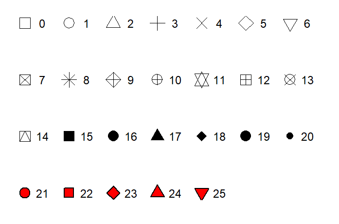
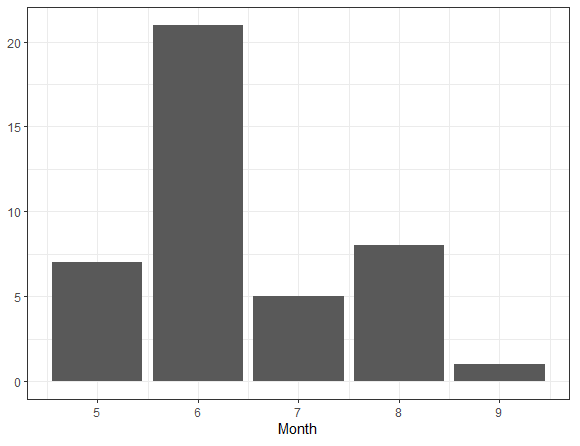
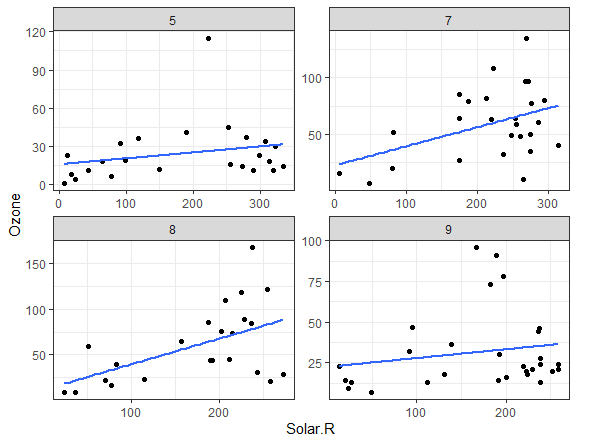

# `ggplot2`에 의한 자료 시각화{#chapter-ggplot2}

자료의 시각화(Visualization)란 자료의 구조를 꿰뚫어 볼 수 있는 명쾌한 그래프를 이용하는 자료 분석방법을 의미한다. 
잘 그려진 그래프는 자료의 모습을 있는 그대로 보여 주는 유일한 분석방법이며, 
다른 어떠한 분석기법에 의한 결과보다도 더 많은 정보를 전달해 줄 수 있는 방법이기도 하다. 
Figure \@ref(fig:barely)은 자료 시각화의 위력을 잘 보여주는 예로서 Cleveland(1993)에 의한 놀라운 발견이다. 
1930년대 초 미네소타 주의 농경학자들이 보리 종류에 따른 수확량의 차이를 알아보기 위한 경작 실험을 실시하였다.
6군데 경작지에 10 종류 보리를 2년간 경작하였는데, Morris 지역만이 1932년의 수확량이 1931년의 수확량
보다 많다는 것을 알 수 있다. 6개 경작지가 모두 근처에 있다는 점을 고려해 보면 유독
Morris 지역에서만 다른 결과가 나왔다는 것이 상당히 의심스럽다고 할 수 있으며, 데이터
가 바뀌었을 가능성을 생각해 볼 수 있는 상황이다.

```{r barely, echo=FALSE, fig.cap = "보리 자료에 대한 다중 패널 점그림", fig.height=6, fig.width=7}
library(tidyverse)
data(barley, package="lattice")

barley %>%
  ggplot(mapping=aes(x=yield, y=variety, color=year, shape=year)) +
  geom_point() +
  facet_wrap(vars(site))
```

자료 시각화에 특히 강점이 있는 R에는 몇 가지의 그래프 작성 시스템이 있다. 함수 `plot()` 등이 속해 있는 
`base graphics`도 그 중 하나인데, 이들 그래프 작성 시스템 중 가장 효과적이고 여러 면에서 우수한 시스템이 바로 `ggplot2`라고 할 수 있다. 
그래프 작성에 일관된 규칙이 있어서 복잡한 상황에서도 쉽게 확장이 가능하다는 것이 큰 장점 중 하나이다.

패키지 `ggplot2`도 core tidyverse에 속해있기 때문에 `library(tidyverse)`를 먼저 실행해 주면 사용할 수 있다.


## `ggplot2` 시작하기

패키지 `ggplot2`에 있는 데이터 프레임 `mpg`의 변수 `displ`과 `hwy`의 관계를 산점도로 나타내보자. 
변수 `displ`은 리터 단위의 배기량이고, `hwy`는 고속도로 연비이다.

```{r first-plot, fig.cap = "ggplot2의 산점도"}
ggplot(data = mpg) +
  geom_point(mapping = aes(x = displ, y = hwy))
```

패키지 `ggplot2`에서 그래프 작성은 함수 `ggplot()`으로 시작한다. 
이 함수는 우선 그래프 작성에 사용되는 데이터를 입력 요소 `data`에서 지정하는데, 
데이터는 반드시 데이터 프레임이어야 한다. 또한 이 함수는 그래프가 작성될 좌표계(coordinate system)를 작성하고,
이어서 작성될 그래프를 기다리는 역할을 한다. 따라서 함수 `ggplot()`만으로는 실질적인
그래프가 작성되지 않는다.

실질적인 그래프는 이어진 함수 `geom_point()`로 작성된다. 패키지 `ggplot2`에서는 하나
또는 여러 개의 레이어(layer)들이 겹쳐져서 그래프가 완성되는데, Figure \@ref(fig:first-plot)에는 점으로 
이루어진 하나의 레이어만이 사용되었다. 레이어를 추가하는 `geom` 함수에는 `geom_point()`
외에도 다양한 함수들이 있으며, 앞으로 계속 소개될 것이다.

또한 `geom` 함수에는 입력 요소 `mapping`이 있는데, 이것은 항상 함수 `aes()`와 함께 사용된다. 
매핑(mapping)은 데이터와 그래프의 시각적 요소(aesthetic)를 서로 연결시키는 것으로, 
함수 `aes()`의 입력 요소 x와 y는 X축과 Y축에 각각의 변수를 연결시키는 역할을 하고 있다.

* `ggplot2`에서 그래프 작성의 최소 요소

패키지 `ggplot2`에서 그래프를 작성하기 위해서는 반드시 따라야 할 법칙이 있다. 
이 법칙은 ‘그래프의 문법’이라고 불리는 것으로서 모든 그래프 작성에서 일정하게 적용되기 때문에 
익숙해지기만 한다면 복잡한 형태의 그래프도 쉽게 작성할 수 있게 된다.
패키지 `ggplot2`에서 그래프를 작성하기 위한 3가지 최소 요소는 `<Data>`, `<Geom_Function>`, 
그리고 `<Mappings>`로써 다음과 같은 형식을 취해야 한다.

```{}
ggplot(data = <Data>) +
  <Geom_FUnction>(mapping = aes(<Mappings>))
```

`<Data>`는 그래프 작성에 사용될 데이터 프레임을 지정하는 것이고, 
`<Geom_Function>`은 geom 함수 중 하나를 지정하는 것으로써 레이어를 작성한다. 
여러 개의 레이어를 겹치기 위해서는 필요한 여러 개의 geom 함수를 덧셈 기호로 연결하면 된다. 
`<Mappings>`는 다양한 시각적 요소(크기, 모양, 색깔 등)와 데이터를 연결하는 것이다.

3가지의 필수 요소 외에도 다양한 그래프를 작성하기 위해서는 몇 가지 기본 요소가 더
필요하다. 앞으로 하나하나 살펴보도록 하겠다.


## 시각적 요소와의 연결: Mapping

Figure \@ref(fig:first-plot)와 같은 산점도를 작성하기 위해서는 점들의 위치와 더불어 점의 크기, 모양 및
색깔 등을 결정해야 하는데, 이러한 특성들은 우리가 그래프를 시각적으로 인식할 때 필요한 시각적 요소(aesthetic)이다.
시각적 요소들은 데이터와 연동되어 결정되기도 하지만, 어떤 경우에는 데이터와 관계 없이 일정한 값을 가지기도 한다. 
시각적 요소들을 데이터와 연동하여 결정하는 것을 매핑(mapping)이라고 하며 Figure \@ref(fig:first-plot)에서는 점의 위치만이 매핑이 되었고, 나머지 다른 시각적 요소들은 일정한 값으로 주어졌다.

점의 크기, 모양 또는 색깔과 같은 시각적 요소들을 변수와 연결하여 표현을 한다면, 기존의 그래프에 다른 변수의 정보를 
추가할 수 있다. 예를 들어 데이터 프레임 `mpg`에 있는 변수 `displ`과 `hwy`의 산점도에 변수 `class`의 정보를 색깔로 
추가해 보자. 색깔은 함수 `aes()`의 입력 요소 `color`에 의하여 변수와 연결된다.

```{r color-mapping, fig.cap='시각적 요소 `color`의 매핑', fig.width=5}
ggplot(data = mpg) +
  geom_point(mapping = aes(x = displ, y = hwy, color = class))
```

시각적 요소인 `color`를 데이터와 연결한 Figure \@ref(fig:color-mapping)에는 변수 `class`의 값에 따라 
다른 색이 사용되었고, 따라서 각 점이 어떤 `class`에 속하는지 바로 알 수 있게 되었다. 그러나
`class`의 범주 개수가 지나치게 많아서 정보 파악이 어려운 그래프가 작성되었다. 시각적
요소 `color`에 범주형 변수를 매핑할 때에는 범주의 개수가 많지 않아야 효과적인 그래프가 작성된다. 
사용된 색깔에 대한 범례는 자동으로 추가된다.

이번에는 점의 모양을 변수 `drv`와 연결하여 표현해 보자. 점의 모양은 함수 `aes()`의 입력 요소 `shape`에 의하여
변수와 연결된다. 시각적 요소 `shape`와 매핑되는 변수는 `drv`와 같이 이산형이어야 한다. Figure \@ref(fig:5-4-a)에는 
세 가지 모양의 점이 사용되었으나, 모양 차이가 쉽게 느껴지지 않고 있다. 이런 경우에는 다른 시각적 요소를 `drv`에 
함께 매핑하여 작성한 Figure \@ref(fig:5-4-b)가 좋은 대안이 될 수 있다.

```{r 5-4-a, fig.cap='시각적 요소 `shape`의 매핑'}
ggplot(data = mpg) +
  geom_point(mapping = aes(x = displ, y = hwy, shape = drv))
```


```{r 5-4-b, fig.cap='시각적 요소 `shape`의 매핑'}
ggplot(data = mpg) +
  geom_point(mapping = aes(x = displ, y = hwy, shape = drv, color = drv))
```

또 다른 시각적 요소인 점의 크기를 변수 `cyl`과 연결해 보자. 점의 크기는 함수 `aes()`의 입력 요소 `size`에 의하여 
변수와 연결된다. 시각적 요소 `size`에는 연속형 변수를 매핑하는 것이 좋다.

```{r 5-5, fig.cap='시각적 요소 `size`의 매핑'}
ggplot(data = mpg) +
  geom_point(mapping = aes(x = displ, y = hwy, size = cyl))
```

시각적 요소를 데이터와 연결하여 결정하지 않고 사용자가 값을 직접 지정하는 것도 가능하다. 
변수 `displ`과 `hwy`의 산점도를 작성하되 점을 모두 빨간색으로 나타내 보자.

```{r 5-6, fig.cap='시각적 요소 `color`의 사용자 지정'}
ggplot(data = mpg) +
  geom_point(mapping = aes(x = displ, y = hwy), color = "red")
```

시각적 요소의 값을 사용자가 지정하기 위해서는 `color`, `shape`, `size` 등을 함수 `aes()`의 밖으로 빼내서 
`geom` 함수의 입력 요소로 사용해야 한다. 각 시각적 요소에 지정되는 값은 다음의 규칙에 따른다.

1. `color`: 색깔을 나타내는 문자열 지정

2. `size`: 점 크기를 mm 단위로 지정

3. `shape`: 점의 형태를 나타내는 0~25 사이의 숫자. 각 숫자에 대응되는 점의 형태는
Figure \@ref(fig:shape)에서 볼 수 있다. 숫자 0~14로 지정되는 속이 비어 있는 도형의 선 색깔과
숫자 15~20으로 지정되는 도형의 색깔은 `color`로 지정하고, 숫자 21~25로 표현되는
도형의 테두리 선 색깔은 `color`로, 내부를 채우는 색깔은 `fill`로 각각 지정한다.

```{r shape, echo=FALSE, fig.cap='시각적 요소 shape의 지정에 사용 가능한 숫자와 대응되는 점 형태', fig.align="center"}

```

여러 시각적 요소를 동시에 사용해야 하는 경우가 많이 있다. 이런 경우에, 여러 시각적
요소들을 모두 변수들과 매핑을 하게 되면 그래프에 너무 많은 정보를 표현하게 될 가능성
이 있으며, 오히려 그래프의 의미가 모호해질 수 있다는 점에 유의해야 할 것이다. 
Figure \@ref(fig:5-8)은 세 가지 시각적 요소를 모두 다른 변수와 연결하여 작성한 것이다.

```{r 5-8, fig.cap='여러 시각적 요소를 동시에 매핑을 실시한 그래프', fig.width=5}
ggplot(data = mpg) +
  geom_point(mapping = aes(x = displ, y = hwy, color = class, shape = drv, size = cyl))
```

여러 시각적 요소의 값을 사용자가 동시에 지정하여 사용해야 하는 경우도 많이 있다. 
Figure \@ref(fig:5-9)는 점의 크기와 모양, 색깔을 모두 사용자가 지정한 그래프이다. 
입력 요소 `stroke`는 `shape`가 21~25의 값으로 표현되는 점들의 테두리 선 두께를 조절하는 요소이다.

```{r 5-9, fig.cap = '여러 시각적 요소를 동시에 지정한 그래프'}
ggplot(data = mpg) +
  geom_point(mapping = aes(x = displ, y = hwy), color = "blue", size = 2, 
             shape = 21, fill = "red", stroke = 1)
```

지금까지 살펴본 바에 의하면 시각적 요소를 변수와 매핑을 하고자 한다면 함수 `aes()` 안에서 변수와 연결해야 하고, 
사용자가 값을 직접 지정하고자 한다면 함수 `aes()` 밖에서 원하는 값을 지정해야 한다. 그런데 만일 함수 `aes()` 안에서 시각적 요소의 특정 값을 사용자가 직접 지정하면 어떤 결과가 나올 것인가? 
Figure \@ref(fig:5-10)은 함수 `aes()` 안에서 시각적 요소 `color`에 `"blue"`를 지정했을 때의 결과이다. 
함수 `aes()` 안에 `color`가 입력되면 그것은 매핑으로 인식되는데, 
매핑은 변수와 연결되는 것이므로 특정 하나의 값과는 매핑이 성립되지 않는다. 
따라서 `"blue"`라는 하나의 값만을 갖고 있는 새로운 변수를 스스로 만들고, 그 변수와 `color`를 매핑하게 된다. 
사용된 점 색깔은 하나의 값만이 있는 변수에 `color`를 매핑할 경우 디폴트로 사용되는 색깔이다.

```{r 5-10, fig.cap='함수 `aes()` 안에서 `color`를 사용자가 지정한 경우의 그래프'}
ggplot(data = mpg) +
  geom_point(mapping = aes(x = displ, y = hwy, color = "blue"))
```


## 그룹별 그래프 작성: Facet

범주형 변수가 다른 변수에 미치는 영향력을 그래프로 확인하는 방법으로써 범주형 변수에 의해 구분되는 그룹별로 그래프를 작성하여 비교하는 것을 생각해 볼 수 있다. 
만일 그룹별로 작성된 그래프에 큰 차이가 없다면 범주형 변수의 영향력은 미미한 것으로 볼 수
있을 것이다. 이와 같이 그룹별로 데이터를 구분하여 그래프를 작성하는 것을 faceting이라고 하는데, 
패키지 `lattice`의 `Trellis plot`과 동일한 개념이 된다.

* 함수 `facet_wrap()`에 의한 faceting

함수 `facet_wrap()`은 데이터를 구분하려는 변수가 하나인 경우에 주로 사용되며, 사용법은 `facet_wrap(facets, nrow, ncol, scales, dir)`이다. 여기에서 `facets`에는 그룹을 구성하는 변수를 지정하는데, 함수 `vars()`에 나열하면 된다. 
`nrow`와 `ncol`에는 패널의 행과 열의 개수 지정하며, `scales`는 각 패널의 XY축 범위를 설정하는 방식을 지정한다. 디폴트 `"fixed"`는 모든 패널의 XY축 범위를 동일하게 설정하고, `"free_x"`는 X축의 범위를 각 패널에 따라 다르게 설정하며, `"free_y"`는 Y축의 범위를 다르게 설정하고, `"free"`는 XY축의 범위를 다르게 설정하는 것이다. `dir`은 그래프의 배치 순서를 지정하는 것인데 디폴트 `"h"`는 행 방향으로 배치하고, `"v"`는 열 방향으로 배치하게 된다.    

예를 들어 데이터 프레임 `mpg`의 변수 `displ`과 `hwy`의 산점도를 변수 `class`의 범주별로 구분하여 작성해 보자.

```{r 5-11, fig.cap = '함수 `facet_wrap()`으로 작성된 그래프'}
ggplot(data=mpg) +
  geom_point(mapping=aes(x=displ,y=hwy)) +
  facet_wrap(vars(class))
```

Figure \@ref(fig:5-11)을 구성하는 7개의 패널 중 `2seater`라는 제목의 패널에는 적은 개수의 데이터만 
해당되는 것을 알 수 있다. 변수 `class`가 `‘2seater’`인 케이스를 제거한 후 패널을 2열로 배치하여 작성해 보자. 

```{r 5-12, fig.cap = '`ncol`로 패널 배치 조절'}
mpg %>% 
  filter(class != "2seater") %>% 
  ggplot() +
  geom_point(aes(x = displ, y = hwy)) +
  facet_wrap(vars(class), ncol = 2)
```

`dir`의 값 변경해서 패널의 그래프 배치 순서를 다르게 해 보자. 

```{r 5-13, fig.cap='`ncol`과 `dir`로 패널 배치 조절'}
mpg %>% 
  filter(class != "2seater") %>% 
  ggplot() +
  geom_point(aes(x = displ, y = hwy)) +
  facet_wrap(vars(class), ncol = 2, dir = "v")
```


* 함수 `facet_grid()`에 의한 faceting

함수 `facet_grid()`은 데이터를 구분하려는 변수가 두 개인 경우에 주로 사용되는 함수이지만, 
구분하려는 변수가 하나인 경우에도 사용할 수 있다. 사용법은 `facet_grid(rows, cols, scales)`이며, 
`rows`와 `cols`에는 패널의 행과 열을 구성하는 변수를 함수 `vars()`을 이용하여 지정한다.  

예를 들어 데이터 프레임 `mpg`에서 데이터를 변수 `drv`와 `cyl`로 구분하여 `displ`과 `hwy`의 산점도를 각각 작성해 
보자. 단, 변수 `drv`가 `"r"`인 데이터와 `cyl`이 5인 데이터는 제외하자.

함수 `ggplot()`으로 작성된 그래프를 지금까지는 Plots 창에 바로 나타나게 했지만, 
이것을 객체에 할당할 수도 있다. 
할당된 ggplot2 객체는 이후에 저장 및 출력 목적으로 사용할 수 있다. 하지만 그래프를 객체에 할당하는 주된 이유는 동일한 내용의 프로그램을 반복해서 입력하지 않기 위함인데, 기본적인 형태의 그래프를 작성하고 그것을 객체에 
할당하면 동일한 작업을 반복할 필요 없이 거기에 몇 가지 요소만을 따로 추가하면 수정된 그래프를 작성할 수 있다.

```{r}
my_plot <- mpg %>%
  filter(cyl != 5, drv != "r") %>%
  ggplot() +
  geom_point(aes(x=displ,y=hwy))
```

객체 `my_plot`을 작성하는 과정에서 확인할 수 있는 것은 함수 `ggplot()`에 데이터 프레임을 첫 번째로 입력하면 요소 이름인 `data=`을 생략할 수 있으며, 함수 `geom_point()`에 함수 `aes()`를 첫 번째로 입력하면 요소 이름인 `mapping=`을 생략할 수 있다는 것이다. 이것은 함수의 변수를 지정하는 방식에 대한 것으로써 자세한 내용은 \@ref(chapter-programming)장에서 확인할 수 있다. 

객체 `my_plot`에는 변수 `drv`가 `"r"`인 데이터와 `cyl`이 5인 데이터가 제외한 상태에서 두 변수 `displ`과 `hwy`의
산점도가 작성되어 있다. 여기에 함수 `facet_grid()`를 추가하면 우리가 원하는 그래프를 작성할 수 있다. 우선 한 변수만을 사용하여 데이터를 구분하고 그래프를 작성해 보자. 

```{r 5-14-1, fig.cap='함수 `facet_grid()`에 의한 한 변수의 faceting'}
my_plot + 
  facet_grid(rows = vars(drv))
```

```{r 5-14-2, fig.cap='함수 `facet_grid()`에 의한 한 변수의 faceting'}
my_plot + 
  facet_grid(cols = vars(cyl))
```

이제는 두 개 변수를 동시에 사용하여 데이터를 구분하고 그래프를 작성해 보자.

```{r 5-15-1, fig.cap='함수 `facet_grid()`에 의한 두 변수의 faceting'}
my_plot + 
  facet_grid(rows = vars(drv), 
             cols = vars(cyl))
```

변수 `drv`의 두 범주와 `cyl`의 세 범주의 조합으로 구성되는 6개 그룹으로 데이터를 구분하여 각각 작성된 산점도가 
Figure \@ref(fig:5-15-1)이다. 변수 `drv`가 행을 구성하고 있고, 변수 `cyl`이 열을 구성하고 있다. 
예를 들어 왼쪽 위 패널은 변수 `drv`가 `“4”`이고, 변수 `cyl`이 `4`인 자동차들의 `displ`과 `hwy`의 산점도이다.

옵션 `scales`의 값을 변경해서 패널의 XY축 범위를 다르게 설정해 보자.  

```{r 5-15-2, fig.cap='함수 `facet_grid()`에 의한 두 변수의 faceting'}
my_plot + 
  facet_grid(rows = vars(drv), 
             cols = vars(cyl),
             scales = "free")
```


두 변수에 의한 faceting은 함수 `facet_wrap()`으로도 작성할 수 있다. 

```{r 5-15-3, fig.cap='함수 `facet_wrap()`에 의한 두 변수의 faceting', fig.height=4, fig.width=5}
my_plot +
  facet_wrap(vars(drv, cyl),
             scales = "free")
```


* 연속형 변수에 의한 faceting

연속형 변수를 이용하여 faceting을 하기 위해서는 우선 연속형 변수를 범주형 변수로 변환시켜야 하는데, 아래의 함수를 이용하면 비교적 쉽게 변환을 할 수 있다.

1. `cut_interval(x, n, length)`: 벡터 `x`를 길이가 `length`인 `n`개의 구간으로 구분

2. `cut_width(x, width, boundary)`: 벡터 `x`를 길이가 `width`인 구간으로 구분. 옵션 `boundary`는 구간의 시작점을 지정.

3. `cut_number(x, n)`: 벡터 `x`를 `n`개의 구간으로 구분하되 각 구간에 속한 데이터 개수가 비슷해지도록 구분


예를 들어 데이터 프레임 `airquality`에서 반응변수 `Ozone`과 설명변수 `Solar.R`과 `Wind`의 관계를 알아보자. 
이와 같이 세 연속형 변수의 관계를 알아보는데 적합한 그래프 중 하나는 설명변수 중 하나를 범주형으로 변환하여 faceting하는 것이다. 
변수 `Wind`를 4개의 구간으로 구분하되 각 구간에 속한 데이터의 개수가 비슷해지도록 구분하고, 
각 그룹에서 나머지 두 변수의 산점도를 작성해 보자.

```{r}
air_1 <- airquality %>%
  mutate(Wind_d = cut_number(Wind, n = 4)) 
```

```{r 5-16, fig.cap='연속형 변수의 faceting', warning=FALSE}
air_1 %>%
  ggplot() + 
  geom_point(aes(x = Solar.R, y = Ozone)) +
  facet_wrap(vars(Wind_d))
```

Faceting은 기존의 그래프에 다른 변수의 정보를 추가하고자 할 때 매우 유용하게 사용되는 기법인데, 
이러한 기능은 색깔 또는 점의 크기 등을 변수와 연결하는 매핑도 갖고 있는 기능이다. 
두 기법은 서로 약간 다른 장단점이 있는데, faceting은 점들이 많이 겹쳐지는 경우에 더 명확하게 다른 변수의 정보를 확인할 수 있지만, 각 패널마다 작성된 그래프에 미세한 차이가 있는 경우에는 확인이 어려울 수 있다는 문제가 있다.

Figure \@ref(fig:5-16)을 작성한 상황에서 변수 `Wind_d`를 색깔과 점의 크기와 연결시켜 나머지 두 변수의 산점도를 작성해 보자.

```{r 5-17, fig.cap='매핑과 faceting의 비교', warning=FALSE, fig.width=5, fig.height=4}
air_1 %>%
  ggplot() +
  geom_point(aes(x=Solar.R, y=Ozone, 
                 color=Wind_d,
                 size=Wind_d))
```

Figure \@ref(fig:5-17)은 너무 많은 점들이 서로 겹쳐 있어서 관계를 확인하는 데 약간의 어려움이 있는 그래프라고 하겠다.


## 기하 객체: Geometric object

함수 `plot()` 등이 속한 `base graphics` 시스템에서는 높은-수준의 그래프 함수로 좌표축과
주요 그래프를 먼저 작성하고 이어서 낮은-수준의 그래프 함수로 점, 선 또는 문자 등을 추가하여 최종적으로 원하는
그래프를 작성하는 방식을 사용한다. 
패키지 `ggplot2`에서는 이것과 조금 다른 방식으로 그래프를 작성한다. 
최종적으로 작성하고자 하는 그래프는 사실 몇몇 유형의 그래프(점 그래프, 선 그래프 등등)를 겹쳐 놓은 것이라 볼 수 있다. 
따라서 이러한 몇몇 유형의 그래프를 각각 따로 작성하고, 그것을 겹쳐 놓음으로써 원하는 그래프를
작성하는 방식을 생각해 볼 수 있는데, 이것이 `ggplot2`에서 그래프를 작성하는 방식이다.
원하는 유형의 그래프(선 그래프 또는 점 그래프 등등)를 작성한다는 것은 해당되는 유형의 기하 객체(혹은 `geom`)를 사용하여 그래프를 작성했다는 것을 의미한다. 
또한 각 기하 객체의 사용이란 해당되는 `geom` 함수를 선택하여 실행하는 것을 의미한다. 
각 `geom` 함수가 실행되면 해당되는 유형의 그래프가 작성된 레이어(layer)가 생성된다. 
따라서 동일한 자료를 사용하더라도 다른 `geom` 함수를 사용하면 다른 그래프가 작성된다.

여러 개의 `geom` 함수를 실행하면 여러 개의 레이어가 생성되는데, 
첫 번째 `geom` 함수로 생성된 레이어가 가장 밑에 놓이고,
다음 `geom` 함수의 레이어가 그 위에 차례로 겹쳐짐으로써 최종적으로 원하는 그래프를 얻게 된다.

Figure \@ref(fig:5-18-1)과 Figure \@ref(fig:5-18-2)는 데이터 프레임 `mpg`의 변수 `displ`과 `hwy`를 대상으로 `geom_point()`와 `geom_smooth()`를 각각 적용했을 때의 결과를 보여주고 있다.

```{r 5-18-1, fig.cap='함수 `geom_point()`에 의한 그래프'}
ggplot(mpg) +
  geom_point(aes(x = displ, y = hwy))
```


```{r 5-18-2, fig.cap='함수 `geom_smooth()`에 의한 그래프'}
ggplot(mpg) +
  geom_smooth(aes(x = displ, y = hwy))
```

현재 `ggplot2`에는 대략 30개 이상의 `geom` 함수가 있다. 
예를 들어 한 변수를 대상으로 하는 `geom` 함수로는 `geom_bar()`, `geom_histogram()`, `geom_density()`,
`geom_dotplot()` 등이 있고, 두 변수를 대상으로 하는 함수로는 `geom_point()`, `geom_smooth()`, 
`geom_text()`, `geom_line()`, `geom_boxplot()` 등이 있으며, 세 변수에 대한 함수로는 `geom_contour()`,
`geom_tile()` 등이 있다. 사용할 수 있는 `geom` 함수들의 리스트는 RStudio의 메뉴에서
`Help > Cheatsheets > Data Visualization with ggplot2`를 선택하면 볼 수 있다.


* 글로벌 매핑과 로컬 매핑

데이터 프레임 `mpg`에서 변수 `displ`과 `hwy`의 산점도에 두 변수의 비모수 회귀곡선을 겹쳐서 나타내 보자. 
비모수 회귀곡선이란 일반적으로 두 변수의 관계를 가장 잘 설명해주는
매끄러운(smooth) 곡선(line)을 의미하는 것이며, 함수 `geom_smooth()`가 그래프로 표현하는 기능을 갖고 있다. 
따라서 원하는 작업을 수행하기 위해서는 함수 `geom_point()`와 함수 `geom_smooth()`를 함께 사용해야 하는데, 
이 경우에 두 `geom` 함수에 적용되는 매핑이 동일하기 때문에 같은 내용을 다음과 같이 중복해서 입력하게 된다.

```{r, eval=FALSE}
ggplot(mpg) +
  geom_point(aes(x = displ, y = hwy)) +
  geom_smooth(aes(x = displ, y = hwy))   # 중복된 입력
```

이러한 중복 입력의 문제는 함수 `ggplot()`에 있는 매핑 기능을 다음과 같이 사용하면 해결된다.

```{r 5-19, fig.cap='글로벌 매핑'}
ggplot(mpg, aes(x = displ, y = hwy)) +  # 글로벌 매핑
  geom_point() +
  geom_smooth()
```

함수 `ggplot()`에 있는 매핑 기능은 해당 그래프 작성에 참여한 모든 `geom` 함수에 공통적으로 적용되는 일종의 글로벌 매핑이다. 
반면에 함수 `geom`에 있는 매핑은 해당 `geom`으로 작성되는 레이어에만 적용되는 일종의 로컬 매핑이 된다. 
따라서 여러 `geom` 함수에서 동일한 매핑을 사용한다면 한 번의 글로벌 매핑을 사용하는 것이 중복을 피하는 방법이 된다.

글로벌 매핑이 모든 `geom` 함수에 공통적으로 적용되기는 하지만, 실질적으로 레이어를
작성하는 `geom` 함수에서 이루어지는 로컬 매핑이 글로벌 매핑보다 우선해서 적용된다. 
따라서 각 레이어에서 글로벌 매핑과 다른 내용으로 매핑을 할 수 있게 되는데, 이러한 특성으로 인하여 훨씬 다양한 형태의 그래프를 작성할 수 있다.

이제 데이터 프레임 `mpg`의 변수 `displ`과 `hwy`의 비모수 회귀곡선을 표시하고, 그 위에
산점도를 추가하되 변수 `drv`의 값에 따라 점의 색을 다르게 표시해 보자. 
이와 같이 두 개 이상의 `geom` 함수를 사용해야 하는 경우, 글로벌 매핑과 로컬 매핑을 명확하게 구분해서
지정해야 한다. 여기에서 사용되는 매핑은 변수 `displ`과 `hwy`를 `x`와 `y`에 연결하는 것과 변수 `drv`에 `color`를 연결하는 세 가지가 있다. 
세 가지를 모두 글로벌 매핑으로 지정한 그래프가 Figure \@ref(fig:5-20-1)에 있고, 색깔은 함수 `geom_point()`에서 로컬 매핑으로 지정한 그래프가 Figure \@ref(fig:5-20-2)에 있다.

```{r 5-20-1, fig.cap='글로벌 매핑'}
ggplot(mpg, aes(x = displ, y = hwy, color = drv)) +
  geom_point() +
  geom_smooth(se = FALSE)
```

```{r 5-20-2, fig.cap='로컬 매핑'}
ggplot(mpg, aes(x = displ, y = hwy)) +
  geom_point(aes(color = drv)) +
  geom_smooth(se = FALSE)
```

세 가지 매핑이 모두 글로벌로 지정된 경우에는 비모수 회귀곡선의 추정도 변수 `drv`로
구분되는 그룹별로 각각 이루어졌다는 것을 알 수 있다. 함수 `geom_smooth()`에서 옵션
`se=FALSE`를 사용하면 그래프에 비모수 회귀곡선의 신뢰구간이 표시되지 않는다.

이번에는 데이터 프레임 `mpg`의 변수 `displ`과 `hwy`의 비모수 회귀곡선을 변수 `drv`에 
의해 구분되는 그룹별로 각각 추정하여 선의 종류를 다르게 표시하고, 그 위에 변수 `drv`의
값에 따라 점의 색을 다르게 하여 산점도를 추가해 보자. 또한 산점도의 점 크기도 조금
크게 하자. 여기에서 사용될 선의 종류도 시각적 요소로써 변수와의 연결은 입력 요소
`linetype`으로 지정한다.

```{r 5-21, fig.cap='두 `geom` 함수에서 `color`와 `linetype`을 각각 로컬 매핑한 그래프'}
ggplot(mpg, aes(x = displ, y = hwy)) +
  geom_point(aes(color = drv), size=2) +
  geom_smooth(aes(linetype = drv), se = FALSE)
```

여러 개의 레이어가 작성되는 경우, 각 레이어는 다른 `data`를 사용할 수 있다. 
예를 들어 데이터 프레임 `mpg`의 변수 `displ`과 `hwy`의 산점도를 작성하되 변수 `drv`의 값에 따라
점의 색을 다르게 하고, 그 위에 두 변수의 비모수 회귀곡선을 추가하되 변수 `drv`의 값이
4인 데이터만을 대상으로 추정해 보자. 이 경우에는 함수 `geom_smooth()`에 데이터 프레임
`mpg` 중 변수 `drv`의 값이 4인 케이스만 선택한 일종의 로컬 데이터 프레임을 지정해야 한다. 
즉, 매핑에서와 같이 데이터도 함수 `ggplot()`에서 지정하는 글로벌 데이터와 개별 `geom` 함수에서 지정하는 
로컬 데이터로 구분할 수 있다. 다만 모든 `geom`함수에서는 로컬 데이터를 지정하는 `data`가 두 번째 요소이다. 
따라서 다음과 같이 `geom` 함수 내에서 첫 번째에 위치하게 된다면 반드시 `data=`이라는 이름과 함께 로컬 데이터를 
지정해야 한다. 

```{r 5-22, fig.cap='로컬 데이터를 사용하여 작성한 레이어'}
ggplot(mpg, aes(x = displ, y = hwy)) +
  geom_point(aes(color = drv), size = 2) +
  geom_smooth(data = filter(mpg, drv == "4"),
              se = FALSE, color = "red")
```


## 통계적 변환: Statistical transformation

그래프 작성 과정에서 함수 `ggplot()`에 입력된 데이터 프레임의 자료가 그대로 사용되는
경우도 있지만, 통계적 변환 과정을 거쳐 생성된 자료가 사용되는 경우도 많이 있다. 
예를 들어 산점도는 입력된 자료를 그대로 사용해서 작성할 수 있는 그래프이지만, 비모수 회귀
곡선의 경우에는 적절한 추정 과정을 통해 새롭게 생성된 자료를 사용해야 작성할 수 있는 그래프이다.

통계적 변환(혹은 `stat`)이란 함수 `ggplot()`에 입력된 데이터 프레임 자료의 변환을 의미하는 것으로써 
각 그래프 유형별로 대응되는 통계적 변환이 존재한다. 
예를 들어 산점도와 같이 입력된 자료 그대로가 사용되는 경우에 대한 `stat`은 `"identity"`라는 것이며, 
비모수 회귀곡선의 작성에 필요한 `stat`은 `"smooth"`가 된다. 
그런데 우리는 지금까지 두 종류의 그래프를 작성할 때 `geom` 함수에 별도로 `stat`을 지정하지 않았다. 
이것은 모든 `geom` 함수에는 미리 설정된 디폴트 `stat`이 존재한다는 것으로, 예를 들어 `geom_point()`는 
`geom_point(stat="identity")`와 동일한 것이고, `geom_smooth()`는 `geom_smooth(stat="smooth")`와 동일한 것이다.

그래프 작성에 필요한 통계적 변환은 `geom` 함수를 사용하지 않고 `stat` 함수를 대신 사용해도 지정할 수 있다. 
예를 들어 함수 `geom_smooth()`의 디폴트 `stat`인 `"smooth"`에 대응되는 함수 `stat_smooth()`를 함수 `geom_smooth()` 대신 사용하는 것이 가능하다는 것이다. 
이와 같이 모든 `geom` 함수는 그것을 대체할 수 있는 `stat` 함수가 존재한다. 
또한 `geom` 함수의 경우처럼 모든 `stat` 함수에는 디폴트 `geom`이 설정되어 있다. 
예를 들어 함수 `stat_identity()`는 `stat_identity(geom="point")`를 의미한다.

통계적 변환을 활용하는 예로서 막대 그래프를 작성해 보자. 
막대 그래프는 범주형 변수의 분포를 나타내는 데 적합한 그래프로써, 함수 `geom_bar()`로 작성한다. 
이때 사용되는 디폴트 `stat`은 `"count"`이다. 따라서 `geom_bar()` 또는 `stat_count()`로 동일한 
막대 그래프를 작성할 수 있다. 데이터 프레임 `mpg`의 변수 `trans`는 자동차의 변속기 종류를 나타내고 있다. 
변수 `trans`의 막대 그래프를 `geom_bar()`와 `stat_count()`로 각각 작성해 보자.

```{r, eval=FALSE}
ggplot(mpg, aes(x = trans)) +
  geom_bar()
```

```{r 5-23, fig.cap='변수 `trans`의 막대 그래프'}
ggplot(mpg, aes(x = trans)) +
  stat_count()
```

그래프를 `geom` 함수를 사용하여 작성할 것인지 혹은 `stat` 함수를 사용하여 작성할 것인지는 사용자가 더 편한 방법을 선택하면 된다고 본다. 
그러나 일반적으로 `geom` 함수를 사용하는 것이 직관적으로 더 명확하다고 보여지기 때문에 특별한 상황이 아니라면 
`geom` 함수를 사용하여 그래프를 작성하는 것이 더 좋을 듯하다.

함수 `ggplot()`으로 그래프를 작성하는 과정에서 `stat` 함수는 데이터 프레임을 입력 자료로 받고 
변환과정을 거쳐 그래프 작성에 필요한 변수들로 이루어진 데이터 프레임을 내부적으로 생성한다. 
이런 과정을 통해 `stat` 함수가 생성한 변수들은 사용자가 직접 지정하여 사용할 수 있다. 
예를 들어 함수 `geom_bar()` 또는 `stat_count()`는 `count`와 `prop`라는 두 변수를 생성하는데, 
변수 `count`는 각 범주의 도수로써 막대 그래프의 디폴트 막대 높이로 사용된다. 
변수 `prop`는 그룹별 비율을 의미하는 것으로 막대 그래프의 막대 높이를 상대도수로 작성하고자 한다면 사용해야 할 변수가 된다.

`stat` 함수에서 생성된 변수를 사용자가 직접 지정해서 사용할 때는 함수 `after_stat()`에 사용하고자 하는 변수를 입력하면 된다. 예를 들어 `stat_count()`에서 생성된 변수 `prop`를 사용자가 직접 사용하기 위해서는 `after_stat(prop)`라고 지정하면 된다. 
함수 `after_stat()`은 이전 방식인 변수 이름 양끝에 붙이는 `..` 기호나 함수 `stat()`을 대체하는 새로운 방법이다. 

이제 데이터 프레임 `mpg`의 변수 `trans`에 대한 막대 그래프를 상대도수를 이용하여 작성해 보자. 
이 경우 변수 `after_stat(prop)`를 시각적 요소 `y`로 매핑하는 것이 필요한데, 문제는 `y`에 대한 매핑만으로는 
원하는 형태의 그래프를 얻을 수 없다는 것이다.

```{r 5-24-1, fig.cap='디폴트 `group`에 의해 잘못 작성된 막대 그래프'}
ggplot(mpg) +
  geom_bar(aes(x = trans, y = after_stat(prop)))
```

그 이유는 변수 `after_stat(prop)`가 그룹별 비율을 나타내고 있는데, 변수 `trans`의 각 범주가 개별 그룹으로 
설정되는 것이 디폴트이기 때문이다. 따라서 각 그룹에는 한 범주의 도수만이 존재하게 되어
변수 `after_stat(prop)`는 항상 1이 된다. 
이 문제는 개별 그룹으로 나눠져 있던 각 범주들을 하나의 그룹으로 묶어주면 해결이 된다. 
자료들을 그룹으로 묶어주는 기능은 시각적 요소 `group`에 있는데, 모든 범주를 같은 그룹으로 묶어주는 것이므로 
`group`에 하나의 값을 함수 `aes()` 안에서 지정해주면 된다. 
프로그램에서는 `group = 1`으로 지정했지만, 어떤 값을 지정해도 상관없다.

```{r 5-24-2, fig.cap="`group`에 하나의 값을 지정하여 제대로 작성된 막대 그래프"}
ggplot(mpg) +
  geom_bar(aes(x = trans, y = after_stat(prop), group = 1))

```

대부분의 경우, `geom` 함수에 어떤 `stat`을 지정해야 하는지 걱정할 필요 없이 디폴트 값을 그대로 사용하면 원하는 그래프를 작성할 수 있다. 
하지만 몇몇 상황에서는 `stat`을 따로 지정해야 하는데, 막대 그래프의 경우에는 도수분포표를 자료로 입력하는 경우가 여기에 해당된다. 
예를 들어 데이터 프레임 `mpg`의 변수 `trans`의 범주에서 `auto(av)`에서 `auto(s6)`까지를 `auto`로 통합하고
`manual(m5)`와 `manual(m6)`를 `manual`로 통합한 후, 두 범주에 속한 자료의 개수를 확인해 보자. 
각 범주에 속한 자료의 개수를 세는 작업은 함수 `count()`로 할 수 있다.

```{r}
mpg_am <- mpg %>%
  mutate(am = substr(trans, 1, nchar(trans)-4)) %>%
  count(am)
mpg_am
```

데이터 프레임 `mpg_am`은 변수 `trans`의 범주를 `auto`와 `manual`로 통합한 변수 `am`의 도수분포표가 입력되어 있다. 
이러한 도수분포표가 함수 `geom_bar()`에 자료로 입력된 경우 입력된 자료 그대로를 막대 그래프의 높이로 사용해야 한다.
따라서 이 경우에는 `stat`이 `"count"`가 아닌 `"identity"`로 지정을 해야 한다.

```{r 5-25, fig.cap='함수 `geom_bar()`에 `stat="identity"`를 지정해야 하는 경우'}
ggplot(mpg_am) +
  geom_bar(aes(x = am, y = n), stat = "identity")
```


## 위치 조정: Position adjustments

그래프를 작성하다 보면 그래프의 요소들이 서로 겹쳐지는 경우가 있다. 
이런 경우에 그래프 요소들의 위치를 약간 조정하여 서로 겹치지 않게 할 수 있다면 그래프의 완성도를 더 높일 수 있을 것이다.

예를 들어 데이터 프레임 `mpg`의 변수 `cty`와 `hwy`의 산점도를 작성해 보자. 

```{r 5-26-1, fig.cap="점들이 서로 겹쳐진 산점도"}
ggplot(mpg, aes(x = cty, y = hwy)) +
  geom_point()
```

Figure \@ref(fig:5-26-1)에 나타난 점의 개수는 데이터의 전체 개수인 234개에 훨씬 못 미쳐 보인다. 
이것은 시내 연비와 고속도로 연비인 두 변수의 값이 모두 반올림 처리가 되어 정수로 입력되었기 
때문에 겹치는 자료가 많아져서 발생한 현상이다. 
이와 같이 산점도의 점들이 서로 겹쳐지게 되면 자료가 갖고 있는 정보를 정확하게 파악하기 어렵게 되는데, 
이것은 사실 산점도가 갖고 있는 가장 큰 문제이기도 하다. 
산점도의 점이 겹치는 문제의 해결 방안은 경우에 따라 달라질 수밖에 없는데, 
변수 `cty`와 `hwy`의 산점도 경우에는 각 자료에 약간의 난수(random noise)를 더해주어 점의 위치를 수정해 주는 
방법을 사용하면 겹쳐지는 문제를 해결할 수 있다.

이와 같이 산점도의 점에 약간의 난수를 더해 점의 위치를 조정하는 방법은 함수 `geom_point()`에 옵션
`position="jitter"`를 추가하는 것이며, 그 결과는 Figure \@ref(fig:5-26-2)와 같다.

```{r 5-26-2, fig.cap="옵션 `position='jitter'`의 효과"}
ggplot(mpg, aes(x = cty, y = hwy)) +
  geom_point(position = "jitter")
```

함수 `geom_jitter()`는 함수 `geom_point(position="jitter")`와 같은 기능을 갖고 있으며, 
점의 위치를 조정하기 위해 사용되는 난수의 크기를 조절하는 옵션 `width`와 `height`를 간편하게 이용할 수 있다는 장점이 있다.

```{r 5-27-1, fig.cap="함수 `geom_jitter()`에 옵션 `width`와 `height`를 사용한 그래프"}
ggplot(mpg,  aes(x = cty, y = hwy))+
  geom_jitter(width = 0.4, height = 0.05) 
```


```{r 5-27-2, fig.cap="함수 `geom_jitter()`에 옵션 `width`와 `height`를 사용한 그래프"}
ggplot(mpg,  aes(x = cty, y = hwy))+
  geom_jitter(width = 0.05, height = 0.4) 
```

연속형 변수의 특성상 원래의 자료가 서로 겹치는 경우는 거의 없다고 할 수 있다. 
또한 대규모 자료들이 좁은 구역에 몰려서 하나의 큰 무리를 형성하는 경우, 점의 위치에 약간의 난수를 추가하는 
위치 조정만으로는 문제 해결이 불가능할 것이다. 
따라서 위치 조정은 연속형 자료를 위한 그래프보다는 이산형 자료를 위한 그래프, 특히 이변량 막대 그래프
작성에서 가장 유용하게 사용된다. 
이변량 막대 그래프는 두 범주형 변수의 분포를 함께 나타내는 막대 그래프로서, 쌓아 올리는 형태 혹은 옆으로 붙여 놓은 형태를 취하게 된다.

예를 들어 데이터 프레임 `mpg`에서 변수 `trans`의 범주를 `auto`와 `manual`로 통합한 변수 `am`을 생성하고, 
변수 `cyl`이 5인 케이스를 제거한 후 변수 `am`과 `cyl`의 이변량 막대 그래프를 작성해 보자.

이변량 막대 그래프의 작성은 함수 `geom_bar()`로 할 수 있으며, 시각적 요소 `x`와 `fill`에 변수를 하나씩 대응시켜야 한다.

```{r}
mpg_1 <- mpg %>% 
  mutate(am = substr(trans, 1, nchar(trans)-4)) %>%
  filter(cyl != 5)
p_1 <- ggplot(mpg_1, aes(x = as.factor(cyl), fill = am)) + 
  xlab("Number of Cylinders") 
```

디폴트 형태는 시각적 요소 `fill`과 연결된 변수의 도수가 위로 쌓아 올려지는 `position="stack"`이다. 

```{r 5-28-1, fig.cap = "쌓아 올린 이변량 막대 그래프"}
p_1 + geom_bar()
```

옆으로 붙여 놓은 막대 그래프는 옵션 `position`에 `"dodge"` 또는 `"dodge2"`를 지정하면 작성된다. 

```{r 5-28-2, fig.cap = "옆으로 붙여 놓은 이변량 막대 그래프"}
p_1 + geom_bar(position = "dodge")
```

옵션 `position`에 `"fill"`을 지정하면, 시각적 요소 `x`에 매핑된 변수를 조건으로 하는 조건부 확률에 의한
쌓아 올린 막대 그래프가 작성된다. 따라서 모든 막대의 높이는 1이 된다.

```{r 5-28-3, fig.cap = "조건부 확률에 의한 쌓아 올린 이변량 막대 그래프"}
p_1 + geom_bar(position = "fill")
```


연속형 변수의 분포를 그룹별로 비교하고자 하는 경우 유용하게 사용되는 그래프가 ‘나란히 서 있는’ 상자그림이다.
상자그림을 작성하는 `geom` 함수는 `geom_boxplot()`인데, 그룹을 구성하는 변수를 `x` 변수로 지정하고 
연속형 변수를 `y` 변수로 지정하면 수직 방향으로 나란히 서 있는 상자그림을 작성할 수 있다. 
예를 들어 데이터 프레임 `mpg`에서 변수 `trans`의 범주를 `auto`와 `manual`로 통합한 변수 `am`을 생성하고, 
변수 `cyl`이 5인 케이스를 제거한 데이터 프레임 `mpg_1`을 대상으로, 변수 `cyl`에 따른 변수 `hwy`의 상자그림을 
작성해 보자.

```{r 5-29-1, fig.cap="그룹 변수가 하나인 나란히 서 있는 상자그림"}
ggplot(mpg_1,  aes(x = as.factor(cyl), y = hwy)) +
  geom_boxplot() +
  xlab("Number of Cylinders")
```


일반적으로 볼 수 있는 나란히 서 있는 상자그림은 하나의 그룹 변수를 대상으로 작성되는데, 
만일 그룹을 구성하는 변수가 두 개라면 상자그림을 어떻게 배치하는 것이 최적이겠는가? 
예를 들어 두 변수 `cyl`과 `am`을 그룹 변수로 지정하여 `hwy`의 상자그림을 작성해보자. 
이 그래프는 변수 `cyl`을 `x` 변수로, 변수 `am`을 시작적 요소 `fill`에 연결해야 작성되는데, 
작성된 그래프는 변수 `cyl`에 따라 작성된 변수 `hwy`의 상자그림을 다시 변수 `am`에 따라 분할한 것처럼 보인다. 
이러한 배치는 옵션 `position`에 `"dodge"`가 디폴트로 적용되어 작성된 결과이다.

```{r 5-29-2, fig.cap="그룹 변수가 두 개인 나란히 서 있는 상자그림"}
ggplot(mpg_1,  aes(x = as.factor(cyl), y = hwy)) +
  geom_boxplot(aes(fill = am)) +
  xlab("Number of Cylinders")
```


## 좌표계: Coordinate system

좌표계는 시각적 위치 요소인 `x`와 `y`를 근거로 그래프 각 요소의 2차원 위치를 결정하는 체계이다. 
디폴트 좌표계는 데카르트 좌표계인 `coord_cartesian()`이며, 그 외에 활용도가
높은 좌표계로 `coord_flip()`과 `coord_polar()`가 있다.


* `coord_cartesian()`의 활용: XY축 범위 조정

함수 `coord_cartesian()`은 변수 `xlim`과 `ylim`으로 그래프의 XY축의 범위를 조정하는 기능이 있다. 
원래 XY축의 조정은 `ggplot2`에서 실행되는 ‘그래프의 문법’ 성분 중 `scale`이 담당하는 영역이다. 
`Scale`이란 자료와 시각적 요소와의 매핑 및 XY축과 범례 등의 내용 조정을 의미한다. 
대부분의 경우에는 디폴트 상태에서 그래프를 작성하지만, XY축의 범위나 XY축의 라벨 등을 변경해야 한다면, 
`scale`의 디폴트 값을 수정해야 한다.

예를 들어 데이터 프레임 `mpg`의 변수 `displ`과 `hwy`의 산점도에 비모수 회귀곡선을 추가한 그래프의 X축 범위를 (3,6)으로 축소시켜보자. 
`Scale`의 디폴트 값을 수정하기 위해 사용하는 함수는 `scale_*1*_*2*()`의 형태를 취하고 있다. 
여기서 `*1*`은 수정하고자 하는 시각적 요소를 지정하는 것으로써 `color`, `x`, `y`, `fill` 등이 가능하고, 
`*2*`는 적용되는 `scale`을 지칭하는 것으로 `discrete`, `continuous` 등이 가능하다. 
따라서 연속형 변수 `displ`과 연결된 시각적 요소 `x`의 범위를 (3,6)으로 수정하기 위해서는 
함수 `scale_x_continuous(limits=c(3,6))`을 추가해야 한다.

```{r 5-30-1, fig.cap="'scale'로 X축 범위 축소"}
p <- ggplot(mpg,  aes(x = displ, y = hwy)) +
  geom_point() + 
  geom_smooth()
p + scale_x_continuous(limits=c(3,6))
```

이러한 XY축의 범위 조정은 상당히 흔한 작업이기 때문에 간편하게 `scale`의 디폴트 값을 수정할 수 있도록 
함수 `xlim()`과 `ylim()`이 만들어졌다. 즉 위의 예제는 `p + xlim(3,6)`을 실행해도 동일한 그래프를 작성할 수 있다.

Scale 함수를 사용하여 XY축 범위를 축소한 경우, 조심해야 할 점은 범위를 벗어난 자료들이 모두 `NA`로 바뀐다는 것이다.
따라서 Figure \@ref(fig:5-30-1)는 범위를 벗어난 105개 자료가 삭제된 상태에서 작성된 그래프이다. 
이에 반하여 XY축 범위를 함수 `coord_cartesian()`으로 축소하면, 전체 그래프 중 축소된 범위에 해당되는 부분만 확대해서 보여주는 것으로써 범위를 벗어난 자료를 삭제하지는 않는다.

```{r 5-30-2, fig.cap="함수 `coord_cartesian()`으로 X축 범위 축소"}
p + coord_cartesian(xlim=c(3,6)) +
  xlab("Engine Displacement")
```

Figure \@ref(fig:5-30-2)는 X축 라벨의 디폴트 값이 수정되었는데, 축의 라벨 수정도 상당히 흔한
작업이기 때문에 함수 `scale_x_continuous(name="Engine Displacement")`을 실행시키는 대신 함수 `xlab()`으로 
간편하게 수정할 수 있다. 또한 함수 `labs()`을 사용하면 X축, Y축 라벨 수정 및 그래프 제목, 범례의 제목 등도 수정할 수 있다.

* `coord_flip()`의 활용: XY축 좌표 90^°^ 회전

`ggplot2`의 이전 버전에서 대부분의 `geom` 함수와 `stat` 함수는 주어진 `x` 값에 대한 `y` 값의 분포 등을 
나타내는데 중점을 두고 있다. 
따라서 나란히 서 있는 상자그림은 그룹을 구성하는 `x` 변수의 개별 값에 대하여 연속형 `y` 변수의 상자그림이 수직방향으로 작성되는 것이 디폴트 형태가 된다. 
따라서 이전에는 나란히 서 있는 상자그림을 수평방향으로 작성하고자 한다면, 수직방향으로 그래프를
작성하고, 작성된 그래프의 좌표를 함수 `coord_flip()`으로 90^°^ 회전시켜야 했다. 

그러나 최근 버전에는 Y축 변수를 조건 변수로 지정하는 것이 가능하게 되었고, 따라서 수평 방향의 상자그림을 작성하기
위해 굳이 함수 `coord_flip()`을 사용할 필요는 없어졌다. 

데이터 프레임 `mpg`에서 변수 `class`의 그룹별로 `hwy`의 상자그림을 작성해 보자.
우선 조건 변수 `class`를 X축 변수로 사용하는 경우이다. 

```{r 5-31-1, fig.cap="수직방향의 나란히 서 있는 상자그림"}
p1 <- ggplot(mpg, aes(x = class, y = hwy)) +
  geom_boxplot()
p1
```

```{r 5-31-2, fig.cap="수평방향의 나란히 서 있는 상자그림"}
p1 + coord_flip()
```

조건 변수 `class`를 Y축 변수로 사용하는 경우에 Figure \@ref(fig:5-31-2)는 다음과 같이 작성할 수 있다.  

```{r, eval=FALSE}
p2 <- ggplot(mpg, aes(x = hwy, y = class)) +
  geom_boxplot()
p2
```

또한 Figure \@ref(fig:5-31-1)는 `class`를 Y축 변수로 지정하고 함수 `coord_flip()`을 사용하여 다음과 같이 작성할 수 있다. 

```{r, eval=FALSE}
p2 + coord_flip()
```

한 변수의 상자그림을 작성하는 경우에도 함수 `geom_boxplot()`에는 시각적 요소 `x`와 `y` 모두가 필요하다. 
수직 방향으로 작성하는 경우에는 시각적 요소 `y`에 상자그림 작성 대상이 되는 연속형 변수를 연결하고,
`x`에는 길이가 1인 객체를 연결하면 되는데, 하나의 빈칸이 입력된 문자형 벡터를 지정하는 것이 무난한 방법이 된다.

```{r 5-32-1, fig.cap="수직방향 상자그림"}
ggplot(mpg, aes(x = "", y = hwy)) +
  geom_boxplot() +
  xlab(NULL)
```

수평방향 상자그림은 `x`에 연속형 변수, `y`에 길이가 1인 객체를 연결하면 된다. 

```{r 5-32-2, fig.cap="수평방향 상자그림"}
ggplot(mpg, aes(x = hwy, y = "")) +
  geom_boxplot() +
  ylab(NULL)
```


* `coord_polar()`의 활용: 파이 그래프 작성

극좌표는 2차원 공간에 있는 어느 한 점의 위치를 원점에서의 거리와 각도로 나타내는 좌표계이다. 
디폴트 좌표계인 데카르트 좌표를 극좌표로 전환하려면 함수 `coord_polar()`을
사용하면 되는데, 시각적 요소 `x`와 `y` 중 각도로 전환할 요소를 변수 `theta`에 지정해야 하며, 
디폴트는 `theta="x"`이다.

극좌표의 활용 예제로 Coxcomb 또는 Wind rose라고 불리는 그래프를 작성해 보자. 
우선 데이터 프레임 `mpg`의 변수 `class`의 막대 그래프를 작성하되, 막대 사이의 간격을 없애고 범례를 제거해 보자.

```{r 5-33-1, fig.cap="Coxcomb 그래프 작성을 위한 막대 그래프"}
b1 <- ggplot(mpg, aes(x = class, fill = class)) +
  geom_bar(show.legend = FALSE, width = 1) +
  labs(x = NULL, y = NULL)
b1
```

함수 `geom_bar()`에 사용된 옵션 `show.legend = FALSE`는 범례를 제거하기 위한 것이며,
`width = 1`은 막대 사이의 간격을 제거하기 위한 것이다. 변수 `width`는 막대 폭을 지정하는
것으로 구간의 90%를 차지하는 0.9가 디폴트 값이다. 
이제 작성된 막대 그래프에 극좌표를 적용시켜 보자.

```{r 5-33-2, fig.cap="극좌표를 이용하여 막대 그래프를 Coxcomb 그래프로 변환"}
b1 + coord_polar()
```

각도 `theta`에 디폴트인 `x`가 적용됐고, 따라서 동일한 막대 폭이 각도로 변환되고 서로
다른 막대의 높이가 각 조각의 반지름으로 변환된 Coxcomb 그래프가 작성되었다.

극좌표 활용의 두 번째 예제로 파이 그래프와 Bullseye 그래프를 작성해 보자. 
이 경우에도 막대 그래프를 작성하고 극좌표를 적용하는 것인데, 막대 그래프를 위로 쌓아 올리는
형태로 작성해야 한다. 한 변수에 대한 막대 그래프를 쌓아 올리기 위해서는 시각적 요소
`x`에 길이가 1인 객체를 매핑하고 범주형 변수를 시각적 요소 `fill`에 매핑해야 한다. 
또한 X축 전체 구간을 막대로 가득 채우기 위해 `width = 1`을 추가해야 한다.

```{r 5-34-1, fig.cap="파이 그래프 작성을 위한 막대 그래프"}
b2 <-  ggplot(mpg, aes(x = "", fill = class)) +
  geom_bar(width = 1) +
  labs(x = NULL, y = NULL)
b2
```

작성된 막대 그래프에 극좌표를 적용하면서 각도 `theta`에 디폴트인 `"x"`가 지정되면 전체 구간에 해당되는 360°가 
모든 그룹에 적용되어 Bullseye 그래프가 작성된다.

```{r 5-34-2, fig.cap="극좌표를 이용하여 막대 그래프를 Bullseye 그래프로 변환"}
b2 + coord_polar()
```


반면에 `theta`에 `"y"`를 지정하면 각 그룹의 상대도수에 비례하여 각도가 정해져서 파이 그래프가 작성된다.

```{r 5-34-3, fig.cap="극좌표를 이용하여 막대 그래프를 파이 그래프로 변환"}
b2 + coord_polar(theta = "y")
```

함수 `coord_polar()`를 활용하여 파이 그래프의 작성방법을 살펴보았으나, 
사실 파이 그래프와 같이 면적의 차이로 그룹 간의 도수를 비교해야 하는 그래프는 가능한 사용하지
않는 것이 좋다. 그것은 사람들이 길이의 차이는 비교적 정확하게 분별할 수 있으나, 
면적의 차이를 정확하게 구분하는 것이 쉽지 않기 때문이다. 
좋은 그래프란 갖고 있는 정보를 신속하고도 정확하게 인지할 수 있는 그래프를 의미하는 것이고, 
그런 의미에서 파이 그래프를 좋은 그래프라고 할 수는 없을 것이다.


* `ggplot2`의 기본 요소

지금까지 살펴본 `ggplot2`에서 그래프를 작성하는 기본 요소를 정리해 보면 다음과 같다.

```{}
ggplot(data = <Data>) +
  <Geom_Function>(mapping = aes(<Mappings>), stat = <Stat>,
                  position = <Position>) +
  <Coord_Function> +
  <Facet_Function>
```

`ggplot2`는 `base graphics`보다 여러 면에서 개선된 그래프 작성 시스템이다. 
특히 빅데이터 시대에 요청되는 다양한 그래픽스를 비교적 간편하게 작성할 수 있기 때문에 앞으로
한층 더 주목을 받게 될 것이다.

이 장에서는 `ggplot2`의 기본 개념에 대하여 살펴보았다. 
일변량 혹은 이변량 자료 탐색 과정을 포함한 다양한 상황에서의 ggplot2의 활용 방안에 대해서는 \@ref(chapter-EDA)에서 자세하게 소개할 것이다.


## 연습문제

1. 데이터 프레임 `airquality` 는 New York city 의 오존 농도에 관한 데이터이다.

 + 변수 `Ozone`과 `Solar.R`에는 많은 결측값이 있다. 두 변수 중 한 변수라도 결측값이 있는 날수를 월별로 나타내는 다음의 그래프를 작성해 보자.
 
```{r ggplot-ex-1-1, echo=FALSE, fig.align='center'}

```
 
 + 월별로 변수 `Ozone`과 `Solar.R`의 산점도에 회귀직선을 추가한 다음의 그래프를 작성해 보자. 
 결측값이 지나치게 많은 6월 자료는 대상에서 제외한다.

```{r ggplot-ex-1-2, echo=FALSE, fig.align='center'}

```
 


