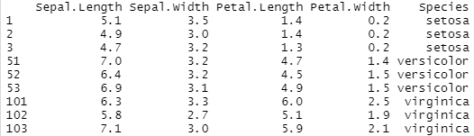

## 연습문제

1.  데이터 프레임 `iris`는 세 가지 종류 붓꽃 `setosa` , `versicolor` , `virginica`의 꽃잎과 꽃받침의 길이와 폭을 측정한 자료이다. 각 종류별로 50송이를 측정하여 처음 50개 행에는 `setosa`, 51부터 100번째 행에는 `versicolor`, 마지막 50개 행에는 `viginica`의 측정값이 입력되어 있다.

 +   `iris`의 1\~3 행 51\~53 행 101\~103 행을 다음과 같이 출력해 보자.

```{r, echo=FALSE, fig.align="center", out.height=150, out.width=400}

```

 +   `iris`의 변수 `Sepal.Length`, `Sepal.Width`, `Petal.Length`, `Petal.Width`에는 꽃잎과 꽃받침의 길이와 폭을 측정한 결과가 입력되어 있다. 세 가지 붓꽃 종류별로 네 변수의 평균값을 각각 계산해 보자

 +   150송이 중 `Petal.Width`의 값이 1 이하이고 `Petal.Length`가 4 이하인 붓꽃이 모두 몇 송이가 있는지 알아보자. 또한 세 종류의 붓꽃별로는 각각 몇 송이가 있는지 알아보자.

2.  데이터 프레임 `mtcars`는 1974년에 발행된 어떤 잡지에 소개된 32대 자동차의 연비와 관련된 자료이다.

 +  숫자형 변수 `mpg`에 대한 다음의 조건으로 요인 `grade`를 생성해 보자. 단, $\bar{x}$ 와 $sd$ 는 변수 `mpg`의 평균 및 표준편차이다.
 

```{r, echo=FALSE, fig.align="center", out.height=60, out.width=300}
knitr::include_graphics("Figure/ch2_ex_21_2.png")
```

 +  `mtcars`의 행 이름을 데이터 프레임에 변수 이름 `model`로 추가해 보자

 +   요인 `grade`가 `Excellent`인 자동차의 변수 `model`과 `mpg`의 값을 출력해 보자.

 +   요인 `grade`가 `Bad`인 자동차들의 평균 `mpg` 값을 계산해 보자.

3.  데이터 프레임 `mtcars`는 32대 자동차의 연비와 관련된 자료가 입력되어 있으며, 자동차 모델 이름은 행 이름으로 입력되어 있다.

-  변수 `mpg` 의 값이 `mpg` 의 평균보다 큰 자동차의 모델 이름을 다음과 같이 벡터로 출력해 보자. 

```{r, echo=FALSE}
ex3_1 <- rownames(mtcars)[with(mtcars, mpg >= mean(mpg))]         
```

```{r, echo=TRUE}
ex3_1
```

-  변수 `mpg` 의 값이 `mpg` 의 평균보다 크고, 변수 `gear`가 4 또는 5이며, 변수 `am`이 1인 자동차를 선택해서 다음과 같이 데이터 프레임으로 출력해 보자. 

```{r, echo=FALSE}
mpg_2 <- with(mtcars, mpg >= mean(mpg) & gear %in% c(4,5) & am == 1) 
ex3_2 <- mtcars[mpg_2,]                                              
```

```{r, echo=TRUE}
ex3_2
```


4. 데이터 프레임 `iris`는 세 가지 종류 붓꽃 `setosa` , `versicolor` , `virginica`의 꽃잎과 꽃받침의 길이와 폭을 측정한 자료이다.

-  변수 `Sepal.Length`가 5 이하고, `Sepal.Width`가 2.5 이하인 붓꽃을 선택해서 다음과 같은 데이터 프레임 형태로  출력해 보자. 

```{r, echo=FALSE}
iris_1 <- with(iris, Sepal.Length <= 5 & Sepal.Width <= 2.5)   
ex4_1 <- iris[iris_1,]                                         
```

```{r, echo=TRUE}
ex4_1
```

-  붓꽃 `setosa` 중에 변수 `Petal.Length`가 3 이하고, `Petal.Width`가 1 이하인 케이스가 몇 송이가 되는지 확인해 보자. 

```{r, include=FALSE}
sum(with(iris,  Petal.Length <= 3 & Petal.Width <= 1 & Species == 'setosa'))
```


5. 벡터 `letters`는 영문자 소문자로 이루어진 문자형 벡터이다.

-  `letters`의 첫 번째, 세 번째, 다섯 번째와 마지막 문자를 선택해서 다음의 벡터 `ex5_1`을 만들어 보자. 

```{r, echo=FALSE}
ex5_1 <- letters[c(1, 3, 5, length(letters))]  
ex5_1 <- paste0(ex5_1, collapse = "")          
```

```{r, echo=TRUE}
ex5_1
```

-  벡터 `ex5_1`을 이용해서 다음의 벡터 `ex5_2`를 만들어 보자. 

```{r, echo=FALSE}
ex5_2 <- paste(ex5_1, toupper(ex5_1), sep = ",")   
```

```{r, echo=TRUE}
ex5_2
```

-  벡터 `letters`를 이용해서 다음의 벡터 `ex5_3`를 만들어 보자. 

```{r, echo=FALSE}
y2_1 <- rep(letters[1:3], times = 3)
y2_2 <- rep(letters[1:3], each = 3)
y2_3 <- rep(letters[1:3], times = c(1, 3, 5))
ex5_3 <- paste0(y2_1, y2_2, y2_3)                 
```

```{r, echo=TRUE}
ex5_3
```


6. 다음의 code를 실행해서 문자형 벡터 `a1`, `a2`, `a3`를 생성하자.

```{r, echo=TRUE}
a1 <- rep("a", times = 5)
a2 <- rep("b", times = 3)
a3 <- rep("c", times = 4)
```

-  벡터 `a1`, `a2`, `a3`를 이용해서 다음의 벡터 `ex6_1`을 만들어 보자. 

```{r, echo=FALSE}
a1_1 <- paste(a1, collapse = "")
a2_1 <- paste(a2, collapse = "")
a3_1 <- paste(a3, collapse = "")

ex6_1 <- paste(a1_1, a2_1, a3_1, sep=",")  
```

```{r, echo=TRUE}
ex6_1
```

-  벡터 `ex6_1`의 문자열은 같은 문자가 여러 번 반복되어 있는데, 이렇게 동일 문자가 반복된 문자열에서 반복 횟수를 계산할 수 있는 code를 작성해 보자. 벡터 `ex6_1`을 대상으로 각 문자의 반복 횟수를 계산해 보자. 이어서 계산된 결과가 해당 문자 다음에 표시되고, 콤마로 구분된 벡터 `ex6_2`를 만들어 보자.

```{r, echo=FALSE}
a4 <- unlist(strsplit(ex6_1, split = ","))   
a4_1 <- substr(a4, 1, 1)                     
a4_2 <- nchar(a4)                            
ex6_2 <- paste0(a4_1, a4_2, collapse = ",")  
```

```{r, echo=TRUE}
ex6_2
```


