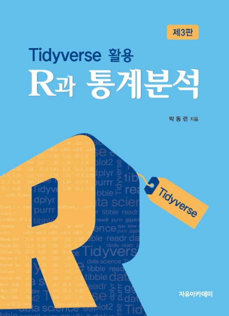

--- 
title: "R과 통계분석"
author: "박동련"
date: "`r Sys.Date()`"
output:
  bookdown::gitbook: default
site: bookdown::bookdown_site
documentclass: book
bibliography: [book.bib]
---

# 소개하기 {.unnumbered}

```{r include=FALSE}
knitr::opts_chunk$set(prompt=TRUE, comment = NULL, collapse = TRUE, message=FALSE, fig.width=6, fig.height=4)
```



